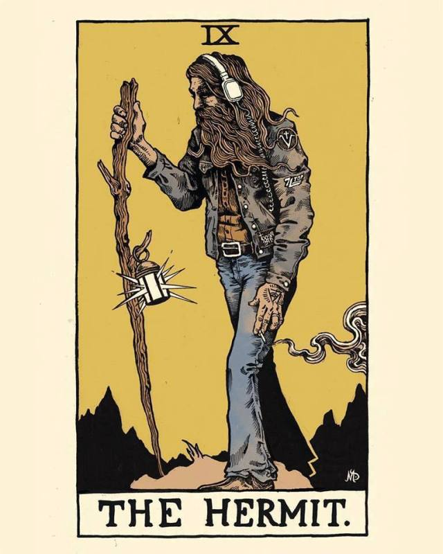
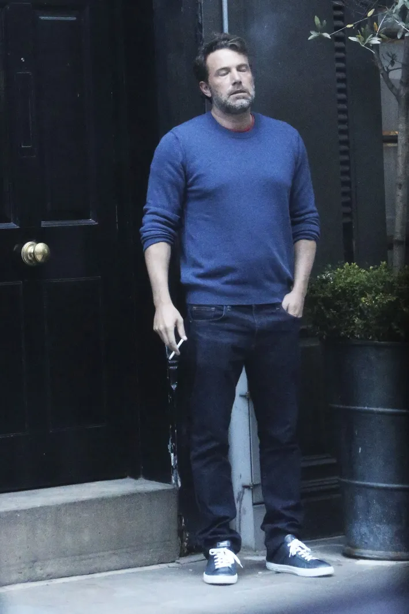
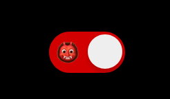
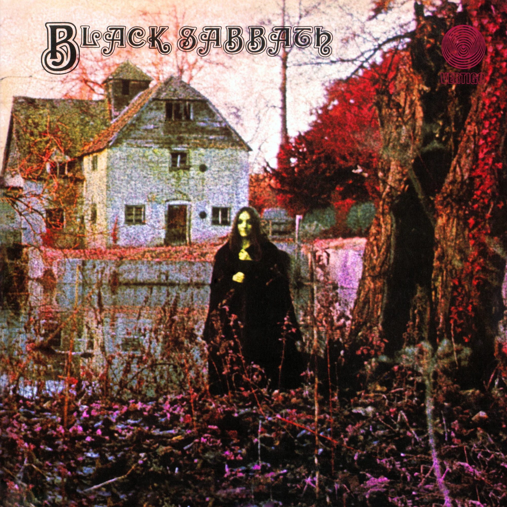

Vamos começar com música por que aqui é assim: Se não tem música nem graça a coisa tem. 'All Them Witches' é uma das bandas interessantes que conheci na internet no último ano e um dia quero ir no show.

<iframe src="https://open.spotify.com/embed/album/4ViTtcecbZ1kjNAkZ4BYNh" width="100%" height="200" frameborder="0" allowtransparency="true" allow="encrypted-media"></iframe>

----

Eu tenho trabalhado e muito no último ano, de forma intensa. Comecei a trabalhar pro exterior e embora muita gente queira dizer que "Ai... nem é grande coisa, é por que no Brasil ta muito sucateado e bla bla bla...", pra mim sim é grande coisa e é o que importa na real. Só que tem sido tão intensamente que quase não tenho parado pra viver e isso gera outro probleminha bem comum na nossa profissão: **BURNOUT**

Eu já estava exatamente como essa imagem do Ben Affleck (tirando o cigarro, pois não fumo) pra qualquer coisa que me falassem, somado a pandemia, somado aos *fiscais de ~~cu~~ comorbidades* por eu ter tomado vacina quando pude.

Foi com isso que decidi me dar uns dias de folga depois de um periodo intenso programando e me frustrando cada vez mais por não respeitar o que pra mim se tornou a habilidade principal para ser um bom desenvolvedor: descansar. É difícil aceitar mas sim, descansar é parte fundamental e talvez o melhor *lifehack* de produtividade.

Eu nos últimos anos deixei de lado minha saúde, meus hobbies, meus interesses reais de vida. Não que eu não ame programar, mas existem outras coisas na vida: Pra quem não sabe eu sou músico desde criança, adoro ler MUITO e em consequencia do stress e de vida atribulada (olá @gserrano), eu engordei 30 quilos. E isso tudo aconteceu comigo tentando não negligenciar a minha própria saúde... porém shit happens... eu só posso agora é correr atrás do prejuízo e tentar levar uma vida mais simples pra não infartar antes dos 40.

-----

Meu blog sempre foi algo mais voltado à area de tecnologia mas eu vi que nos últimos tempos ele pode ser mais, uma janela para me expressar e é isso que eu pretendo fazer daqui pra frente, o blog tornar-se um HUB de coisas que quero fazer, por isso, nesse descanso dei uma certa atenção e repaginada nele. 

> Atenção, se você não é do rock pare agora.

Trouxe o dark mode por padrão, o que facilita a leitura e não 'dói as vista' pra quem não gosta de temas claros. Se você prefere o light theme é só clicar aqui nesse botão que ele volta ao tema anterior:

Também dei uma logo pro blog inspirada na primeira do Black Sabbath depois de ler um belo artigo da newsletter do Cadu Carvalho.

Além disso tem tudo a ver com o que eu gosto, meu jeito de ser e talz. Mas o que eu quero dizer com esse texto é: não vale a pena se matar trabalhando se você não conseguir de vez enquanto fazer alguma bobeira que te alegre.

----

Paz e se cuide, fique de olho no blog que coisas novas chegam em breve :D