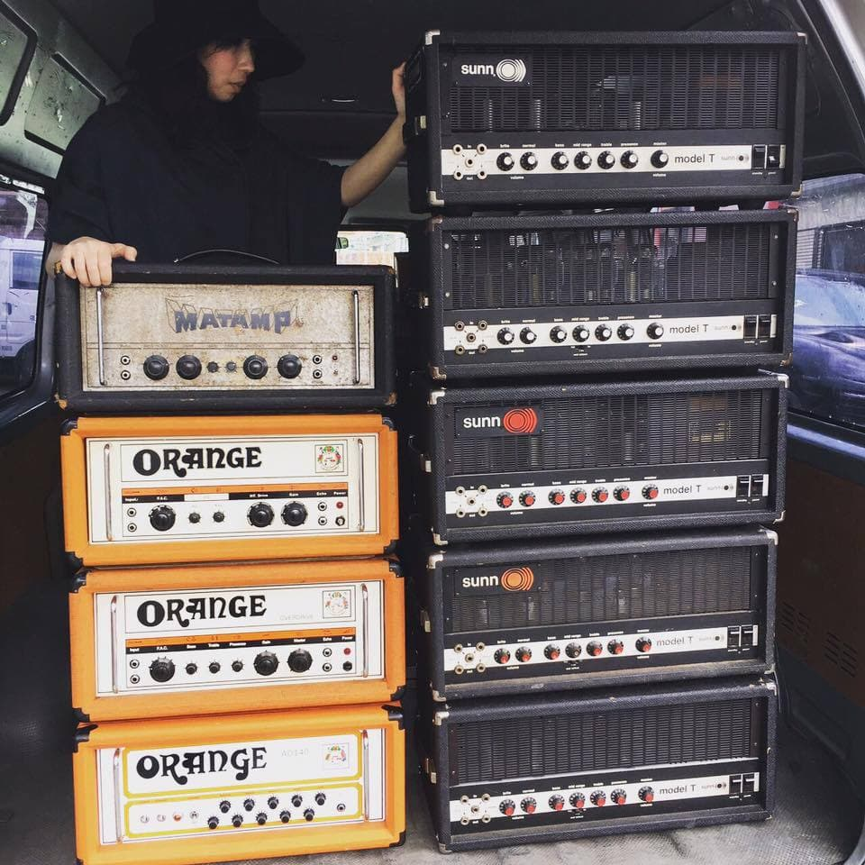
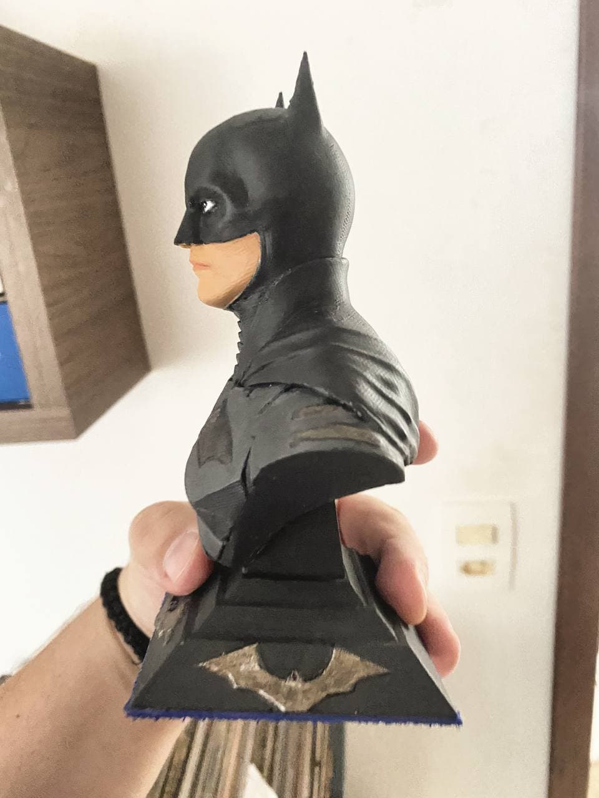
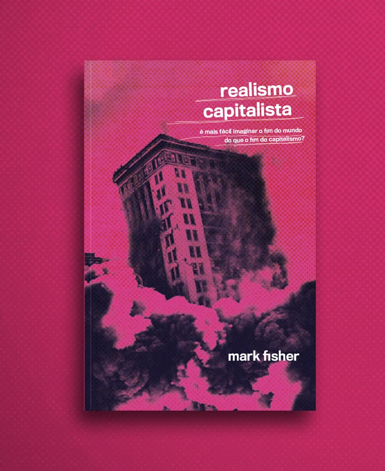

Os últimos meses tem sido conturbados para mim e eu não tive muita vontade de criar conteúdo durante a pandemia.

O fato de não saber se eu estaria vivo na próxima semana de uma maneira mais substancial me fazia não ter vontade alguma de criar textos
ou qualquer coisa durante o período - ainda bem que a vacina veio. O tanto de amigos que perdi pra essa merda de doença e pra esse governo genocida é intolerável.

O stress foi alto e o meu antigo emprego foi extremamente desgastante, tendo um chefe que pouco entendia de gerenciamento
de pessoas e muito menos de gerenciamento de software. Eu sofri um mini-burnout.

Mas como é de praxe nos meus textos, vamos colocar um álbum pra animar de uma banda da Ucrânia que eu acho sensacional.

<iframe style="border-radius:12px" src="https://open.spotify.com/embed/album/322xABbHvGS46f44yW6wfF?utm_source=generator" width="100%" height="280" frameBorder="0" allowfullscreen="" allow="autoplay; clipboard-write; encrypted-media; fullscreen; picture-in-picture"></iframe>

## Demissão

No final de 2021 as coisas não iam exatamente bem no meu antigo emprego devido à problemas financeiros que a empresa sofria, falta de gerenciamento e descaso.
O cadáver do que restava deste emprego foi arrastado até o finalzinho de março e foi sepultado na última semana. Eu me prejudiquei e muito no processo
pois sempre me cobrei demais e achei que pudesse ter culpa, o que não era nem um pouco o caso.

Eu não fiquei esperando parado e fiz vários processos seletivos, alguns que eram terríveis e decidi esperar aparecer algo que me fosse mais agradável e mais
alinhado com o que eu espero, sem me desesperar com o que eu iria fazer. Decidi pegar alguns projetos freelances que falarei mais a frente.

O final foi eu me desligando e a empresa se desligando. Enfim, trágico.

## Novos ânimos

Uma coisa que me deu ânimo para criar conteúdo novamente foi uma palestra do [Fernando](https://twitter.com/fmsedrez), meu amigo de longa data,
sobre AWS, coisa que confesso não gostar muito.
Porém o conteúdo foi tão abrangente e a conversa após isso foi tão enriquecedora que decidi fazer esses posts life check só pra não ficar parado.

Se você já visitou meu blog anteriormente sabe que ele era visualmente mais simples e eu dei uma incrementada com o
conhecimento que adquiri nesses dois anos trabalhando com graphql e afins.

Como novo projeto, eu estou auxiliando o blog de viagens belga [Soms Ook Heimwee](https://somsookheimwee.be/) a melhorar sua performance com imagens e NextJS num geral. Tem sido uma
experiência interessante, ainda mais por que algumas decisões feitas, apesar de boas, são o extremo oposto do que eu faria.

## Fiz 30.

A temida idade chegou, 30 pra mim era uma idade impensável e eu não me vejo nem um pouco dentro desta faixa etária, me sinto velho e
jovem ao mesmo tempo. Uma das coisas mais legais
que ganhei (por enquanto) foi esse busto do Batman que o meu amigo Davis imprimiu e pintou.

> Busto do Batman que ganhei do [Davis Cabral](https://twitter.com/daviscabral), que está experimentando com impressões 3D

Eu adoro o Batman, mesmo as pessoas nos últimos tempos tendo tentado meter uma pecha de fascista, tenho uma coleção de batmans.

## Check-up geral

### 💪 Fitness

- Sem muitas atualizações aqui ainda. _MAS EM BREVE TEREMOS_ (Ler com a vóz do Rogerinho do Ingá).

### 📖 Leitura

- Lendo _Realismo Capitalista_ de Mark Fischer, sobre os impactos culturais e psicológicos que o capitalismo tem feito nas pessoas e na sociedade num geral, é um livro excelente
  cuja frase que bem resume ele é: "É mais fácil imaginar o fim do mundo que o fim do capitalismo". O que nos leva a questionar alternativas à esse regime de moer gente.

### 📺 TV, Filmes e Anime

- Estou acompanhando _Cavaleiro Da Lua_, revendo a 10ª temporada de _The Big Bang Theory_ e esperando ansiosamente pelo novo filme _The Batman_ no HBOMax.

- Também vi esse documentário sobre a cena alternativa de Doom/Stoner:

<iframe width="560" height="315" src="https://www.youtube.com/embed/g7VQATcHXtk" title="YouTube video player" frameborder="0" allow="accelerometer; autoplay; clipboard-write; encrypted-media; gyroscope; picture-in-picture" allowfullscreen></iframe>

### 👾 Video games

- Não consegui jogar muito como gostaria mas estou imerso em _ELDEN RING_ - Mais comentários em breve.

#### 🎙 Podcasts and YouTubes

- O podcast _Cálice_ da Atabaque, que conta a história de como a ditadura militar brasileira era sim um lixo corrupto e cheio de falácia e mentira, mostrando como foi
  a perseguição e assassinato do diplomata José Jobim. Confira abaixo:

<iframe style="border-radius:12px" src="https://open.spotify.com/embed/show/5rnzoHNWT0a1fdWIw6vCDY?utm_source=generator" width="100%" height="232" frameBorder="0" allowfullscreen="" allow="autoplay; clipboard-write; encrypted-media; fullscreen; picture-in-picture"></iframe>

- Esse vídeo sensacional do _Programação Dinâmica_:

<iframe width="560" height="315" src="https://www.youtube.com/embed/bMLbf10uC0Y" title="YouTube video player" frameborder="0" allow="accelerometer; autoplay; clipboard-write; encrypted-media; gyroscope; picture-in-picture" allowfullscreen></iframe>

- E a volta do _Panelaço_ ao vivo em grande estilo:

<iframe width="560" height="315" src="https://www.youtube.com/embed/HxdlMwNt0iI" title="YouTube video player" frameborder="0" allow="accelerometer; autoplay; clipboard-write; encrypted-media; gyroscope; picture-in-picture" allowfullscreen></iframe>

### 📝 Blogs:

- Como estou voltando nesse post, só posso listar um post muito bom que li sobre a [3a Era do Front end](https://www.swyx.io/js-third-age/)

----

E é isso, em breve postarei mais life checks aqui se assim a própria vida permitir, e se quiser, entre em contato.