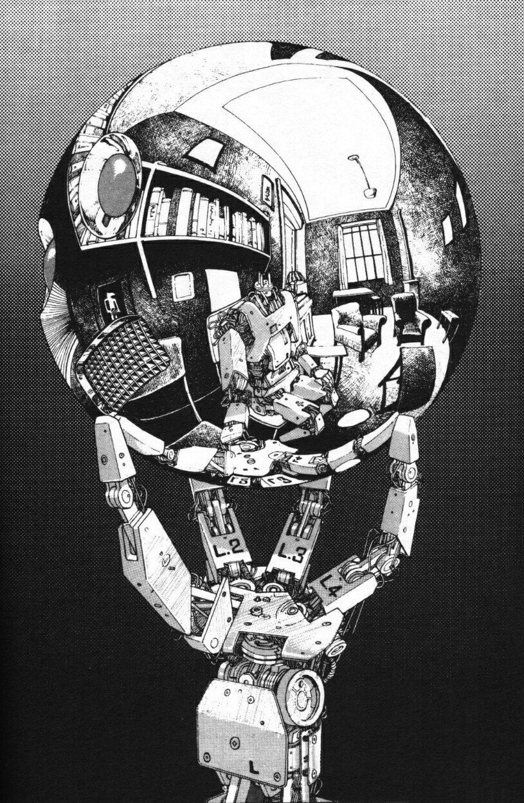

Que ano intenso. Eu to é exausto.

Se no primeiro life check eu estava um tanto quanto depressivo, neste eu estou realizado. Exausto, cansado, destruído

_Moído_

Mas realizado, por que desde a última vez que pisei aqui, muita coisa aconteceu. Põe um Polyphia aí que eu vou explicando no caminho. É muita coisa:

<iframe style="border-radius:12px" src="https://open.spotify.com/embed/album/1BJtoy1VgHMMvotBwvylJ5?utm_source=generator" width="100%" height="380" frameBorder="0" allowfullscreen="" allow="autoplay; clipboard-write; encrypted-media; fullscreen; picture-in-picture" loading="lazy"></iframe>

- Metallica, Krisiun, Crypta e Iron Maiden
- Emprego novo
- Viagem á são paulo
- Fallen Engels + EP
- Participação na rádio
- Palestras

## Check-up geral

### 💪 Fitness

- Volta a consultar com nutri +

### 📖 Leitura

- Brandon Sanderson

### 📺 TV, Filmes e Anime

- Filmes Classicos + A24
- Cyperpunk Edgerunners + Chainsawman
- Documentario Insurgentes

### 👾 Video games

- Não consegui jogar muito como gostaria mas continuo imerso em _ELDEN RING_ - GAME OF THE YEAR, PORRA!!

#### 🎙 Podcasts and YouTubes

- Soberana

### 📝 Blogs:

- Viiste esse blog ano que vem

---

E é isso, em breve postarei mais life checks aqui se assim a própria vida permitir, e se quiser, entre em contato.
