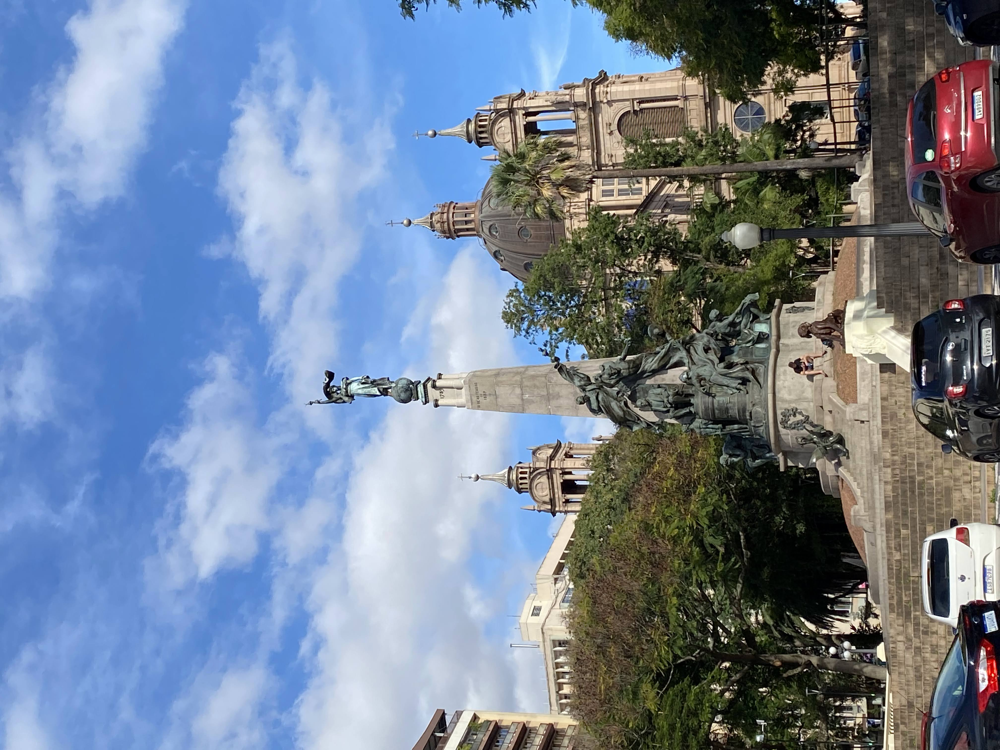
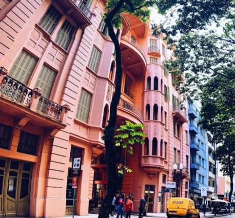
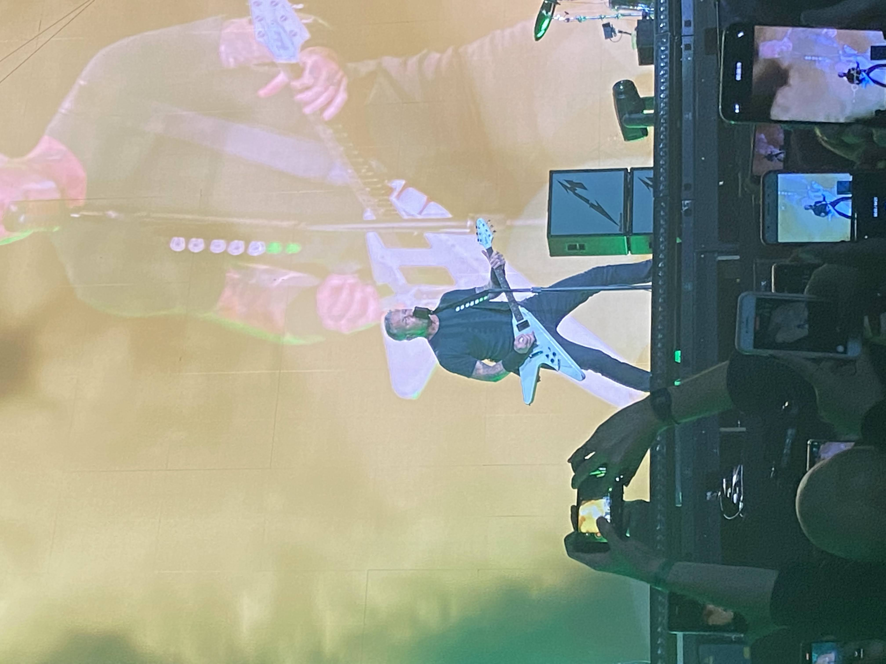
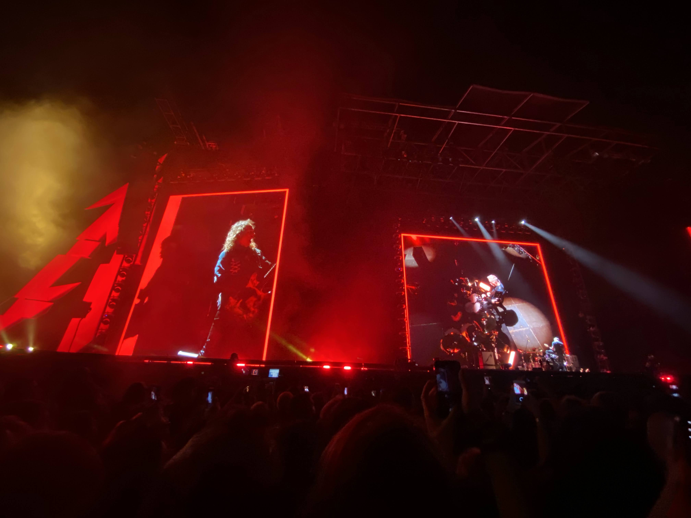
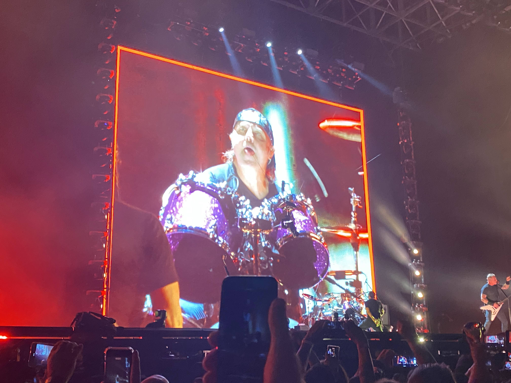
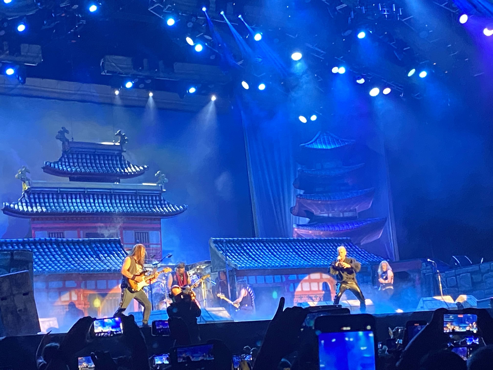
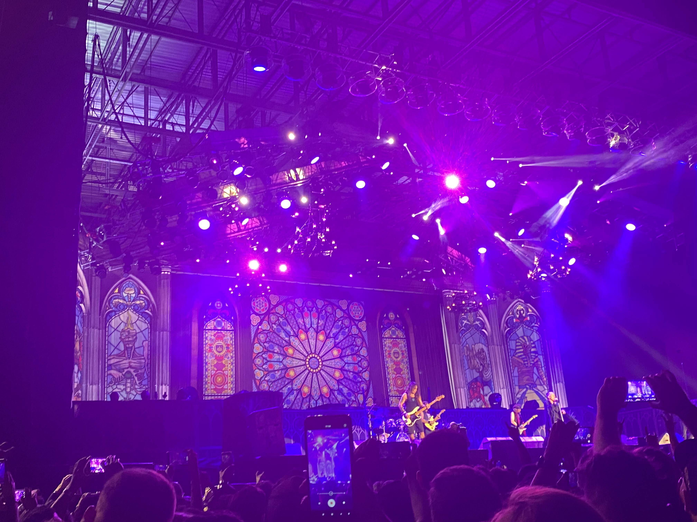
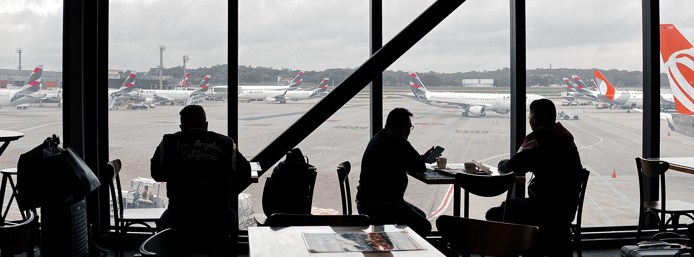
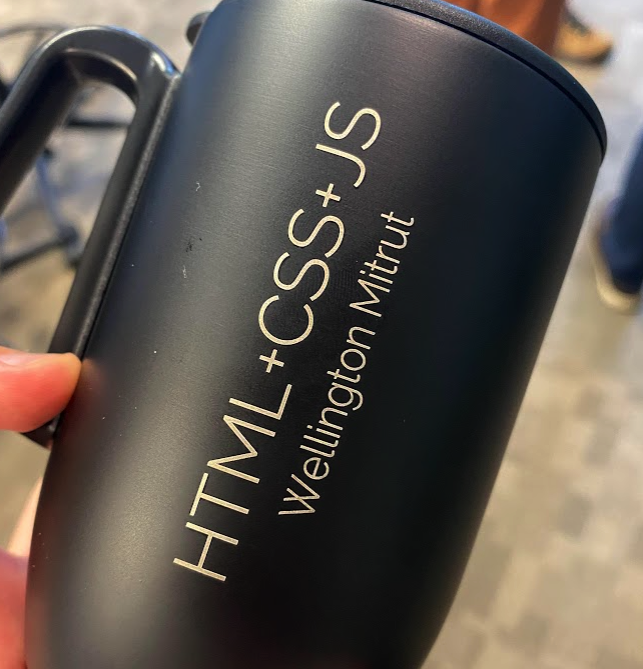

Que ano intenso. Eu to é exausto. 2022 foi um dos anos mais importantes da minha vida e mesmo tendo tanto pra gente esquecer e comemorar ao mesmo tempo, sinto agora que fiz tanta coisa que este ano valeu por cada um perdido na pandemia.

Se no primeiro life check eu estava um tanto quanto depressivo, neste eu estou realizado. Exausto, cansado, destruído, precisando dar uma respirada por que muito aconteceu e ta acontecendo. Se tem uma palavra que me resume, essa palavra é:

_Moído_

Mas também tenho que dizer que estou realizado. Põe um Polyphia aí que eu vou explicando no caminho. É muita coisa:

<iframe style="border-radius:12px" src="https://open.spotify.com/embed/album/1BJtoy1VgHMMvotBwvylJ5?utm_source=generator" width="100%" height="380" frameBorder="0" allowfullscreen="" allow="autoplay; clipboard-write; encrypted-media; fullscreen; picture-in-picture" loading="lazy"></iframe>

### 1. Fade to Black

Vamos começar pelo absoluto começo: eu estava (e em muitos pontos ainda estou) desanimado com como as coisas tem se desenrolado com comunidades a ponto que eu fiquei desde 2019 sem palestrar. Em Janeiro o [Joselito](https://twitter.com/breakzplatform/) me convidou pra dar uma palestra num evento da Turing, os slides dessa palestra você pode conferir abaixo:

<iframe class="speakerdeck-iframe" frameborder="0" src="https://speakerdeck.com/player/a3675b09af10438ba55679f75095b8d7" title="React States - Passado, presente e o que vem por aí" allowfullscreen="true" mozallowfullscreen="true" webkitallowfullscreen="true" style="border: 0px; background: padding-box padding-box rgba(0, 0, 0, 0.1); margin: 0px; padding: 0px; border-radius: 6px; box-shadow: rgba(0, 0, 0, 0.2) 0px 5px 40px; width: 100%; height: 420px; margin-bottom: 40px" data-ratio="1.7777777777777777"></iframe>

Depois de passar um periodo trabalhando pra fora do país pra uma empresa da França, o ciclo chegou ao fim e eu tive que procurar outra forma de me manter pois não vivo de like e mesmo que vivesse provavelmente morreria de fome, depois de _inúmeros_ (e vocês não tem noção de quantos) processos seletivos, eu decidi por integrar o quadro de consultores da Avenue Code e essa parceria tem dado muito certo.

Mas foram 3 meses de procura intensa e frustrante, muita promessa e muita coisa que não se cumpria. Nesse meio tempo fiz uma das viagens mais doidas da minha vida:

#### Porto Alegre.

Porto Alegre pra mim era uma cidade lendária da qual eu só tinha ouvido falar e mesmo estando por um curtíssimo espaço de tempo adorei, tomei Polar e Fruki e fui muito bem recebido. Visitei museus, a sua famosa catedral e infelizmente por falta de tempo não pude visitar outros lugares que queria como a Arena do Grêmio.

Mas o que deu tempo e u fui. Visitei a lendária casa Mario Quintana, que serviu de morada final ao poeta e escritor. Na Rua dos Andradas que é considerada uma das ruas mais bonitas do Brasil e só tenho a concordar

Mas essa viagem eu fiz mesmo é pra ver uma das maiores bandas do mundo, o **Metallica**

E que show foi meus amigos, somente músicas da era clássica, dava pra ver que mesmo depois de 40 anos de carreira eles ainda entregam e entregam MUITO. Eu em minha inocência achei que tinha sido o melhor show da minha vida - peguei palheta do Kirk Hammet e tudo, mas nisso entraremos mais tarde com mais detalhes quando eu falar de outro show.

### 2. ...And Justice For All.

Comecei menos de um mês após isso a minha parceria com a Avenue Code, trabalhei, estudei e foquei muito na minha saúde mental, o que me fez lidar melhor com muita coisa e amadurecer muito. Ainda fui em 2 shows de bandas nacionais que estão muito em evidência: **Krisiun** e **Crypta**, além de prestigiar toda a cena local de Cascavel e região que vive uma efervescência com bandas como **Górgona**, **Karnifalia**,**Crepúsculo dos Ídolos**, **World Suppuration**, **Embryo** e pro ano que vem uma das minhas bandas, o **Fallen Engels** (Com E mesmo, quem pegar a referência pegou). Essa interação me rendeu até uma participação no programa de Radio _Rock Voraz_, fica meu abraço a cada uma das pessoas que estão fazendo isso acontecer por aqui.

Mas o show que me _curou da depressão_ mesmo foi **Iron Maiden**

É uma experiência quase religiosa ver Bruce Dickinson e a banda ao vivo, não tem palavras que eu escreva aqui e duvido que um dia eu consiga expressar a emoção que foi de cantar Revelations, Flight of Icarus, Fear Of The Dark e até mesmo as mais novas do Senjutsu com cerca de 25 mil pessoas.

> The light of the blind\
> You'll see\
> The venom tears my spine\
> The Eyes of the Nile are opening\
> You'll see

Inclusive, a frase _Quer algo mais legal que o Bruce Dickinson de lança-chamas?_ ta gravada na minha memória.

### 3. Flight of Icarus

Ainda, antes de encerrar o ano, fiz uma viagem profissional para São Paulo, depois de anos sem pisar num aeroporto devido a pandemia, e que saudade de ver o mundo la de cima e refletir o quão longe a humanidade pode ir. Conheci vários profissionais da área e colegas de trabalho num evento privado no Morumbi.

Fechando o ano, mais uma vez o Joselito me chamou pra dar uma palestra no TDC, numa trilha da qual ele seria coordenador. A palestra você pode conferir abaixo:

<iframe class="speakerdeck-iframe" frameborder="0" src="https://speakerdeck.com/player/8e5dce332fd74081a2b92c2646cffade" title="Como manter a sanidade no trabalho remoto" allowfullscreen="true" mozallowfullscreen="true" webkitallowfullscreen="true" style="border: 0px; background: padding-box padding-box rgba(0, 0, 0, 0.1); margin: 0px; padding: 0px; border-radius: 6px; box-shadow: rgba(0, 0, 0, 0.2) 0px 5px 40px; width: 100%; height: 415px;" data-ratio="1.7777777777777777"></iframe>

Logicamente meu 2022 aconteceu muito mais coisas, mas eu me limito a poder mostrar o que está aqui por privacidade e também por questão contratual 😛 - Tem coisas que vocês só vão ver em 2023 por que não ta pronto ainda, mas a semente foi plantada em 2022.

---

E antes que eu me esqueça. Esse ano foi um ano de superação e um ano que a gente aprendeu que da pra **Ser feliz de novo** ⭐

Espero vocês por aqui ano que vem.

## Check-up geral

Agora, recapitulando desde o último post de [Life Check](https://blog.wmitrut.co/2022-04-06-life-check-01/)

### 💪 Fitness

- Voltei a ter acompanhamento profissional com nutricionista e personal trainer 3x na semana e em pleno 2023 o shape vem!

### 📖 Leitura

- Li cerca de 50 ítems, entre livros, quadrinhos, graphic novels, mangás, livros técnicos e artigos cientificos.
- Vou me aprofundar na obra de Brandon Sanderson em 2023 com Stormlight Archive e _cometi o erro_ de começar One Piece.

### 📺 TV, Filmes e Anime

- Infiltrado Na Klan foi o filme que vi nesse meio tempo e mais gostei

<iframe width="560" height="315" src="https://www.youtube.com/embed/0vWHEuhEuno" title="YouTube video player" frameborder="0" allow="accelerometer; autoplay; clipboard-write; encrypted-media; gyroscope; picture-in-picture" allowfullscreen></iframe>

- Assistam Cyperpunk Edgerunners e Chainsawman, melhores animes desse ano

<iframe width="560" height="315" src="https://www.youtube.com/embed/JtqIas3bYhg" title="YouTube video player" frameborder="0" allow="accelerometer; autoplay; clipboard-write; encrypted-media; gyroscope; picture-in-picture" allowfullscreen></iframe>

<iframe width="560" height="315" src="https://www.youtube.com/embed/dFlDRhvM4L0" title="YouTube video player" frameborder="0" allow="accelerometer; autoplay; clipboard-write; encrypted-media; gyroscope; picture-in-picture" allowfullscreen></iframe>

### 👾 Video games

- Todo amor e glória _ELDEN RING_ - GAME OF THE YEAR, PORRA!!
- Comecei Stray no PS4 e esse jogo é 😻😻😻
- Finalmente acabei todos os DLC do Spoder Mem, do PS4. Muito bom mas aqueles desafios da Screwball são um saco.

#### 🎙 Podcasts and YouTubes

- Assista todo e qualquer vídeo do pessoal do coletivo [Soberana](https://soberanatv.github.io/)

### 📝 Blogs:

- Viiste esse blog ano que vem, tenho muita coisa preparada e espero que você seja parte da audiência.

---

E é isso, em breve postarei mais life checks aqui se assim a própria vida permitir, e se quiser, entre em contato. Um ótimo 2023 pra todo mundo.
