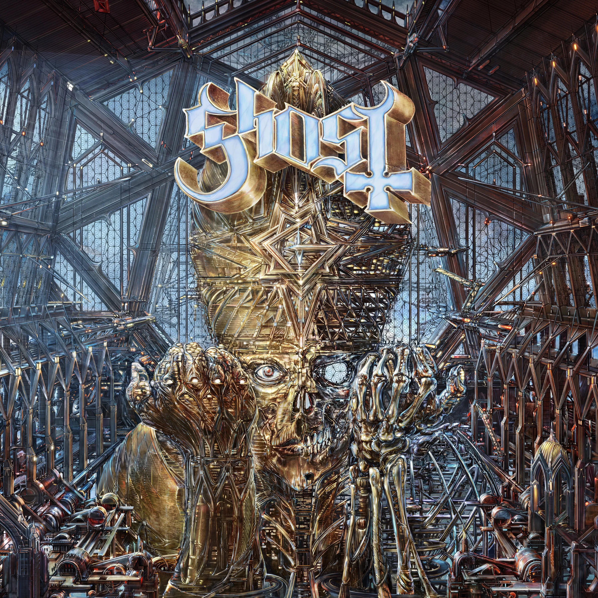
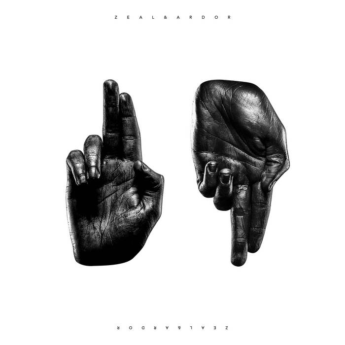
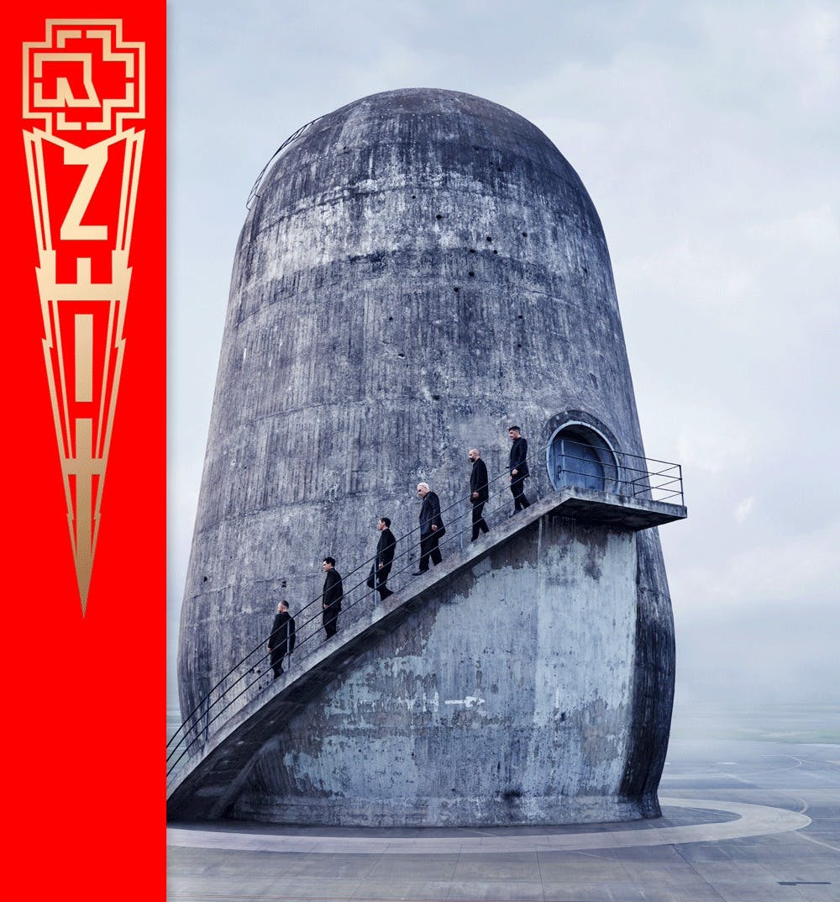
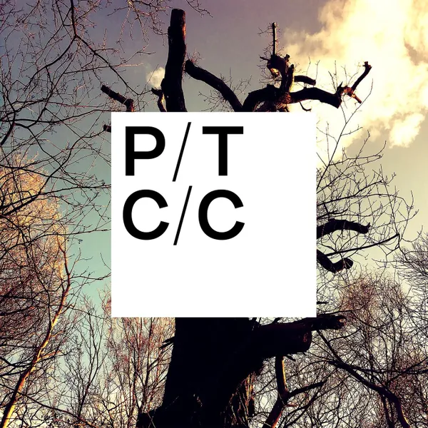
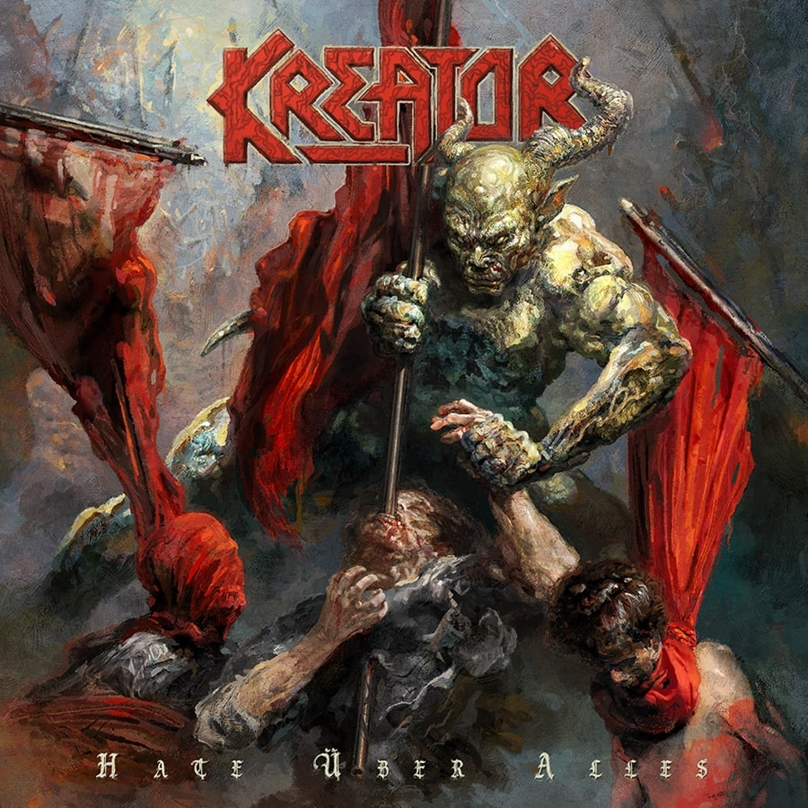
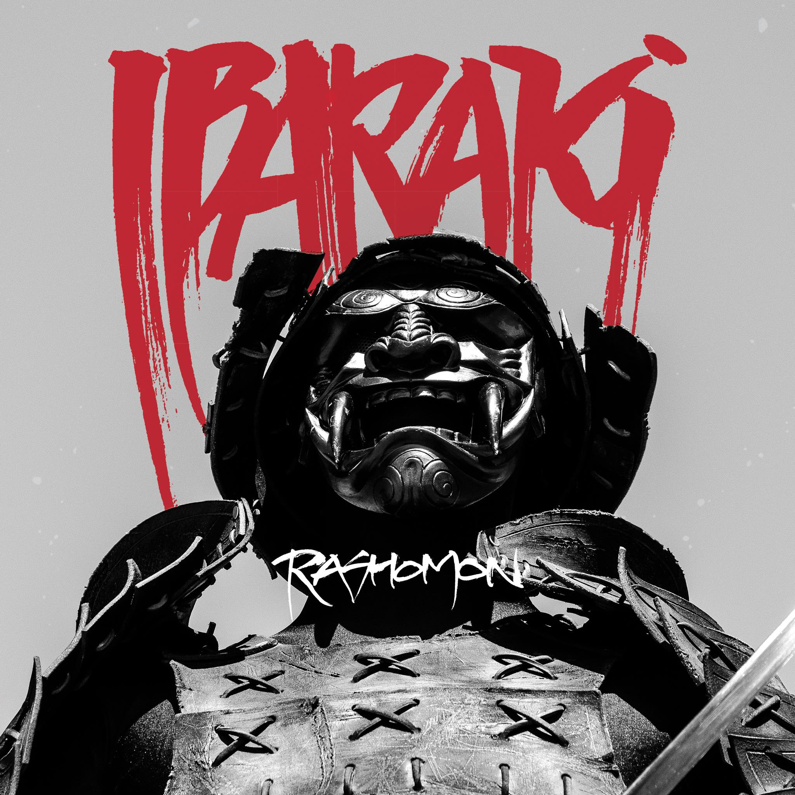
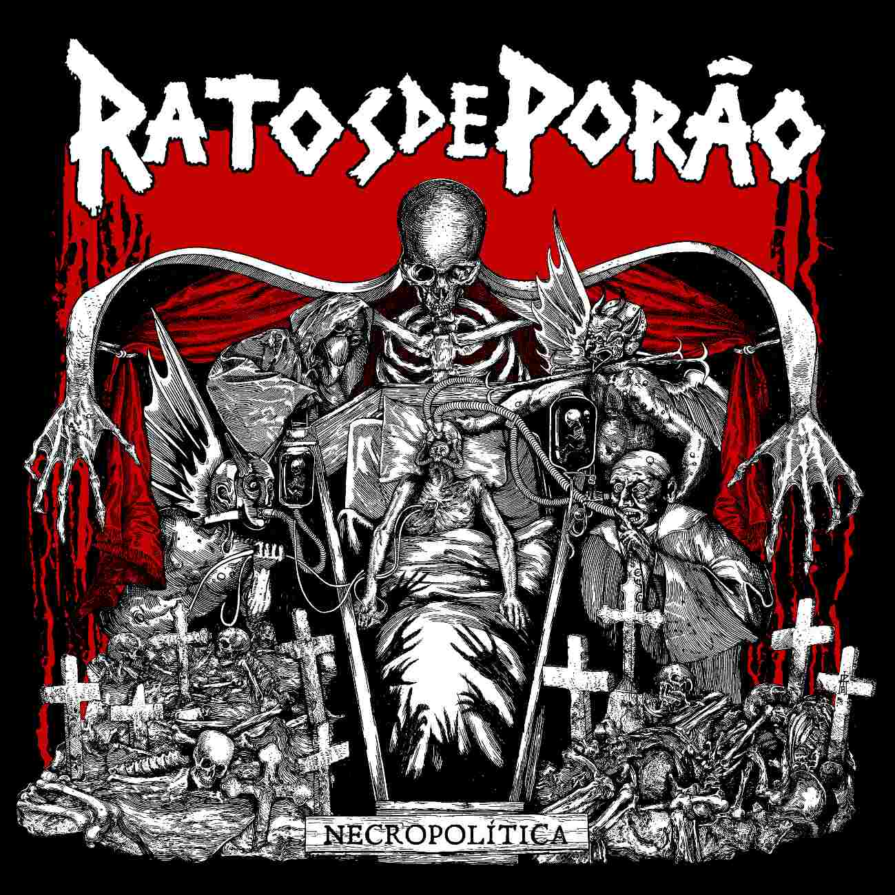
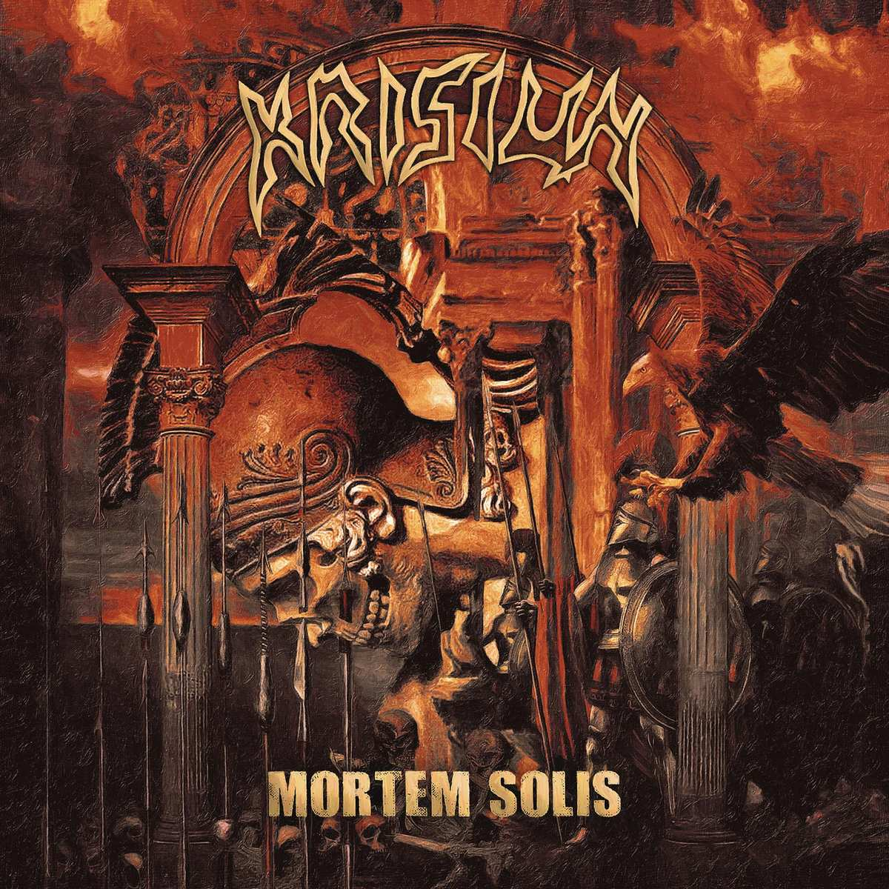
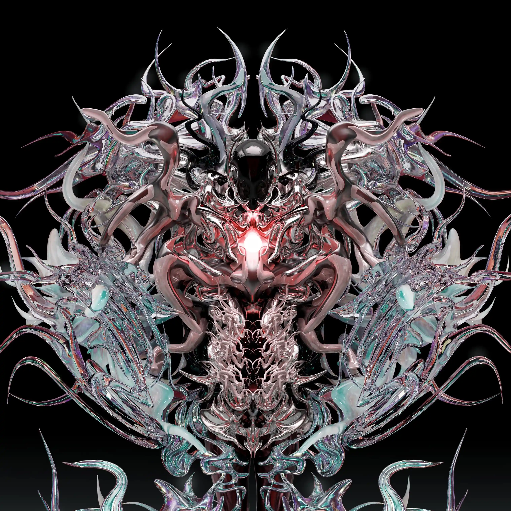
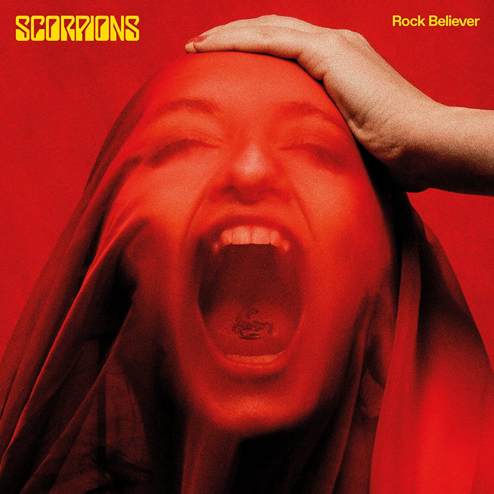

> Photo by <a href="https://unsplash.com/@ignatkushanrev?utm_source=unsplash&utm_medium=referral&utm_content=creditCopyText">Ignat Kushanrev</a> on <a href="https://unsplash.com/photos/y9DEa0AqluQ?utm_source=unsplash&utm_medium=referral&utm_content=creditCopyText">Unsplash</a>

2022 já nos deixou e vai ser um ano que eu [não vou esquecer tão cedo](https://blog.wmitrut.co/2022-12-31-life-check-02/), porém, como eu costumava fazer tempos atrás, escolhi 10 álbums que se destacaram no meu ano e acho que valem a pena ser ouvidos quando se lembrar de 2022.

Esta é uma classificação INTEIRAMENTE pessoal e critérios subjetivos ao que ouço num geral, por isso você pode não ver aqui talvez os seus álbums preferidos e pode até torcer o nariz pra muito do que eu escolhi.

Com isso em mente, abaixo os 10 álbums que escolhi.

### Top 10 álbums que fizeram meu 2022 musical valer a pena:

#### Ghost - Impera

Existe uma força criativa chamada Tobias Forge e ela é quem move uma banda chamada Ghost. IMPERA foi o álbum do ano pra mim, aquele que não tem uma única música que eu pule e que cante todas, escute incessantemente. Se você nunca ouviu Ghost mas conhece outras bandas de metal, pense no que daria misturar o ABBA e o Mercyful Fate.

A mistura da estrutura encontrada em pop, música gospel, hard rock e black metal primordial gera o melhor álbum do ano e talvez o melhor álbum do Ghost.

<iframe style="border-radius:12px" src="https://open.spotify.com/embed/album/3fn4HfVz5dhmE0PG24rh6h?utm_source=generator" width="100%" height="380" frameBorder="0" allowfullscreen="" allow="autoplay; clipboard-write; encrypted-media; fullscreen; picture-in-picture" loading="lazy"></iframe>

#### Zeal & Ardor - Zeal & Ardor

E se ao invés de se prender à deus as pessoas escravizadas escolhessem o outro lado? Zeal & Ardor é a resposta, a mistura de metal com blues, soul e work music gera essa banda que traz uma sensação densa, uma espécie de revanche e uma execução incrível no terceiro álbum dessa banda jovem e que merece aparecer muito mais no cenário atual.

Muita referência à Crowley, à escravidão, luta racial - Heavy Metal e Soul executados com maestria.

<iframe style="border-radius:12px" src="https://open.spotify.com/embed/album/4lh0rl7eI2w9Rik8JECk9l?utm_source=generator" width="100%" height="380" frameBorder="0" allowfullscreen="" allow="autoplay; clipboard-write; encrypted-media; fullscreen; picture-in-picture" loading="lazy"></iframe>

#### Rammstein - Zeit

O Rammstein é uma banda que vez ou outra some e aparece com um álbum incrível. A abertura com "Armee der Tristen" estabelece o tom do álbum, com uma introdução lenta e sinistra que explodem em riffs de guitarra pesados. A a faixa-título "Zeit" é uma das mais populares do álbum, com sua letra pegajosa e ritmo introspectivo. Outros destaques incluem "Zick Zack", com sua atmosfera dançante e arranjos de música eletronica, e "Angst", com sua letra intrigante e instrumental eletrizante - um clássico instantâneo do Rammstein.

O álbum também inclui faixas mais lentas e introspectivas, como "Nebel" e "Adios", que mostram o lado mais vulnerável da banda. A faixa final, "Ich Will", é uma explosão de energia, encerrando o álbum de maneira grandiosa.

Destaque para a curiosa _Dicke Titten_.

<iframe style="border-radius:12px" src="https://open.spotify.com/embed/album/75OE7M0wduJyffbffehHuR?utm_source=generator" width="100%" height="380" frameBorder="0" allowfullscreen="" allow="autoplay; clipboard-write; encrypted-media; fullscreen; picture-in-picture" loading="lazy"></iframe>

#### Porcupine Tree - CLOSURE/CONTINUATION

Eu senti falta do Porcupine Tree. Eles haviam parado lá em 2009 com o abum _The Incident_, um ótimo álbum que foi sucedido pela ótima carreira solo de Steven Wilson que transitou entre o prog e o pop na última década.

Closure/Continuation é um trabalho épico e ambicioso que combina elementos de rock progressivo, metal e música eletrônica. A abertura com "Harrida" traz o som clássico da banda (agora um trio) com uma introdução misterosa e atmosférica que se desenvolve em uma canção poderosa e emotiva. A canção "Rats Return" é um destaque, com sua letra introspectiva e arranjo musical complexo. Outras faixas dignas de destaque incluem "Never Have", com sua letra evocativa e instrumental cativante, e "Love In The Past Tense", evocando os primórdios da banda com sua mistura única de riffs de guitarra pesados e sintetizadores eletrônicos.

Para os que não conhecem, é como se o Radiohead fosse realmente _dark_.

<iframe style="border-radius:12px" src="https://open.spotify.com/embed/album/0w9RrU2alZeQ1BJwpvpFtP?utm_source=generator" width="100%" height="380" frameBorder="0" allowfullscreen="" allow="autoplay; clipboard-write; encrypted-media; fullscreen; picture-in-picture" loading="lazy"></iframe>

#### Kreator - Hate Über Alles

Se teve um gênero que ouvi muito esse ano foi Thrash Metal. E sabendo as minhas posições ideologicas, o Kreator não iria ficar de fora com esse ábum no mínimo visceral. Com homenagens até ao diretor Sergio Corbucci com "Sergio Corbucci Is Dead" na introdução digna de um filme épico, este álbum é um petardo.

Em geral, "Hate Uber Ales" é um álbum incrível que mostra o talento e a paixão do Kreator. Se você é fã de thrash metal ou apenas gosta de músicas agressivas e emotivas, definitivamente deve dar uma chance a este álbum.

<iframe style="border-radius:12px" src="https://open.spotify.com/embed/album/1uWrXYT7gBJ39hy4PLptnF?utm_source=generator" width="100%" height="380" frameBorder="0" allowfullscreen="" allow="autoplay; clipboard-write; encrypted-media; fullscreen; picture-in-picture" loading="lazy"></iframe>

#### Ibaraki - Rashomon

Matt Heafy deixa o metalcore de lado e abraça o Black Metal progressivo, falando sobre samurais e honra. Esse album consegue a proeza de juntar Ihsahn(Emperor), Nergal (Behemoth)e Gerard Way (My Chemical Romance e autor da série de HQs The Umbrella Academy).

As canções do álbum têm títulos em japonês e são longas, variando de cinco a quase 10 minutos. É descrito como a obra mais pessoal e introspectiva de Matt Heafy.

<iframe style="border-radius:12px" src="https://open.spotify.com/embed/album/3iErNnoi1sc1pqKntalRN2?utm_source=generator" width="100%" height="380" frameBorder="0" allowfullscreen="" allow="autoplay; clipboard-write; encrypted-media; fullscreen; picture-in-picture" loading="lazy"></iframe>

#### Ratos de Porão - Necropolítica

Que álbum necessário para os tempos que vivemos. O álbum "Necropolítica" dos Ratos de Porão é um trabalho de punk rock raivoso e politizado que demonstra a determinação da banda em fazer sua voz ser ouvida. Só dá play e vai, se te ofender, pense bem no que você ta fazendo da vida.

<iframe style="border-radius:12px" src="https://open.spotify.com/embed/album/6zDGIt0fJinL9KBMDUbqvU?utm_source=generator" width="100%" height="380" frameBorder="0" allowfullscreen="" allow="autoplay; clipboard-write; encrypted-media; fullscreen; picture-in-picture" loading="lazy"></iframe>

#### Krisiun - Mortem Solis

Esse eu vi ser executado ao vivo, cores, suór e mosh. Krisiun foi inclusive um dos melhores shows desse ano ao qual eu fui 1 semana antes de lançarem esse álbum, que energia, Death metal de primeira.

<iframe style="border-radius:12px" src="https://open.spotify.com/embed/album/5lQW7kHR5FlOWlrkfkbPLs?utm_source=generator" width="100%" height="380" frameBorder="0" allowfullscreen="" allow="autoplay; clipboard-write; encrypted-media; fullscreen; picture-in-picture" loading="lazy"></iframe>

#### Polyphia - Remember that you will die

Esse é o álbum mais diferentão da lista, uma mistura de álbum de virtuose de guitarra com rap/hip-hop, pop e sim... _K-Pop_, por que não? Gosta de sons mais eletrônicos? Confira o som de uma das bandas mais inovadoras da atualidade abaixo.

<iframe style="border-radius:12px" src="https://open.spotify.com/embed/album/1BJtoy1VgHMMvotBwvylJ5?utm_source=generator" width="100%" height="380" frameBorder="0" allowfullscreen="" allow="autoplay; clipboard-write; encrypted-media; fullscreen; picture-in-picture" loading="lazy"></iframe>

#### Scorpions - Rock Believer

O Scorpions meteu o louco e se fez igual o Judas Priest alguns anos atrás e entregou um álbum que remete ao seu periodo clássico a lá “Blackout” (1982) e “Love at First Sting” (1984). Não inova, mas isso não quer dizer que não é bom, é incrível. Hard Rock oitentista clássico.

<iframe style="border-radius:12px" src="https://open.spotify.com/embed/album/3buy6DvCMUseqKyEC4RI4g?utm_source=generator" width="100%" height="380" frameBorder="0" allowfullscreen="" allow="autoplay; clipboard-write; encrypted-media; fullscreen; picture-in-picture" loading="lazy"></iframe>

---

### Menções Honrosas

Álbums que não entrarm no top 10 mas valem a escuta

- Fantastic Negrito – White Jesus Black Problems
- Imperial Triumphant – Spirit of Ecstasy
- Behemoth – Opvs Contra Natvram
- Arch Enemy – Deceivers
- Hällas – Isle of Wisdom
- Clutch – Sunrise on Slaughter Beach
- Marcus King - Young Blood
- The Sheepdogs – Outta Sight
- The Black Keys – Dropout Boogie
- The Hellacopters – Eyes of Oblivion
- Whiskey Myers – Tornillo
- Tears For Fears – The Tipping Point
- White Lies - As I try to not fall apart
