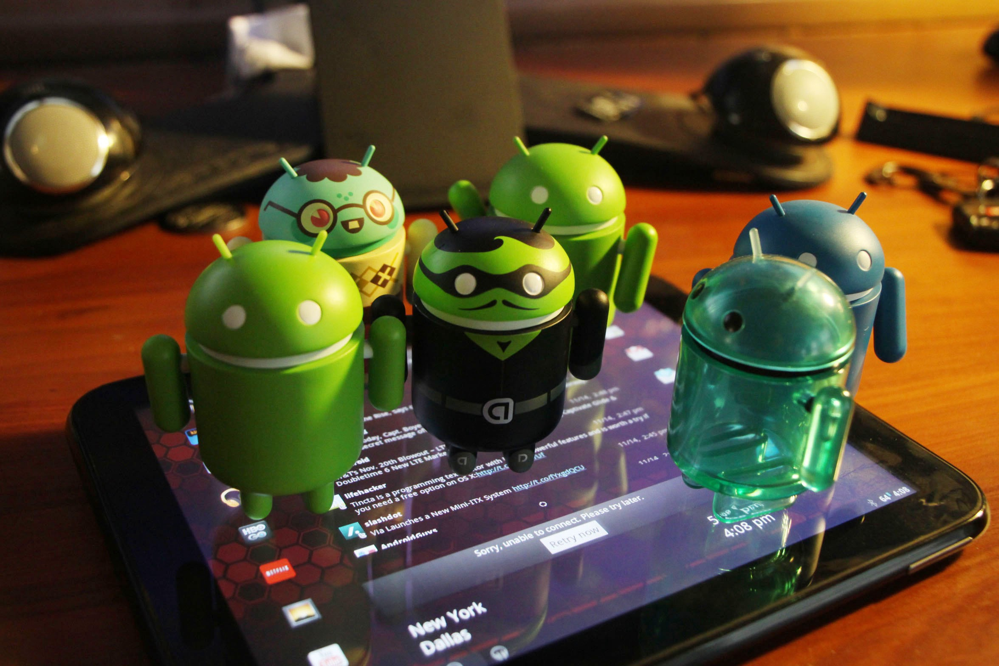
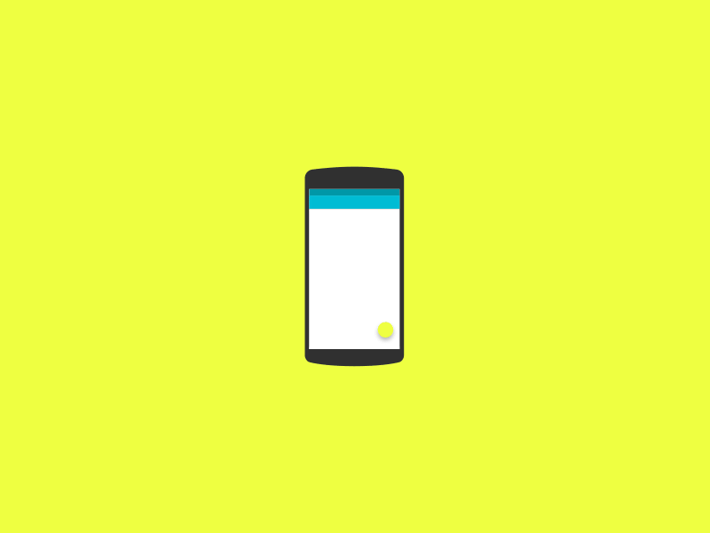
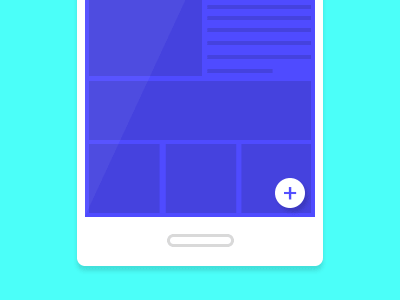
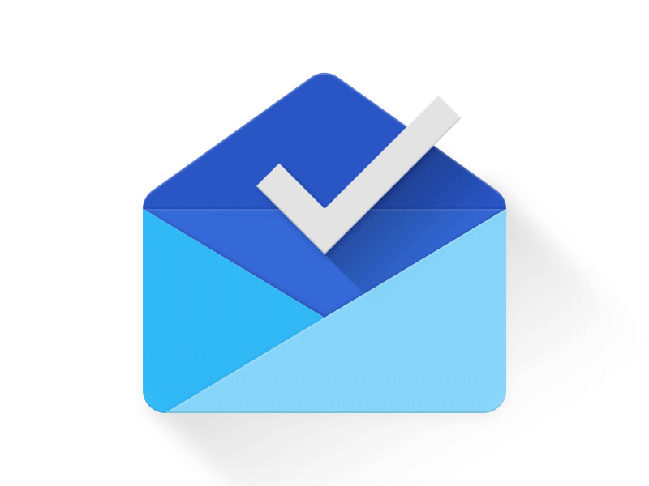

Durante muito tempo no meio de design de aplicativos projetos iOS foram favorecidos em detrimento a projetos com Android, isso se deve em grande parte ao fato de que o Android não teve até 2014 uma guideline de design que fosse sólida e específica, porém, isso mudou com a implementação do Material Design.

Sabemos que o mercado é <a href="https://www.idc.com/promo/smartphone-market-share/os" target="_blank">dominado</a> pelo sistema operacional do Google (no Brasil já ultrapassa a marca de 90%, enquanto que no mundo é cerca de 85%) e devido a este sucesso, já passou da hora de pensarmos em melhores interfaces e experiências para usuários de Android.

Boa parte dos aplicativos para Android ainda não são um primor de design e o Material Design não é a linguagem perfeita. O sistema de aprovação para o Google Play Store é um tanto quanto ‘frouxo’, resultando em muitos aplicativos que não possuem sequer o mínimo de consideração com UX.

Só que os dias do Ice Cream Sandwich se foram. O Material Design é uma iniciativa boa e bonita.

Com isto em mente, listei 4 coisas que consideramos importantes ter em mente quando se trata de projetar um bom design para Android.

### 1 - RESPONSIVIDADE

Muito se fala que o maior problema do Android é a fragmentação. Muitos dispositivos, muitas telas, como projetar algo com tantas variáveis?

Muitos designers tendem a optar por projetar para iOS e com uma certa razão: projetar para diferentes tamanhos de tela e resoluções é uma dor de cabeça que ninguém ama ter.

Mas esse desafio requer nada mais do que um pensamento criativo, o que por sua vez, pode levar a uma melhor concepção de UX.

> Pense adaptativo! Pense como web!

fonte: https://dribbble.com/shots/2159651-Responsive-Material-Design

Pensar em responsividade não é algo novo. A ideia por trás da documentação do Material design consegue englobar conceitos que servem para acomodar a tantos diferentes tamanhos de tela quanto forem possíveis, semelhante a tudo aquilo que já vimos com a web.

É para fazer o usuário do telefone não se sentir usando um tablet e o usuário tablet não se sentir usando um telefone.

Uma máxima no design de UX é: CONTENT IS KING, e sim, isto se torna um grande desafio quando se trata de projetar para mobile.

Você tem que projetar o layout de uma forma que ainda faça sentido para o usuário. Sem dúvida, é mais trabalho para designers, mas é um trabalho que serve para garantir uma experiência de usuário ideal, que é necessária. Use a granulidade do Android à seu favor. Pense responsivo.

### 2 — F.A.B.

O Floating Action Button, mais conhecido como FAB, foi introduzido junto com o conceito do Material. FABs são botões circulares que chamam a atenção e que geralmente estão localizados no canto inferior direito da tela.

Os FABs se tornaram muito populares em aplicativos Android que se adaptaram ao Material Design. Eles também estão se tornando cada vez mais comuns em aplicativos iOS.

Mas seria o FAB um bom padrão de UX? Argumentos de ambos os lados não faltam.

fonte: https://dribbble.com/shots/1909833-Floating-Action-button-on-roll

O pessoal que vai contra argumenta que ele serve muito mais como um obstáculo, que tira a atenção do usuário e que é difícil saber o que pode acontecer quando tocar neste botão. Uma falha de UX.

Na outra mão, quem é a favor acha que o destaque que o botão tem na tela AJUDA a entender que ali existe uma ação e situa o usuário no contexto, podendo este ser usado como um ponto de acesso rápido e fácil. Também argumenta-se que também que se a ação ficou confusa para o usuário é por que a equipe de design não entendeu quem é o usuário e nem o aplicativo que projetou.

Se você pensa que o FAB é realmente fabuloso ou um grande erro, isto não importa. O que deve importar é você compreender seu usuário e saber quando usar tal recurso.

Pergunte-se:

> Será que o aplicativo precisa de um FAB? A ação é suficientemente importante para justificar ter um FAB?

Estas são perguntas importantes que só podem ser respondidas com insights derivados de usuários.

Se você decidir usar o FAB, certifique-se de seguir as orientações da documentação e implementá-las em conformidade. Caso contrário, uma FAB sem muito sentido prático só poderia arruinar a UX do seu aplicativo.

### 3 — SPLASHSCREEN

Quando o Google implementou as splashscreens em seus aplicativos (ou telas de lançamento como eles chamam em suas diretrizes de projeto), a comunidade Android entrou em uma profunda discussão, sendo que a maior parte do feedback tem sido bastante negativa.

A tela inicial consiste em uma imagem que ocupa o espaço na tela inteira e é visível enquanto o aplicativo está sendo carregado. Normalmente, o que é mostrado é um logo ou outra informação de marca sobre o app.

Em vez de deixar o usuário olhando para uma tela em branco, enquanto o aplicativo carrega se vê uma tela que cria a impressão de que o aplicativo está carregando mais rápido. Além disso, ele ajuda a trazer toda a imagem da marca.

Exêmplo de bom uso Splashscreen no app Inbox By Gmail.

Mas o uso de splashscreens levanta a questão, é realmente um bom padrão de UX? Muitos na comunidade Android têm argumentado contra ele, afirmando que, se um aplicativo leva muito tempo para carregar, então o problema é o próprio app.

Sabe-se que um bom design de UX está além da aparência e da emoção que cada tela desperta, está diretamente ligado à uma performance rápida e entrega de interface do aplicativo para o usuário. É aquele velho dilema de não desperdiçar o tempo de um usuário com telas desnecessárias.

Porém, se o design da interface de um aplicativo falha em transmitir de forma eficaz a imagem de marca sem o uso de uma tela de outra forma não-funcional, o projeto do app falhou.

No caso de aplicativos complexos e conexões de internet lenta, é verdade que uma tela em branco enquanto o aplicativo carrega não é o ideal.

É uma decisão para cada projeto. É necessario decidir sobre isso em relação ao aplicativo e contexto do comportamento do usuário.

Por exemplo, no aplicativo <a href="https://play.google.com/store/apps/details?id=com.google.android.keep&hl=en" target="_blank">KEEP</a>, se um usuário deseja adicionar nota rápida, seria irritante ver uma tela toda vez que o aplicativo é iniciado. No entanto, para um aplicativo como o YouTube, pode ser menos incômodo pois os usuários não estar sempre com pressa para assistir a um vídeo.

### 4 — FOQUE NA NAVEGAÇÃO

Navegação. A navegação em um aplicativo é o contato direto do usuário com a sua arquitetura. Se um usuário enfrenta problemas de navegação ao usar o aplicativo, então este aplicativo é estruturalmente falho. Ponto.

Uma boa UX implica em um design sólido, de navegação fácil e que faça sentido.

Lembre-se, sua aplicação é APENAS mais um aplicativo em um dispositivo móvel cheio de apps. É importante manter um determinado nível de consistência entre o dispositivo com o uso de padrões de UI familiar.

fonte: https://dribbble.com/shots/2083232-Inbox-Trips

Foque-se em ser entendido. Não importa se você está usando várias abas, ou então o polêmico hamburguer menu. Foque em entregar aquilo que é necessário. Se for preciso imite. Há uma citação de Picasso que é: Bons artistas copiam, grandes artistas roubam.

Não tenha vergonha de imitar padrões de outros apps, contanto que isso faça sentido ao seu usuário. Faça um design que entregue valor.

Não espere ser o primeiro app que o usuário exclui quando precisa de espaço para tirar mais uma foto para o Instagram.

-----

**Enfim…**

Ao contrário de sites que têm a função principal de fornecer toneladas de informações para o usuário, os aplicativos móveis em sua maioria são especialmente projetados para tarefas específicas.

Preste atenção na <a href="https://www.google.com/design/spec/material-design/introduction.html" target="_blank">documentação do Google</a> e não tenha medo de inventar, se faz sentido ao usuário e é consistente você não tem o porquê não tentar, seja lá o quão polêmico o uso de determinado recurso for.