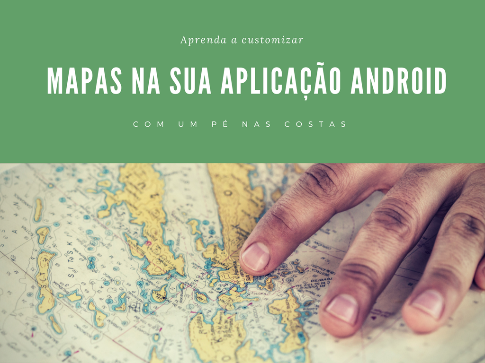
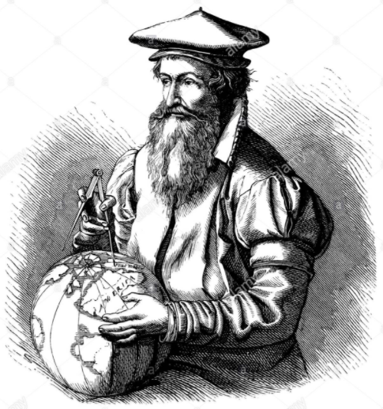
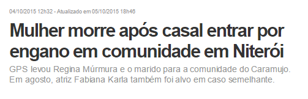
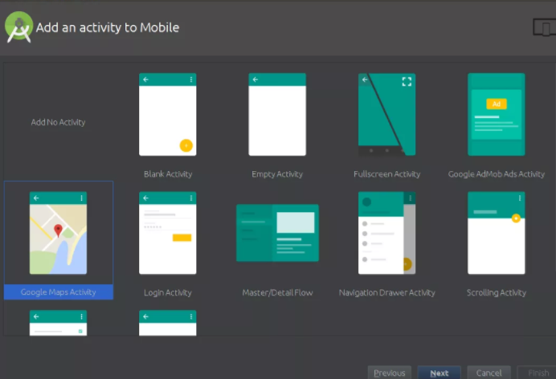
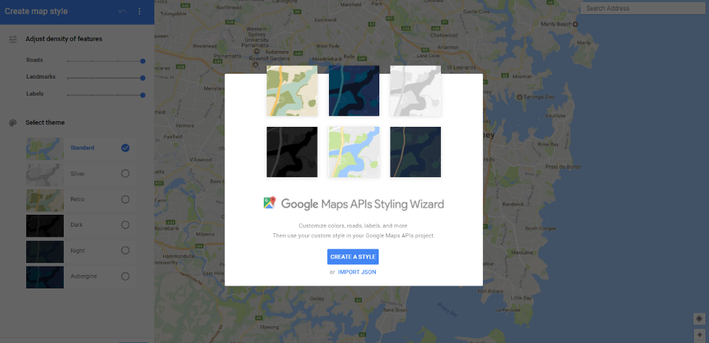
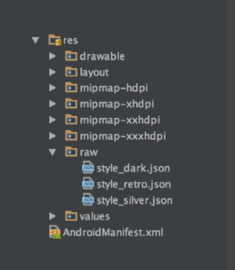
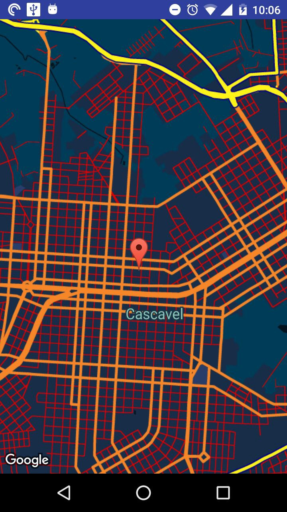

> Esse artigo é uma transcrição de uma palestra que dei no GDG Cascavel e no GDG Pato Branco, adaptada na forma de artigo. Você tem total autorização para replicar. Seguem também os slides, link do github para você baixar e brincar um pouco, assim como link do hangout que fiz sobre o assunto. Agradecimentos especiais ao [Walmyr Carvalho](https://medium.com/@walmyrcarvalho) que foi com quem vi o assunto pela primeira vez e ao [Everton Bortolini](https://twitter.com/eTonBortolini), amigo de longa data que contribui com curiosidades sobre cartografia.

Mapas, acho que existem poucas pessoas senão nenhuma que não tenha tido contato com esse tipo de ‘tecnologia’. Segundo a [wikipedia](https://en.wikipedia.org/wiki/Map), um mapa é *“uma representação simbólica enfatizando as relações entre elementos de algum espaço, como objetos, regiões ou temas.”*, ou seja, um mapa é uma representação gráfica de uma região.

Segundo o Engenheiro Cartógrafo Everton Bortolini, a [ICACI](http://icaci.org/mission/) (International Cartography Association) tem as seguintes definições para mapas e cartografia:

### Mapa

> “Um mapa é uma representação simbolizada da realidade geográfica, representando características gerais ou características selecionadas, resultante do esforço criativo da execução de escolhas de seus autores, e é projetado para uso quando as relações espaciais são de relevância principal.”

### Cartografia

> “A cartografia é a disciplina que trata da arte, ciência e tecnologia de fazer e usar mapas.”

Um dos mapas mais antigos que se tem notícia, ainda segundo Bortolini, é o [Bedolina Map](https://en.wikipedia.org/wiki/Bedolina_Map) que é um mapa feito numa pedra nos alpes italianos, sendo datado da idade do bronze. De lá para cá, a cartografia foi evoluindo e alcançando níveis altíssimos de precisão.

### Cartografia == UX

Não é errado dizer que os primeiros UX designers foram os cartógrafos da idade média, eles tinham um trabalho hercúleo de pesquisa, cálculos, levantamento de dados e se ocorresse de criarem um design ruim ou que não entregasse aquilo que seus usuários pudessem entender… bem, seria uma User experience muitas vezes literalmente desastrosa.


> Mercator, utilizando o Sketch ou o Figma da idade média.

Mas onde diretamente isto vem a ter uma intersecção com o nosso assunto de hoje? Bem, justamente a entrega de uma experiência decente com mapas em nossas aplicações pode se tornar o nosso diferencial.

É necessário se pensar além do branding quando vamos personalizar um mapa. Um mapa mal projetado, sem informações ou então com informações erradas pode custar muito para o seu usuário, as vezes [mais do que você pode imaginar](http://g1.globo.com/rio-de-janeiro/noticia/2015/10/mulher-morre-apos-entrar-por-engano-em-comunidade-em-niteroi-rj.html).


> Fonte: G1

Então bora aprender como se personaliza um mapa no android de forma simples e sem precisar perder a dignidade?

### As opções de personalização

Até pouco tempo atrás, personalizar os mapas no android demandava uma série de configurações, usar outras APIs externas, baixar libs e ficar um tempo considerável configurando. Ainda é possível utilizar alguns destes serviços e alguns deles realmente se destacaram, os principais você confere abaixo:

- [Here Maps](https://here.com/en)
- [MapBox](https://www.mapbox.com/)
- [OpenStreet Maps](https://www.openstreetmap.org/#map=5/51.500/-0.100)
- [MapZen](https://mapzen.com/)

Mas a principal opção de uso de mapas para android na maioria das aplicações ainda é a [Google Maps API](https://developers.google.com/maps/).

Até pouco tempo atrás, todos os mapas que usavam exclusivamente a Google Maps API dependiam de algum serviço externo para que fossem personalizados, mas desde a versão da Google Play Services 9.6.0 é possível editar e personalizar os mapas de forma ‘nativa’, sem a necessidade de uma biblioteca externa.

Bom, a única ajuda externa que você vai precisar é talvez o [Google Maps Styling Wizard](https://mapstyle.withgoogle.com/). A não ser que você seja muito bom em criar JSON.

### Criando a nossa aplicação

>Caso você não queira passar por tudo isso, você pode clonar um projeto demo que fiz lá no meu Github, os passos são praticamentes os mesmos.

#### 1 — Crie um projeto novo no Android Studio com o template de mapas



#### 2 — Abra o Google Maps Styling Wizard e personalize o mapa

É sério, existem algumas opções prontas de mapas customizados, mas eu te indico entrar nele e começar a explorar, você consegue desde aplicar a densidade de informações até mesmo personalizar a cor de elementos de interesse deste mapa.



#### 3 — Baixe o arquivo JSON do Wizard e reserve na geladeira.

O arquivo em média terá uns 5kb e aproximadamente 300 linhas, dependendo de como você personalizar.

#### 4 — Configure a sua chave de API no AndroidManifest.xml

Sim, apesar de gerar um aplicativo preparado para receber dados do Google Maps a nossa parte a gente tem que fazer, ir lá no [Google Developers Console](https://console.developers.google.com/?pli=1), e requisitar a chave de API do Google Maps. Isto feito, é só colocar no AndroidManifest.xml e seguir o baile.

### Personalizando o nosso mapa com o tema criado

Agora vem a parte legal e extremamente simples da nossa implementação. É onde a nossa aplicação deixará de ter a cara de Google Maps e passará a ter o estilo que criamos lá no wizard anteriormente.

#### 1 — Primeiro de tudo, crie uma pasta raw

Lá dentro de sua pasta res crie uma nova pasta vazia chamada *raw*. Dentro desta pasta raw coloque o arquivo JSON que você personalizou e baixou no Map Wizard.



> A estrutura vai ficar mais ou menos como esta

#### 2 — Sete a sua view na activity de forma correta

É importante que a sua view esteja corretamente setada tanto no .java (ou Kotlin) quanto no seu arquivo de layout XML.

No java você seta assim:

```java
public class MapsActivity extends FragmentActivity implements OnMapReadyCallback {

    private GoogleMap mMap;

    private static final String TAG = MapsActivity.class.getSimpleName();

    @Override
    protected void onCreate(Bundle savedInstanceState) {
        super.onCreate(savedInstanceState);
        setContentView(R.layout.activity_maps);

        SupportMapFragment mapFragment = (SupportMapFragment) getSupportFragmentManager()
                .findFragmentById(R.id.map);
        mapFragment.getMapAsync(this);
    }

```

E no XML:

```xml
    <fragment xmlns:android="http://schemas.android.com/apk/res/android"
        xmlns:tools="http://schemas.android.com/tools"
        xmlns:map="http://schemas.android.com/apk/res-auto"
        android:layout_width="match_parent"
        android:layout_height="match_parent"
        android:id="@+id/map"
        tools:context="com.custommapsgdgcvel.custommapsgdgcvel.MapsActivity"
        android:name="com.google.android.gms.maps.SupportMapFragment"/>
```

### 3 — Sete as coordenadas do seu ponto e chame o estilo do mapa

Neste caso, eu criei os dados de forma fixa. Setei as coordenadas de Cascavel — PR e deixei num zoom de câmera do mapa que desse para visualizar até mesmo as BRs que cercam a cidade.

No caso, ficou assim:

> LatLng cascavel = new LatLng(-24.952327, -53.461767);

E no java:

```java
    @Override
        public void onMapReady(GoogleMap googleMap) {

            try {
                boolean success = googleMap.setMapStyle(
                        MapStyleOptions.loadRawResourceStyle(
                                this, R.raw.cascavel_style));

                if (!success) {
                    Log.e(TAG, "Falhou ao aplicar estilo.");
                }
            } catch (Resources.NotFoundException e) {
                Log.e(TAG, "Estilo não encontrado. Error: ", e);
            }
            mMap = googleMap;
            LatLng cascavel = new LatLng(-24.952327, -53.461767);
            mMap.addMarker(new MarkerOptions().position(cascavel).title("Cascavel"));
            mMap.moveCamera(CameraUpdateFactory.newLatLng(cascavel));
            mMap.animateCamera(CameraUpdateFactory.zoomTo(13.0f));
        }
    }
```

Note o primeiramente que a API do maps provê uma classe chamada **onMapReady**, no caso, ela irá executar o código assim que o mapa estiver carregado em nossa view.

Para carregar o estilo eu abri um *try-catch* onde seto a situação de aplicação do estilo. No caso, se o estilo for carregado, eu apenas seto ele no meu mapa, senão, eu informo o erro que ocorreu no console. As configurações e chamadas seguintes são relativas ao que já falamos de ponto no mapa e zoom.

#### 4 — Rode a aplicação
Se tudo ocorrer bem, pronto — você tem uma aplicação demonstrativa com um mapa personalizad, agora você pode agregar mais valor ainda ao seu aplicativo com um mapa que possua a sua branding e um design único como os grandes players.

> [ UPDATE ] Se você baixar o projeto do GitHub ele vai resultar em algo mais ou menos assim:



Caso você se interesse, este post é também uma palestra que fiz, os slides podem ser vistos [aqui](https://speakerdeck.com/wmitrut/customizacao-de-mapas-no-android).


E um hangout que fizemos com o #GDGPATOBRANCO no dia 16 de Março de 2017 pode ser conferido aqui:

<iframe width="560" height="315" src="https://www.youtube.com/embed/-ey-iOdTX58" frameborder="0" allow="accelerometer; autoplay; encrypted-media; gyroscope; picture-in-picture" allowfullscreen></iframe>