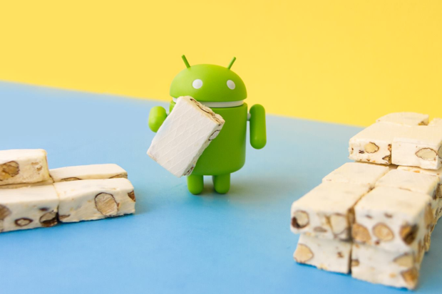

Está passando mais um carro da devlândia na sua rua com um blog cheio de coisa legal que vem por aí falando de desenvolvimento, UX, UI Design… PWA e muito mais!

Já me acompanha do <a target="_blank" href="http://imasters.com.br/perfil/wellingtonmitrut/">iMasters</a>? Do <a target="_blank" href="http://www.uolhost.uol.com.br/academia/noticias/tecnologia/2016/06/20/4-coisas-a-se-considerar-para-uma-boa-ux-em-android.html#rmcl">UOLHost</a>? Mais que ótimo, pode acompanhar nesses lugares… mas aqui você vai ter os textos em primeira mão e alguns exclusivos! É a Comic-Con do desenvolvimento!

Vou falar merda, vou acertar muita coisa também e você é livre para compartilhar e comentar nestes textos. Quer usar um trecho? Pois bem, existe uma condição: Licença de uso <a target="_blank" href="https://pt.wikipedia.org/wiki/Beerware">BEERWARE</a>.

 --------------------------------------------
    "A LICENÇA BEERWARE ou A LICENÇA DA CERVEJA" (Revisão 43 em Português Brasil):
    <wellingtonmitrut@gmail.com> escreveu este arquivo. Enquanto esta nota 
    estiver na coisa você poderá utilizá-la como quiser. Caso nos encontremos 
    algum dia e você me reconheça e ache que esta coisa tem algum valor, 
    você poderá me pagar uma cerveja em retribuição (ou mais de uma)."

    att.
    Wellington Mitrut
-------------------------------------------

Então, em todo caso, sinta-se a vontade só não quebre nada! Te aguardo nos próximos textos!

Pra você não sair sem nada hoje, eis esse gato tocando metal:

<iframe width="560" height="315" src="https://www.youtube.com/embed/yWcak9tZupc" frameborder="0" allow="accelerometer; autoplay; encrypted-media; gyroscope; picture-in-picture" allowfullscreen></iframe>

