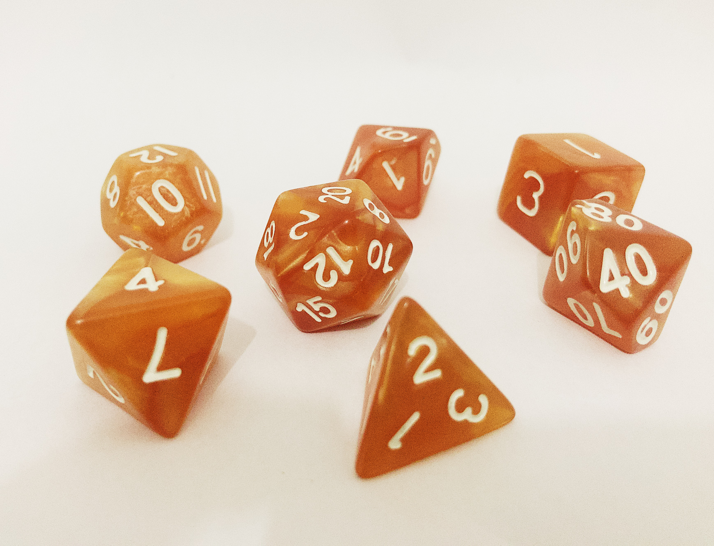
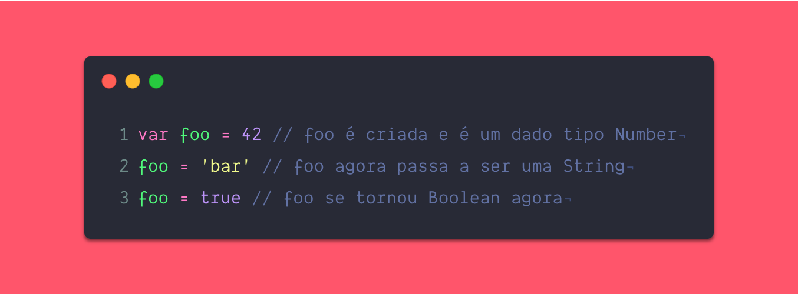
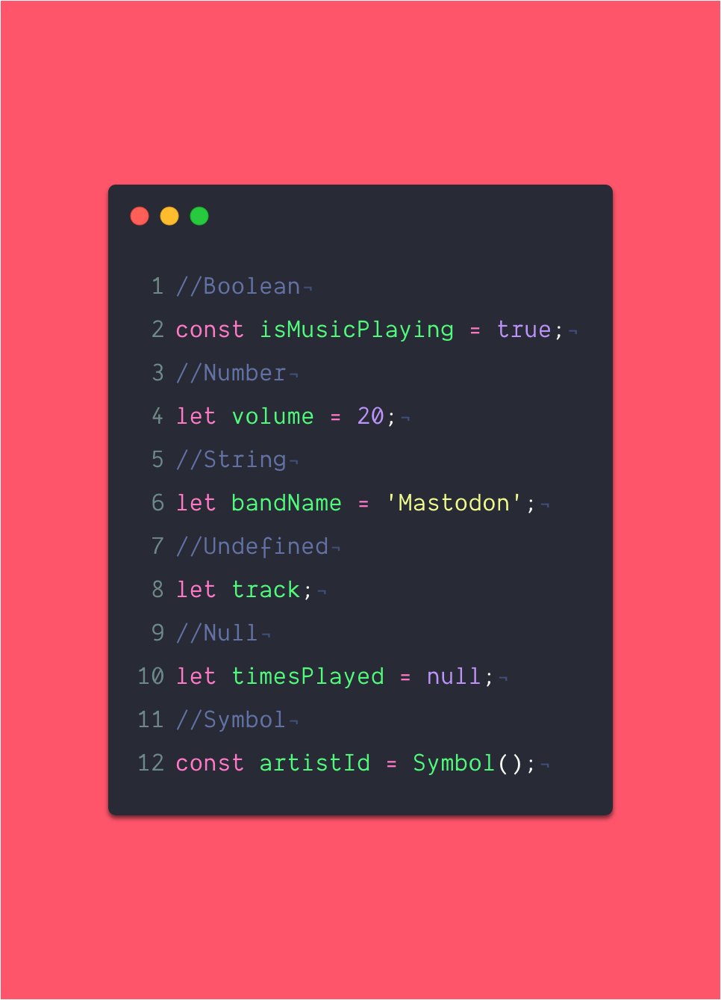
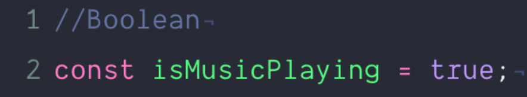
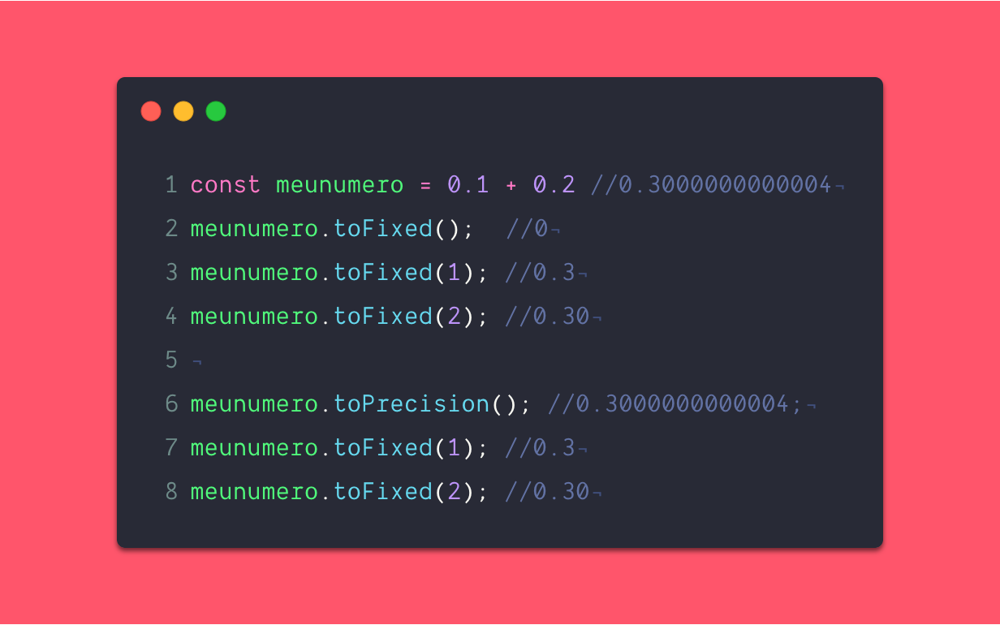
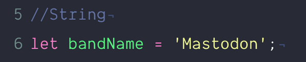

> É de tipos de dados mas não é necessariamente ESSE tipo de dados que vamos falar hoje - Acervo Pessoal

Primeiro coloca esse álbum do Elder que saiu final de Abril e ta demais

<iframe src="https://open.spotify.com/embed/album/78OcH9fP0a6iyfaCgo4qUN" width="300" height="120" frameborder="0" allowtransparency="true" allow="encrypted-media"></iframe>

Fala galera, decidi utilizar a quarentena (e o desemprego) pra criar alguns conteúdos - a começar por JS mais purão básico, pra você que nunca teve contato com programação e/ou  ta iniciando na faculdade, pra quem ta aí batendo cabeça pra entender como tudo funciona e até alguns conteúdos mais 'divertidos' pra quem já entende um pouco. 

Esse tempo de quarentena me fez relembrar um pouco de como foi meu começo e de como as coisas não eram claras por algum motivo - eu não era um mal aluno, tirava boas notas na faculdade, mas não necessariamente estava aprendendo no começo.

Eu vou tentar criar e abstrair estes conceitos da mesma maneira que eu gostaria que tivesse sido ensinado pra mim lá nos idos de 2011 quando iniciei a faculdade e meu entendimento de programação era talvez até menor que o seu.

Eu não sei quanto tempo isso vai levar pra acabar, nem quantos posts eu vou escrever pra englobar tudo que imagino ser o 'básico'. Se você estiver procurando algo mais avançado ou quer dar um mergulho mais profundo sem me esperar, eu indico o curso [JAVASCRIPT NINJA](https://www.udemy.com/course/curso-javascript-ninja/) do [Fernando Daciuk](https://twitter.com/fdaciuk) e o livro [Estruturas De Dados E Algoritmos Com Javascript](https://www.amazon.com/Estruturas-Dados-Algoritmos-Com-Javascript/dp/8575226932) da [Loiane.](https://twitter.com/loiane) Ambos são excelentes profissionais e amigos que tenho profundo respeito - os conteúdos deles já estão mais que revisados e consolidados, então pode adquiri-los sem medo.

A ideia principal da série é criar um conteúdo fácil e de linguagem acessível a qualquer um que tenha um navegador e que possa ler este conteúdo.

## Um pouco de história

O Javascript, embora tenha mais idade que alguns leitores, é uma linguagem de programação relativamente jovem, lá em 1994 muita coisa acontecia - Kurt Cobain morria, o Brasil conquistava o tetra, Mandela era eleito, Tom Hanks ganhava Oscar com Forrest Gump e o Brendan Eich criava o JS.

> Photo by FIFA

É impraticável pensar a internet de hoje sem o JS, muita gente pode tentar reproduzir com outras linguagens, mas a base de tudo é o JS. A internet, o conceito de site, de aplicações, tudo isso veio antes, mas o MUNDO como conhecemos hoje seria consideravelmente sem o JS.

O javascript é uma linguagem multiparadigma, ou seja, existem muitas formas distintas de se trabalhar com ela: orientada a eventos, imperativa, funcional e o diabo a 4 - mas isto é algo que podemos tratar num post (ou mais) futuro.

Como toda linguagem de programação, o Javascript tem seus tipos de dados que pode ser divididos em dois 'grupos', Objects e os chamados de PRIMITIVES - só que pra entende-los antes vamos entender como funciona a tipagem em JS.

## Tipagem dinâmica

Tipagem é o ato de você atribuir a um elemento abstrato um formato de dados. Se dizemos que numa equação x = 1, logo, x é um elemento do tipo *número.* Entende onde quero chegar? Ainda não se trata de JS, mas entender este conceito é essencial.

O JS permite você atribuir diversos tipos de valor a uma variável sem que isso seja fixado, uma variável pode em um momento ser do *tipo a* e logo depois posso atribuir um *tipo b*  a ela. Isso pode ser bom como pode ser ruim. Vejamos abaixo como isso funciona:

> Exêmplo de tipagem dinâmica

Essa tipagem dinâmica pode parecer um tanto confusa e algumas pessoas realmente não gostam, criam coisas como o Typescript e o Flow mas com o tempo você irá se acostumar e entender um pouco mais. Existem momentos em que ambas as abordagens podem ser úteis e tem seus fãs e detratores, mas no final é tudo JS.

<blockquote class="twitter-tweet">
Toda vez que você diz que Typescript é uma linguagem, um panda morre.... Não mate os pandas =/ <a href="https://t.co/5veqRfkUU6">pic.twitter.com/5veqRfkUU6</a>
&mdash; Willian Justen (@Willian_justen) <a href="https://twitter.com/Willian_justen/status/1259929107032399872?ref_src=twsrc%5Etfw">May 11, 2020</a></blockquote> 

Isto posto, vemos novos nomes ali, Number, Boolean e String. Estes são os tipos primitivos do JS.

## Primitives

No exemplo abaixo temos os principais tipos em JS e uma atribuição de exemplo pra cada:

> Primitives em JS

Para um melhor entendimento decidi elencar do mais simples até o mais complexo de explicar, então vamos lá:

### Boolean

Se você já teve alguma noção básica de computação sabe que computadores trabalham lá em sua camada mais simples com 0 e 1, é o sistema binário. Basicamente no sistema binário 1 quer dizer LIGADO e 0 quer dizer DESLIGADO - imagine uma lâmpada, um único LED, ele tem apenas 2 estados: ligado e desligado. A combinação de bits ativos e inativos que gera os cálculos complexos e a computação civil como um todo. 

Agora que você entendeu este conceito, no javascript  podemos trazer esse mesmo sistema lógico para os dados de tipo boolean, algo é (TRUE) ou não é (FALSE).

Deste modo, no nosso exemplo acima, eu digo para minha variável isMusicPlaying que ela é TRUE, que é verdadeira, que sim - há música tocando.

> Exêmplo de Boolean

Um exemplo de uso? Imagine que justamente criamos um player de música tal qual o Spotify e queremos saber se uma música está sendo tocada, no caso, implementamos toda uma estrutura que irá no final resultar em atribuir a isMusicPlaying o valor true ou false para assim fazermos outras funções e implementações do nosso player.

### Number

Number é justamente um número. 

Eu sei o que você pensou:

> "Nossa, gênio, como eu não havia pensado nisso, alguém da um desses prêmio fancy pro rei da programação aqui!"

Mas calma lá, diferente de algumas linguagens de programação, JS não precisa de um tipo específico para inteiros, todo número é um number. Todo número inteiro, negativo, positivo, de ponto flutuante (os lembra dos números racionais? Achou que nunca ia utiliza-los né).

Então desde -0.243423415 ao 3 estão compreendidos neste tipo.

PORÉM, uma coisa importante é que as vezes o JS é meio doido e pode ter seus problemas. E é aqui que eu apresento a vocês um problema clássico do tipo number em JS:

> Exêmplo de Number

Sim.

**0.1 + 0.2 = 0.3**  - *mas nem sempre.*

Pra isso a gente tem que usar artifícios como o método toFixed() e o toPrecision() e isso serve para outros casos também, como arredondar um dado importante -  mas que fique claro, você só vai usar isto pra arredondar se o seu caso for este, se esse for o tipo de precisão que você precisa.

### String

A maneira mais simples mas não a mais correta de explicar o do que uma *String* se trata é esta: **é um texto.**

Agora, se quisermos realmente nos aprofundar, o conceito pode ser melhor definido como uma sequencia de caracteres. Você pode representar uma string com aspas simples ('') ou com aspas duplas("").

> Exêmplo de String

É possível 'navegar' em uma string utilizando programação. por exemplo, eu posso recuperar o valor de um caractere com base no índice que ele ocupa nela. Eu consigo, via linguagem de programação saber qual é a posição ( índice ) de uma letra dentro da string, sabendo que os índices em JS começam com 0, na nossa variável bandName, o valor do índice 2 é *s* e assim por diante.

Diferente de linguagens como C, strings em JS são imutáveis. Isto significa que: uma vez criada a string, não é possível modificá-la. Entretanto, ainda é possível criar outra string baseada em um operador na string original. Por exemplo:

- Uma substring da original a partir de letras individuais ou usando `String.substr()`.
- Uma concatenação de duas strings usando o operador (`+`) ou `String.concat()`.

### Undefined

Undefined é algo que não teve seu valor definido, algo sem um valor, **não é nulo,** não confunda. O undefined existe mas ainda não teve seu valor definido. 

### Null

Nulo por sua vez é um valor inexistente. Em ciência da computação, um valor nulo representa uma referencia que aponta, geralmente de maneira intencional, para um objeto ou endereço de memória inválido ou inexistente. O significado do valor nulo varia entre as implementações das linguagens.

Imagine sua aplicação como se fosse uma caixa, enquanto undefined é algo que ainda não recebeu um valor mas está la dentro,  já o nulo não existe nesse universo da casa.

> Homem Formiga

Se as primitivas fossem Vingadores, null seria o Homem-Formiga quando ficou no reino quântico. Ele é um valor que sabemos que está em algum lugar mas também sabemos que ele não existe naquele universo da Guerra Infinita.

### Symbols

Símbolos são relativamente novos em JS e confesso serem um tanto mais complexos de explicar que os anteriores. Mas é um tipo também imutável. Na maioria das vezes é possível utilizar-se uma string ou um number no lugar do Symbol, com a diferença que se precisarmos definir um valor globalmente.  Futuramente quando abordarmos funções e objetos isto ficará mais claro.

Com isto posto, finalizamos este primeiro post sobre o Basicão do Javascript, semana que vem iremos abordar OBJECTS.

## **Links**

Não por menos, abaixo seguem alguns links, como sempre:

▶ 🔗 [A Capiconf Online ta rolando essa semana!](https://capiconf.com/online)

----------

## **E mais**

▶ FIQUE EM CASA, COMPRE LOCAL

▶ Você não é obrigado a ser produtivo neste momento, cuide dos seus

▶ Leia, e leia muito se possível. Mas também se respeite e descanse.