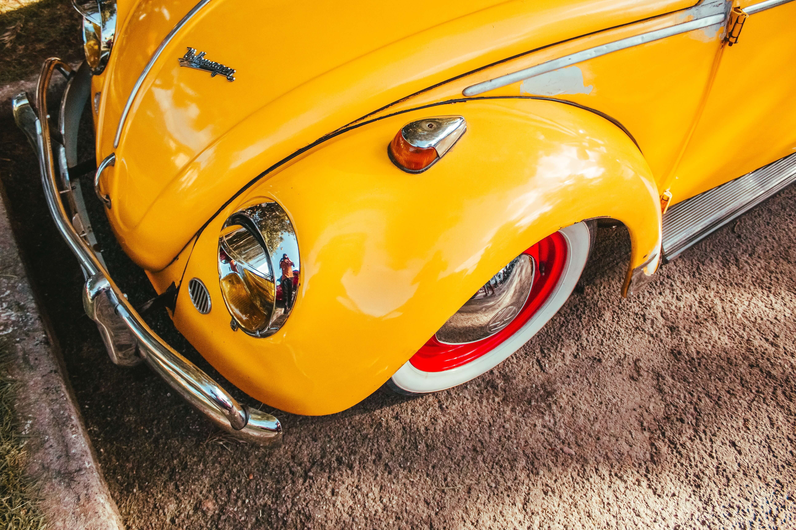
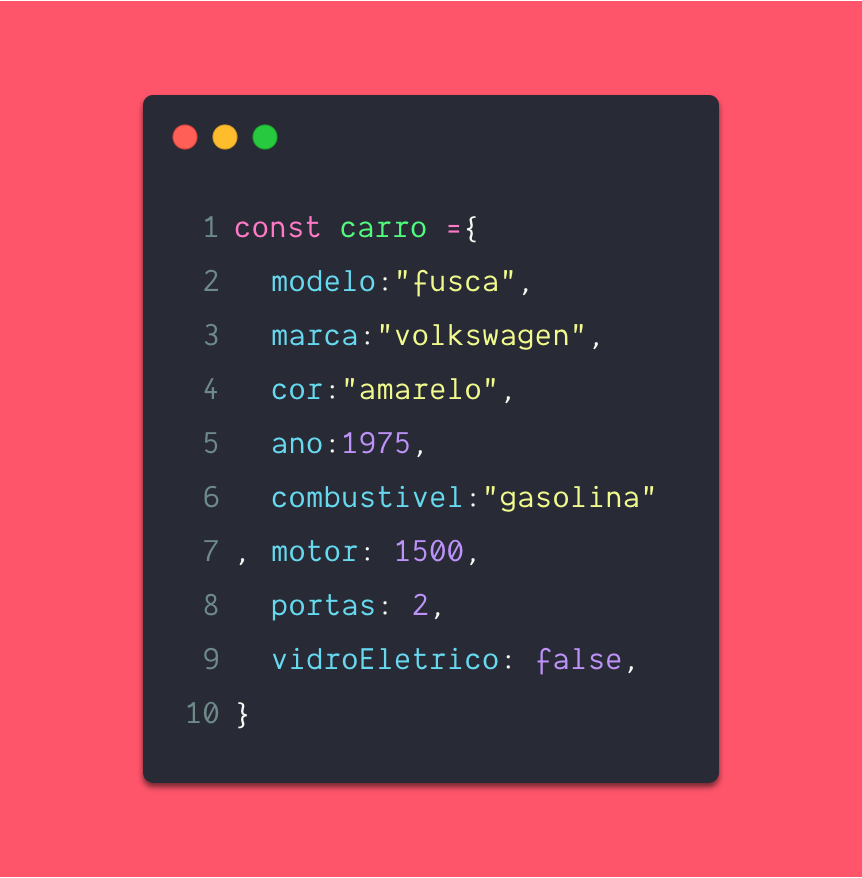
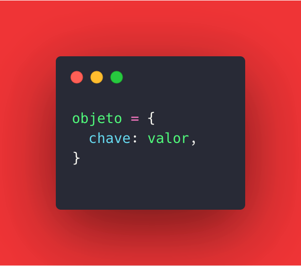
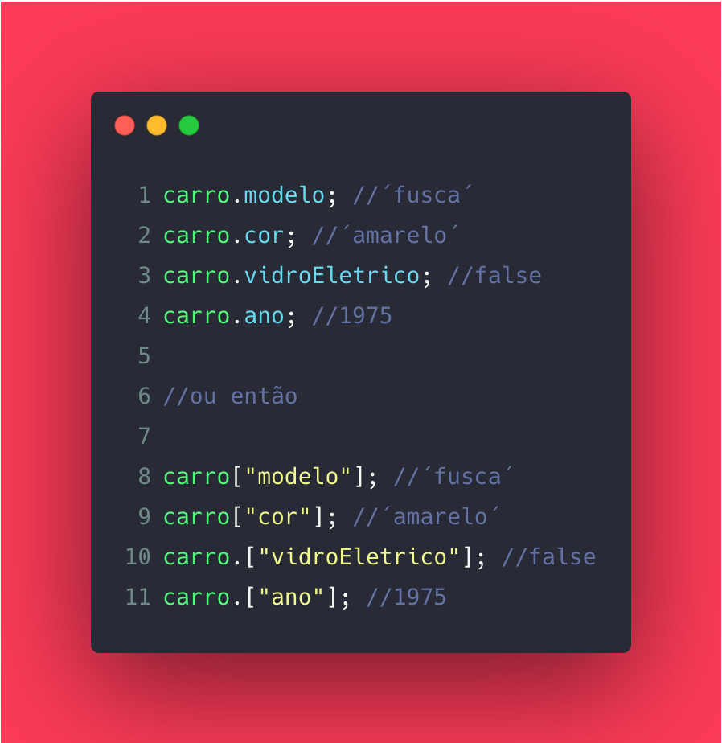
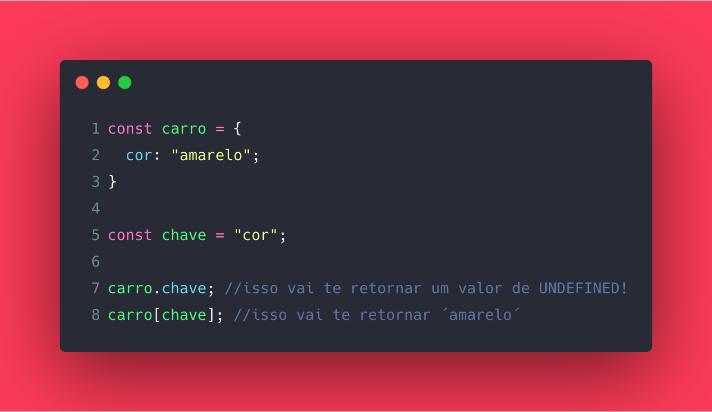
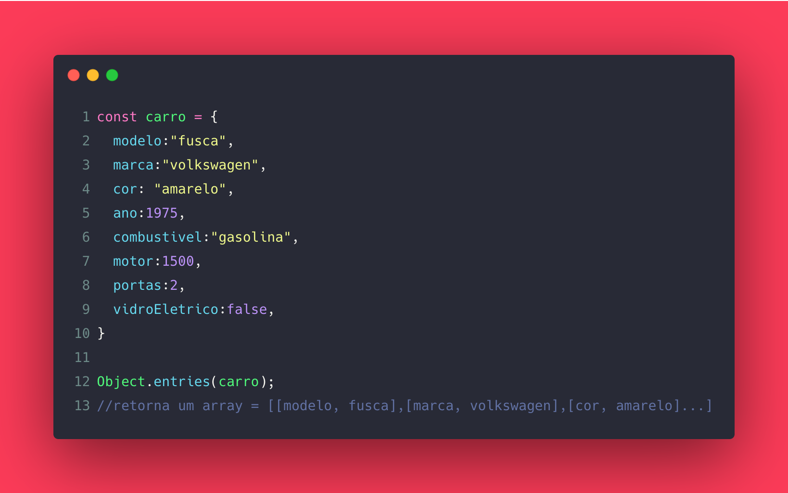
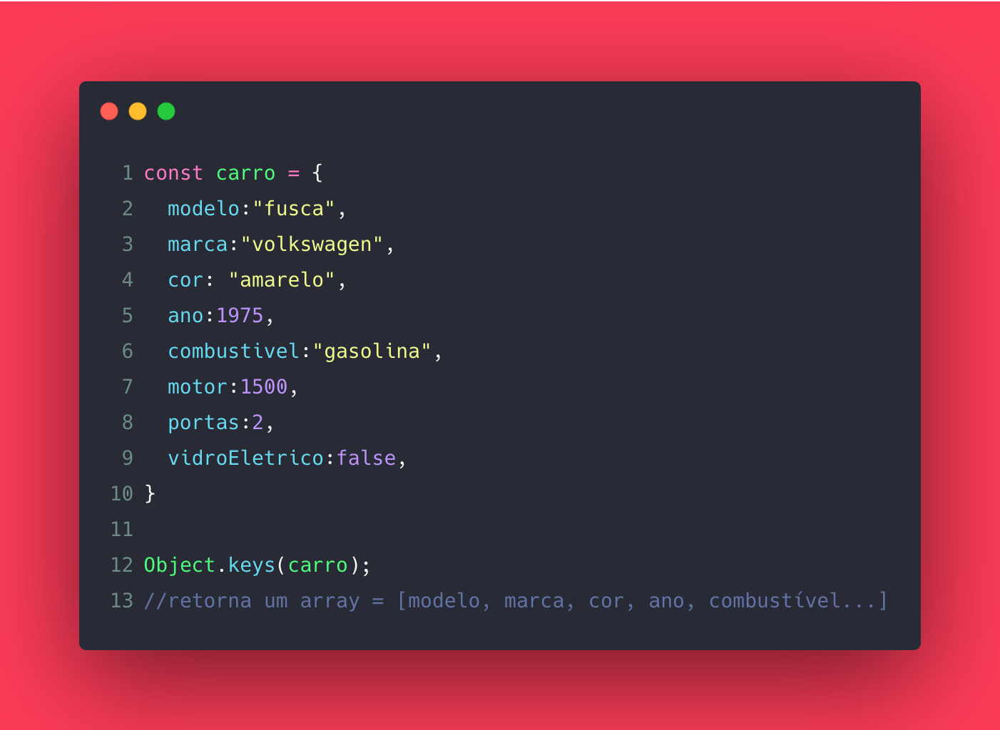
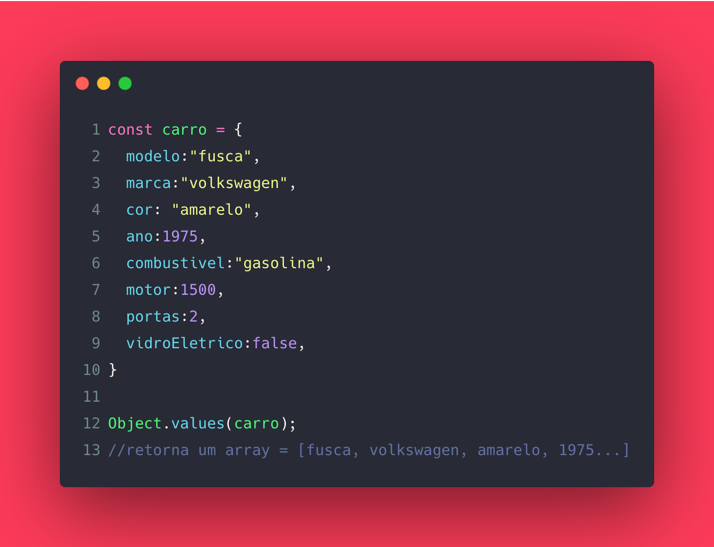
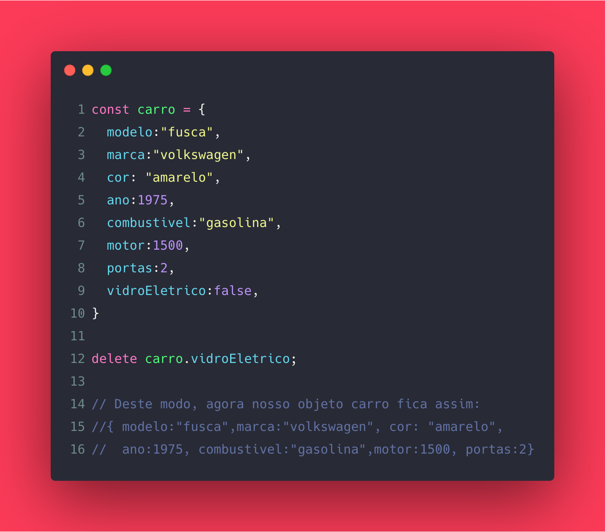

> Photo by Moises Alex - [@arnok](https://unsplash.com/@arnok) peguei lá no Unsplash

Semana passada (ou alguns dias mais) eu falei aqui sobre os primitivos básicos de JS, se você não leu, é essencial que dê uma conferida antes de prosseguir nesse artigo pois lá cobrimos as propriedades essenciais para começar a entender estruturas de dados em JS, você pode acessar clicando no link abaixo.

[#001 Basicão do JS: Tipos de dados em Javascript - parte 1: Primitivos](https://blog.wmitrut.co/basicao-js-001-primitives/)

Quero começar este post agradecendo o [Leonardo Saraiva](https://twitter.com/vyper), que enviou pull request corrigindo algumas coisas do último texto, se você ver algum erro aqui, faça como ele e manda um PR lá!

Agradecimento feito, vamos manter as tradições e colocar pra tocar o novo álbum do Caligula´s Horse.

<iframe src="https://open.spotify.com/embed/album/1BvdqjCZOvhxZU8HZmqRrA" width="300" height="180" frameborder="0" allowtransparency="true" allow="encrypted-media"></iframe>

### Objetos

Se você está começando agora e não tem noção alguma do que seja, talvez você olhe e pense: <i>"Bom, objetos são coisas que estão ao nosso redor e inanimadas"</i>. De certo modo você está certo, a abstração pro conceito de objeto em programação passa por esse caminho.

Na sua mão muito provavelmente você está segurando um objeto enquanto lê esse artigo, e o que esse objeto tem? Atributos: Marca, cor, tamanho, memória, versão do sistema e assim por diante.

### O fusquinha amarelo

Eu sempre gosto de contar uma historinha nos posts e esse não poderia ser diferente, vamos trazer pro mundo real. Até 2016 eu era proprietário de um belo, beberrão, barulhento e confortável fusca amarelo 1975, motor 1500, movido a gasolina - semelhante ao fusca que ilustra o início deste post.

Tive muitas aventuras com este fusca e também já tive que empurrá-lo (e não foram poucas vezes) abaixo de chuva.

<blockquote class="instagram-media" data-instgrm-captioned data-instgrm-permalink="https://www.instagram.com/p/iHg379lfFA/?utm_source=ig_embed&amp;utm_campaign=loading" data-instgrm-version="12" style=" background:#FFF; border:0; border-radius:3px; box-shadow:0 0 1px 0 rgba(0,0,0,0.5),0 1px 10px 0 rgba(0,0,0,0.15); margin: 1px; max-width:540px; min-width:326px; padding:0; width:99.375%; width:-webkit-calc(100% - 2px); width:calc(100% - 2px);">
 <a href="https://www.instagram.com/p/iHg379lfFA/?utm_source=ig_embed&amp;utm_campaign=loading" style=" background:#FFFFFF; line-height:0; padding:0 0; text-align:center; text-decoration:none; width:100%;" target="_blank"> 
 

 
 

 

 
<svg width="50px" height="50px" viewBox="0 0 60 60" version="1.1" xmlns="https://www.w3.org/2000/svg" xmlns:xlink="https://www.w3.org/1999/xlink"><g stroke="none" stroke-width="1" fill="none" fill-rule="evenodd"><g transform="translate(-511.000000, -20.000000)" fill="#000000"><g><path d="M556.869,30.41 C554.814,30.41 553.148,32.076 553.148,34.131 C553.148,36.186 554.814,37.852 556.869,37.852 C558.924,37.852 560.59,36.186 560.59,34.131 C560.59,32.076 558.924,30.41 556.869,30.41 M541,60.657 C535.114,60.657 530.342,55.887 530.342,50 C530.342,44.114 535.114,39.342 541,39.342 C546.887,39.342 551.658,44.114 551.658,50 C551.658,55.887 546.887,60.657 541,60.657 M541,33.886 C532.1,33.886 524.886,41.1 524.886,50 C524.886,58.899 532.1,66.113 541,66.113 C549.9,66.113 557.115,58.899 557.115,50 C557.115,41.1 549.9,33.886 541,33.886 M565.378,62.101 C565.244,65.022 564.756,66.606 564.346,67.663 C563.803,69.06 563.154,70.057 562.106,71.106 C561.058,72.155 560.06,72.803 558.662,73.347 C557.607,73.757 556.021,74.244 553.102,74.378 C549.944,74.521 548.997,74.552 541,74.552 C533.003,74.552 532.056,74.521 528.898,74.378 C525.979,74.244 524.393,73.757 523.338,73.347 C521.94,72.803 520.942,72.155 519.894,71.106 C518.846,70.057 518.197,69.06 517.654,67.663 C517.244,66.606 516.755,65.022 516.623,62.101 C516.479,58.943 516.448,57.996 516.448,50 C516.448,42.003 516.479,41.056 516.623,37.899 C516.755,34.978 517.244,33.391 517.654,32.338 C518.197,30.938 518.846,29.942 519.894,28.894 C520.942,27.846 521.94,27.196 523.338,26.654 C524.393,26.244 525.979,25.756 528.898,25.623 C532.057,25.479 533.004,25.448 541,25.448 C548.997,25.448 549.943,25.479 553.102,25.623 C556.021,25.756 557.607,26.244 558.662,26.654 C560.06,27.196 561.058,27.846 562.106,28.894 C563.154,29.942 563.803,30.938 564.346,32.338 C564.756,33.391 565.244,34.978 565.378,37.899 C565.522,41.056 565.552,42.003 565.552,50 C565.552,57.996 565.522,58.943 565.378,62.101 M570.82,37.631 C570.674,34.438 570.167,32.258 569.425,30.349 C568.659,28.377 567.633,26.702 565.965,25.035 C564.297,23.368 562.623,22.342 560.652,21.575 C558.743,20.834 556.562,20.326 553.369,20.18 C550.169,20.033 549.148,20 541,20 C532.853,20 531.831,20.033 528.631,20.18 C525.438,20.326 523.257,20.834 521.349,21.575 C519.376,22.342 517.703,23.368 516.035,25.035 C514.368,26.702 513.342,28.377 512.574,30.349 C511.834,32.258 511.326,34.438 511.181,37.631 C511.035,40.831 511,41.851 511,50 C511,58.147 511.035,59.17 511.181,62.369 C511.326,65.562 511.834,67.743 512.574,69.651 C513.342,71.625 514.368,73.296 516.035,74.965 C517.703,76.634 519.376,77.658 521.349,78.425 C523.257,79.167 525.438,79.673 528.631,79.82 C531.831,79.965 532.853,80.001 541,80.001 C549.148,80.001 550.169,79.965 553.369,79.82 C556.562,79.673 558.743,79.167 560.652,78.425 C562.623,77.658 564.297,76.634 565.965,74.965 C567.633,73.296 568.659,71.625 569.425,69.651 C570.167,67.743 570.674,65.562 570.82,62.369 C570.966,59.17 571,58.147 571,50 C571,41.851 570.966,40.831 570.82,37.631"></path></g></g></g></svg>

 
 Ver essa foto no Instagram

 

 

 

 

 

 

 

 

 

</a> 
 <a href="https://www.instagram.com/p/iHg379lfFA/?utm_source=ig_embed&amp;utm_campaign=loading" style=" color:#000; font-family:Arial,sans-serif; font-size:14px; font-style:normal; font-weight:normal; line-height:17px; text-decoration:none; word-wrap:break-word;" target="_blank">Ta lustroso o bicho!</a>
 
Uma publicação compartilhada por <a href="https://www.instagram.com/wmitrut/?utm_source=ig_embed&amp;utm_campaign=loading" style=" color:#c9c8cd; font-family:Arial,sans-serif; font-size:14px; font-style:normal; font-weight:normal; line-height:17px;" target="_blank"> Wellington Mitrut</a> (@wmitrut) em <time style=" font-family:Arial,sans-serif; font-size:14px; line-height:17px;" datetime="2013-12-19T20:56:22+00:00">19 de Dez, 2013 às 12:56 PST</time>

</blockquote> 

> Era esse o bonito

Pois bem, se você percebeu, o primeiro parágrafo desta sessão descrevia superficialmente o fusca, não seria necessário colocar fotos dele aqui pra entender o conceito mas sou da política de que quanto mais mastigada a explicação, melhor.

### Objetos em JS

Em outras palavras, o fusca(e qualquer outro carro) pode ser abstraído como um OBJETO. Não só do ponto de vista físico mas do ponto de vista de programação, quer ver?

Só que no nosso caso, ao invés de atributos físicos, temos atributos como os primitivos que citamos no artigo anterior: strings, booleans e numbers. Isto posto, podemos dizer que um objeto é uma _coleção_ de valores. Uma notação de chave (key) e valor (value).

Simples né? Então tendo um objeto _carro_ eu consigo acessar seus valores como abaixo

### Notações

"Então, quer dizer que se eu usar . e [ ] chamando a propriedade é a mesma coisa?"

_Sim. Mas nem sempre._ Se acostume que essa é a máxima de JS.

Na linha 7, o valor vai voltar undefined por que não existe ´chave´ em ´carro´ e na linha 8, estamos atribuindo o valor de chave à interpolação quando chamamos o objeto carro, sendo o valor de chave ´cor´, então o JS vai procurar um atributo ´cor´ dentro do objeto ´carro´ - retornando assim o valor AMARELO.

### Manipulando objetos

Como você pode notar, é fácil demais acessar dados em JS, dessa forma podemos ler e brincar um pouco com as propriedades que existem

Vamos pegar o nosso fusquinha acima e descobrir os métodos do Javascript.

- #### Entries

Com o método entries, ao passar nosso objeto, ele irá retornar um array com todos o dados, ou seja, você pode fragmentar seu objeto em vários pequenos objetos que possuem a chave e o valor do objeto original separados.

- #### Keys

Com o Keys, você pega justamente as CHAVES do objeto, ou seja, os atributos que compõem nosso objeto.

- #### Values

Values, por sua vez retornará os VALORES atribuídos a estas chaves anteriormente citadas.

- #### Delete

Com o método delete é possível se deletar o valor de um objeto.

- #### Assign

Se com delete eu posso deletar atributos, com assign eu consigo adicionar novos atributos:

> Sim, eu vendi o fusca - sdds.

### Arrays e Objetos

Arrays merecem um (ou mais) posts exclusivos para eles e é um dos assuntos que mais estou ansioso para falar aqui. Acompanhe os posts, compartilhe e chame os amigos pra participar. Para o próximo post da série estou planejando falar sobre VARIÁVEIS.

## **Links**

Não por menos, abaixo seguem alguns links, como sempre:

▶ 🔗 O meu amigo [Willian Justen](https://twitter.com/Willian_justen) ta fazendo uma série de vídeos sobre [Typescript](https://www.youtube.com/watch?v=mRixno_uE2o&list=PLlAbYrWSYTiPanrzauGa7vMuve7_vnXG_)

▶ 🔗 Se você é da região de Curitiba ou São Paulo e tá desempregado, a galera do Boticário ta contratando devs:

## <blockquote class="twitter-tweet">
Vagas citadas pelo <a href="https://twitter.com/fabiorogeriosj?ref_src=twsrc%5Etfw">@fabiorogeriosj</a> para SP e Curitiba:  👉Front End Developer <a href="https://t.co/Ta7Hx3mKrW">https://t.co/Ta7Hx3mKrW</a> 👉Back End Developer <a href="https://t.co/kIa9O5YMZy">https://t.co/kIa9O5YMZy</a> 👉Back End Developer Sr. (Integração)<a href="https://t.co/B4RzIT84Ju">https://t.co/B4RzIT84Ju</a>  Por favor compartilhe com RT para q essas vagas cheguem a mais pessoas
&mdash; Senhora Capivara (@capiconf) <a href="https://twitter.com/capiconf/status/1263164088634523649?ref_src=twsrc%5Etfw">May 20, 2020</a></blockquote> 

▶ 🔗Acompanhe as lives do [POKEMÃO](https://www.twitch.tv/pokemaobr)!

## **E mais**

▶ FIQUE EM CASA, COMPRE LOCAL, LAVE A MÃO E USE MÁSCARA.

▶ Você não é obrigado a ser produtivo neste momento, cuide dos seus

▶ Leia, e leia muito se possível. Mas também se respeite e descanse.

