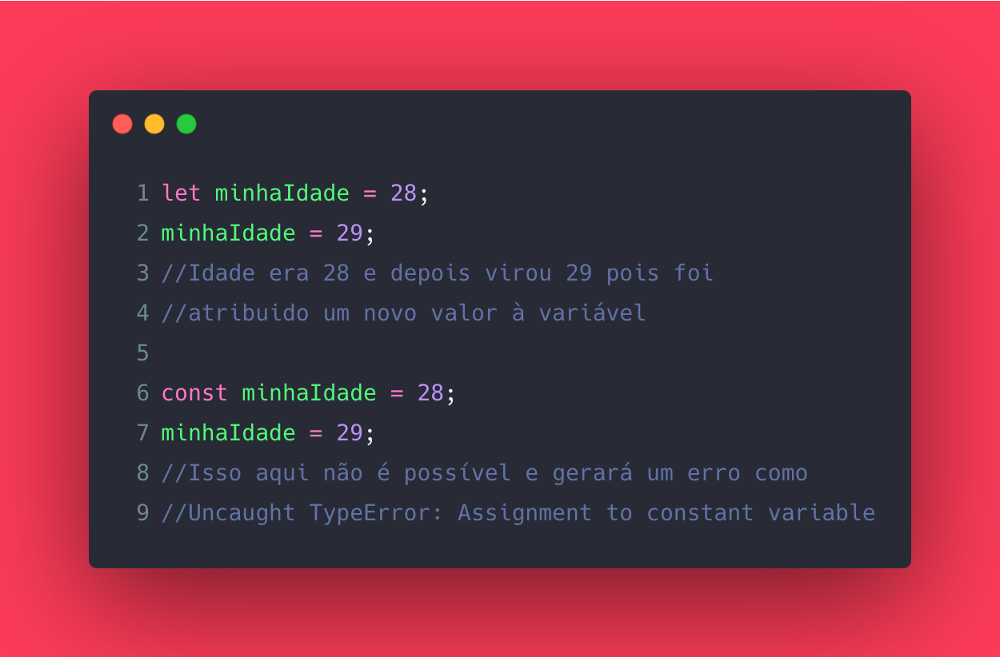
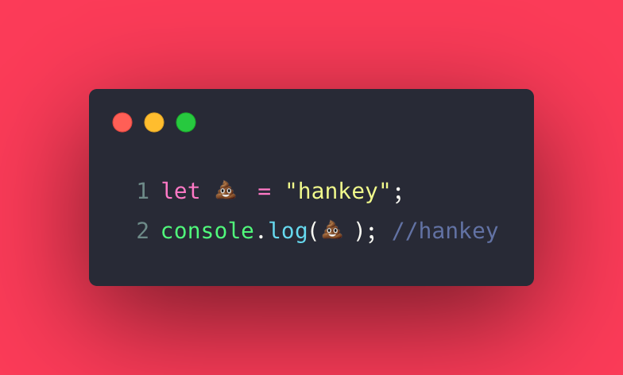
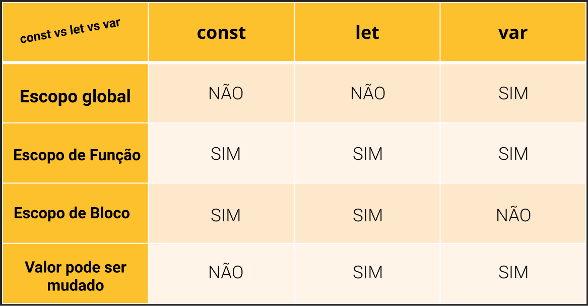
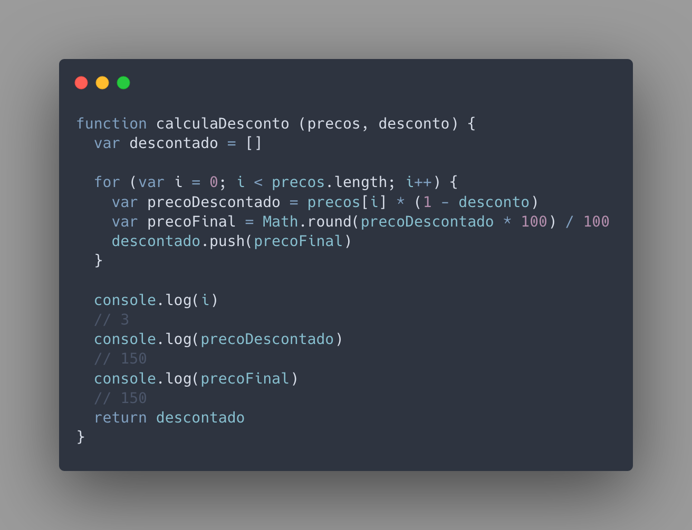
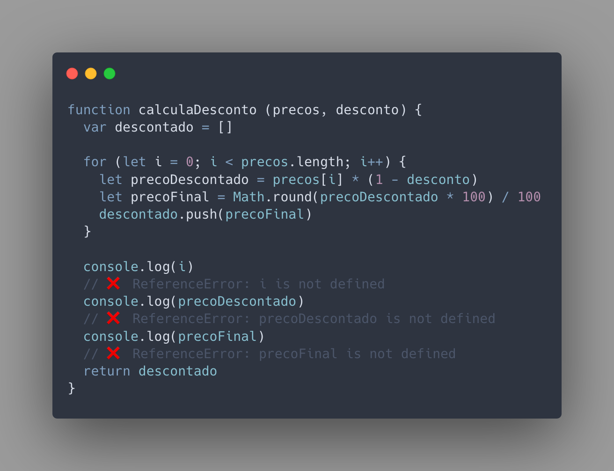
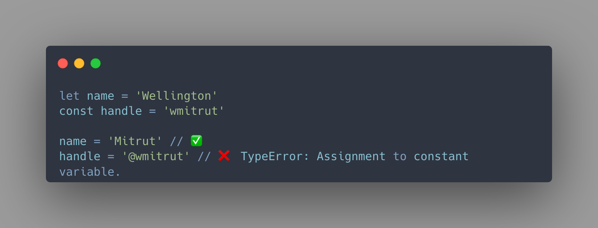
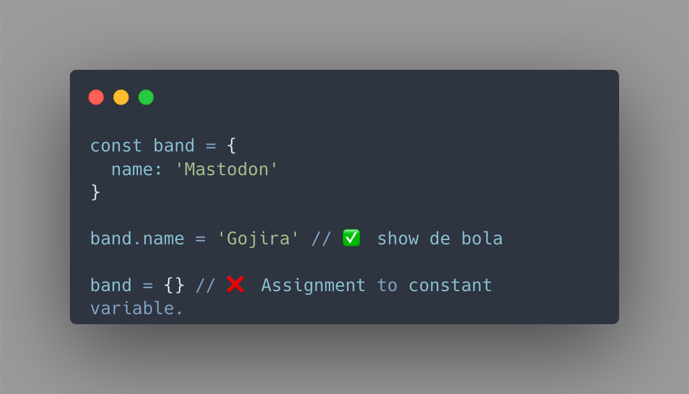

Hoje vamos falar de Várias Variáveis.

Não, esse texto não é sobre o álbum do engenheiros mas poderia ser.

Eu to é muito feliz com o feedback que vocês tem me dado nestes posts, embora ainda sejam poucos leitores e a maioria amigos eu vou insistir neste projeto pois consigo tirar muita coisa da cabeça e pôr meu blog pra funcionar de uma maneira que eu sempre quis que fosse por aqui.

Digo isso não só por repercussão mas por que acho que é importante pra mim tanto tentar ensinar quem ta começando quanto pra reforçar em mim mesmo estes pequenos conceitos de JS e engenharia de software. É básico mas o básico sempre precisa estar sendo lembrado.

Dito isto, como sempre, coloca o último álbum do Katatonia aí

<iframe src="https://open.spotify.com/embed/album/1DX36PVNNEo2o9RAZN6OYJ" width="300" height="180" frameborder="0" allowtransparency="true" allow="encrypted-media"></iframe>

Se você não viu os primeiros posts desta série, vai lá e lê, não leva muito tempo não:

[Parte 1](https://blog.wmitrut.co/basicao-js-001-primitives/)

[Parte 2](https://blog.wmitrut.co/basicao-js-002-objects/)

### Variáveis vs. Constantes

Se você prestou atenção no primeiro post da série, vai pegar variáveis com uma certa facilidade. Variáveis são nomes simbólicos que damos a valores de referencia a um espaço na memória no computador.

Sendo mais claro, é uma palavra ou caractere que damos um valor simbólico. Recebe esse nome por que seu valor pode mudar DURANTE o tempo de execução, já as constantes, como dito pelo próprio nome, se mantém constantemente com o mesmo valor e se você tentar mudar o valor dela, provavelmente terá um erro.

Os tipos de dados que podem ser atribuídos a uma variável em JS são os mesmos dos quais tratamos nos tipos primitivos com adição dos Arrays que trataremos em um post futuro.

### Como declarar uma variável?

Existem algumas formas que uma variável pode de ser declarada, certas pequenas regras que precisam ser lembradas quando você for criar as suas.

- **Variáveis são case-sensitive**

E o que isso quer dizer? Quer dizer que se você declarar uma variável `instrumento` ela vai ser diferente de uma variável `Instrumento` ou seja, ela diferencia maiúsculas e minúsculas na sua nomeação, minhaVariável ≠ minhavariavel

- **Variáveis aceitam nomes com números**

Desde que se precedida de pelo menos uma letra, é possível criar uma variável **camisa9** mas não uma **9camisa** e vamos combinar que pra leitura é bem melhor né

- **É possível utilizar caracteres especiais**

Mas não é indicado, embora os caracteres diferentes do tipo UTF-8 (esses que você tá acostumado a ver em qualquer texto) sejam muito bem interpretados por navegadores é meio chato você ter que procurar algo que não é necessariamente acessível ao seu teclado quando se está tratando de variáveis, então nada de usar 💩 como nome de variável ok?

- **É possível utilizar \_ e \$ para nomear variávels**

Realmente há quem goste de usar esses dois caracteres para simbolizar as variáveis em JS tanto no começo quanto para separar palavras, mas isso vai de gosto e de organização de estilo de código.

> Mas Mitrut, vi um pessoal falando que pode se declarar uma variável com o prefixo var e você utilizou let nos seus exêmplos... como isso funciona?

Ótima pergunta, e é por isso que iremos falar da diferença entre **let e var.**

### let vs. var vs. const

Um conceito que é preciso entender antes de se entender o que difere um 'let' dum 'var' e duma 'const ' se chama ESCOPO.

Escopo é o limite do universo no qual as suas variáveis e funções existem. Existem os escopos **globais, de bloco** ou de **função.**

O que isso significa na prática? Bom, quando você cria uma variável `let` ao invés de uma `var`, a let é limitada ao seu bloco ou função, seu valor não pode ser acessado fora do bloco de código no que foi criada.

Ou seja: Como você pode ver, ao se usar o console.log para verificar os valores do lado de FORA do bloco do for, foi possível pegar o valor de i. de precoDescontado e de precoFinal, afinal var torna-se escopo global.

Se fosse com let, seria o seguinte:

Você pode ver que tivemos `❌ ReferenceError: i is not defined`, ou seja, ele não encontrou o valor da variável pois variáveis com let pertencem somente ao universo do bloco que foram criadas, nesse caso, somente ao loop do for.

E se for const?

Como já falamos antes, const vem de CONSTANT ou seja, seu valor se mantém constante durante o tempo de execução do seu bloco e não pode mudar, logo, acima você pode ver que se tentar haver uma redesignação do valor pré determinado haverá um erro que pode ser detectado pelo seu linter.

Mas isso também não significa que seu valor não possa ser alterado, quer ver? Recapitule nosso artigo sobre objetos e tudo ficará bem claro:

Não é difícil, mas tá... agora aqui no fim do post, qual usar e quando? Minha recomendação é sempre usar `const` a não ser que você tenha absoluta certeza que o valor precisa ser alterado, ai você `let`- o var pode ser deixado de lado por hora a não ser que seja extremamente necessário, visto que seu escopo é muito aberto.

E é isso pessoal, em breve virá mais um post pra vocês, onde vamos falar sobre matemática e operadores.

---

## **Links e Fontes**

▶ 🔗 [Boa e Velha MDN](https://developer.mozilla.org/pt-PT/docs/Web/JavaScript/Guia/Valores,_Vari%C3%A1veis_e_Literais)

▶ 🔗 [Tyler McGinnis Blog](https://tylermcginnis.com/var-let-const/)

▶ 🔗 [CONST-LET-VAR](http://www.constletvar.com/)

▶ 🔗 Acompanhe as lives do [POKEMÃO](https://www.twitch.tv/pokemaobr)!

## **E mais**

▶ FIQUE EM CASA, COMPRE LOCAL, LAVE A MÃO E USE MÁSCARA.

▶ Você não é obrigado a ser produtivo neste momento, cuide dos seus

▶ Leia, e leia muito se possível. Mas também se respeite e descanse.

▶ Tome vacina. Não existe tratamento precoce, Fora Bolsonaro.

▶ Não caia em papo de dev coach nóia.

