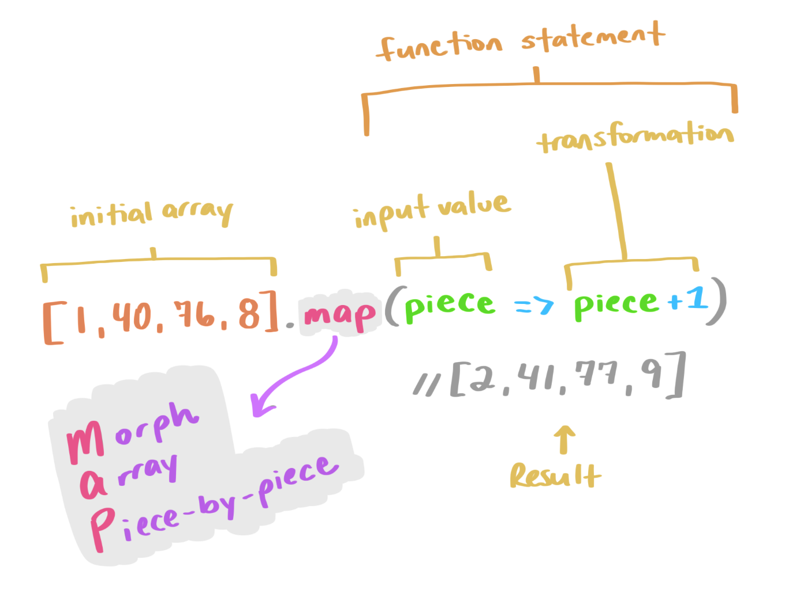
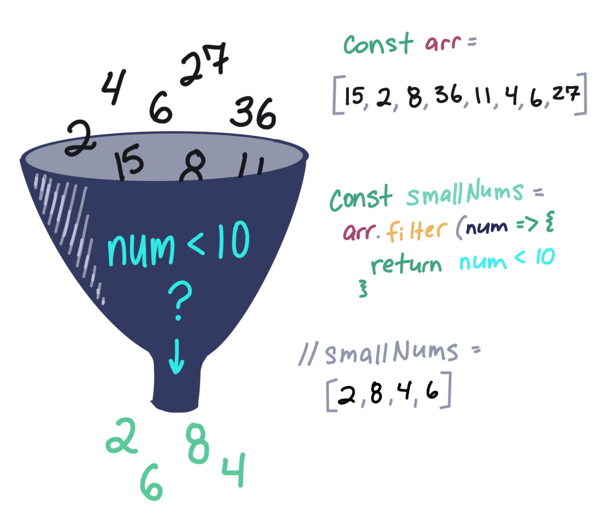
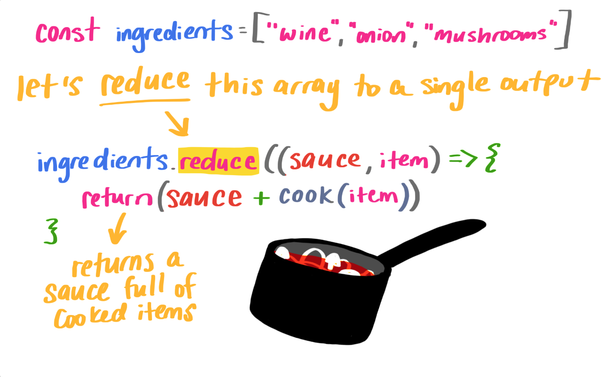

_Este é um texto traduzido e adaptado de [An Illustrated (and Musical) Guide to Map, Reduce, and Filter Array Methods](<https://css-tricks.com/an-illustrated-and-musical-guide-to-map-reduce-and-filter-array-methods/)>) de [Una Kravets](<[https://twitter.com/Una)>) da equipe do Google Chrome._

Map, reduce e filter são três métodos muito úteis em JavaScript que fornecem aos desenvolvedores ferramentas de muito poder em um curto espaço de tempo. Vamos pular direto para você pode aproveitar (e lembrar como usar!) Esses métodos super úteis.

## Array.map()

O `Array.map()` atualiza cada valor individual em um determinado array com base em uma função fornecida e retorna um novo array do mesmo tamanho. Ele aceita uma função de retorno de chamada como argumento, que usa para aplicar a transformação.

```js
let newArray = oldArray.map((value, index, array) => {
  ...
});
```

> Um truquezinho para lembrar disso é MAP: Mexendo no Array Peça por Peça.

Em vez de um loop que use `for-each` para percorrer e aplicar essa função a cada valor, você pode usar um map. Isso serve quando você deseja preservar o valor inicial, mas atualizá-lo. Não estamos potencialmente eliminando nenhum valor (como faríamos com um filter) ou calculando um valor de saída (como usaríamos a reduce). Um map permite transformar um array peça por peça. Vejamos um exemplo:

```js
;[1, 4, 6, 14, 32, 78].map(val => val * 10)
// O resultado é: [10, 40, 60, 140, 320, 780]
```

No exemplo acima, pegamos um array inicial ( `[1, 4, 6, 14, 32, 78]` ) e mapeamos cada valor nele para ser esse valor vezes dez `(val * 10)`. O resultado é um novo array com cada valor do array original transformado pela equação: `[10, 40, 60, 140, 320, 780]`.



## Array.filter()

Já o `Array.filter()` é um atalho muito útil quando temos um array de valores e queremos filtrar esses valores em outro array, onde cada valor no novo array é um valor que passa em um teste específico.

Isso funciona como um filtro de pesquisa. Estamos filtrando os valores que passam pelos parâmetros que fornecemos.

Por exemplo, se tivermos uma array de valores numéricos e quisermos filtrá-los apenas para os valores maiores que 10, poderíamos escrever:

```js
;[1, 4, 6, 14, 32, 78].filter(val => val > 10)
// O resultado é: [14, 32, 78]
```

Se fôssemos usar um método map neste array, como no exemplo acima, retornaríamos um array do mesmo tamanho que o original com val > 10 sendo ama “transformação”, ou um teste neste caso. Transformamos cada um dos valores originais em sua resposta se forem maiores que 10.

Ficaria assim:

```js
;[1, 4, 6, 14, 32, 78].map(val => val > 10)
// the result is: [false, false, false, true, true, true]
```

Um `filter`, no entanto, retorna apenas os valores verdadeiros. Portanto, o resultado é menor que o array original ou do mesmo tamanho se todos os valores passarem por um teste específico.

> Pense no filter como um tipo de peneira. Parte da mistura passará para o resultado, mas parte será deixada para trás e descartada.

## 

---

Digamos que temos uma classe (muito pequena) de quatro cães na escola de obediência. Todos os cães tiveram desafios ao longo da escola de obediência e fizeram um exame final avaliado. Representaremos os cachorrinhos como um array de objetos, ou seja:

```js
const students = [
  {
    name: 'Boops',
    finalGrade: 80,
  },
  {
    name: 'Kitten',
    finalGrade: 45,
  },
  {
    name: 'Taco',
    finalGrade: 100,
  },
  {
    name: 'Lucy',
    finalGrade: 60,
  },
]
```

Se os cães obtiverem uma pontuação superior a 70 em seu teste final, eles recebem um certificado sofisticado; e se não o fizerem, precisarão fazer o curso novamente. Para saber quantos certificados imprimir, precisamos escrever um método que retorne os cães com notas de aprovação. Em vez de escrever um loop para testar cada objeto no array, podemos encurtar nosso código com filtro!

```js
const passingDogs = students.filter(student => {
  return student.finalGrade >= 70
})

/*
passingDogs = [
  {
    name: "Boops",
    finalGrade: 80
  },
  {
    name: "Taco",
    finalGrade: 100
  }
]
*/
```

Como você pode ver, Boops e Taco são bons cachorros (na verdade, todos os cachorros são bons cachorros), então Boops e Taco estão recebendo certificados de conclusão por passar no curso! Podemos escrever isso em uma única linha de código com nossos adoráveis retornos implícitos e, em seguida, remover os parênteses de nossa função de seta, pois temos um único argumento:

```js
const passingDogs = students.filter(student => student.finalGrade >= 70)

/*
passingDogs = [
  {
    name: "Boops",
    finalGrade: 80
  },
  {
    name: "Taco",
    finalGrade: 100
  }
]
*/
```

## Array.reduce()

O método reduce() pega os valores de entrada de uma array e retorna um único valor. Este é realmente interessante. Reduzir aceita uma função de retorno de chamada que consiste em um acumulador (um valor que acumula cada parte do array, crescendo como uma bola de neve), o próprio valor e o índice. Também leva um valor inicial como segundo argumento:



Vamos configurar uma função de cozimento e uma lista de ingredientes:

```js
// our list of ingredients in an array
const ingredients = ['wine', 'tomato', 'onion', 'mushroom']

// a cooking function
const cook = ingredient => {
  return `cooked ${ingredient}`
}
```

Se quisermos reduzir os itens a um molho (trocadilho intencional), vamos reduzi-los com reduce()!

```js
const wineReduction = ingredients.reduce((sauce, item) => {
  return (sauce += cook(item) + ', ')
}, '')

// wineReduction = "cooked wine, cooked tomato, cooked onion, cooked mushroom, "
```

Esse valor inicial ('' no nosso caso) é importante porque se não o tivermos, não cozinhamos o primeiro item. Isso torna nossa saída um pouco instável, então é definitivamente algo a se observar. Aqui está o que quero dizer:

```js
const wineReduction = ingredients.reduce((sauce, item) => {
  return (sauce += cook(item) + ', ')
})

// wineReduction = "winecooked tomato, cooked onion, cooked mushroom, "
```

Por fim, para garantir que não haja espaços em excesso no final de nossa nova string, podemos passar o índice e o array para aplicar nossa transformação:

```js
const wineReduction = ingredients.reduce((sauce, item, index, array) => {
  sauce += cook(item)
  if (index < array.length - 1) {
    sauce += ', '
  }
  return sauce
}, '')

// wineReduction = "cooked wine, cooked tomato, cooked onion, cooked mushroom"
```

Agora podemos escrever isso de forma ainda mais concisa (em uma única linha!) usando operadores ternários, modelos de string e retornos implícitos:

```js
const wineReduction = ingredients.reduce((sauce, item, index, array) => {
  return index < array.length - 1
    ? (sauce += `${cook(item)}, `)
    : (sauce += `${cook(item)}`)
}, '')

// wineReduction = "cooked wine, cooked tomato, cooked onion, cooked mushroom"
```

> A little way to remember this is to recall how you make sauce: you reduce a few ingredients down to a single item.

## Cante comigo!

Eu queria terminar este post do blog com uma música, então escrevi um pouco sobre métodos de array que podem ajudá-lo a se lembrar deles:

<iframe width="1707" height="759" src="https://www.youtube.com/embed/-_YEbB_y3Mk" title="The Array Methods Song" frameborder="0" allow="accelerometer; autoplay; clipboard-write; encrypted-media; gyroscope; picture-in-picture; web-share" allowfullscreen></iframe>
