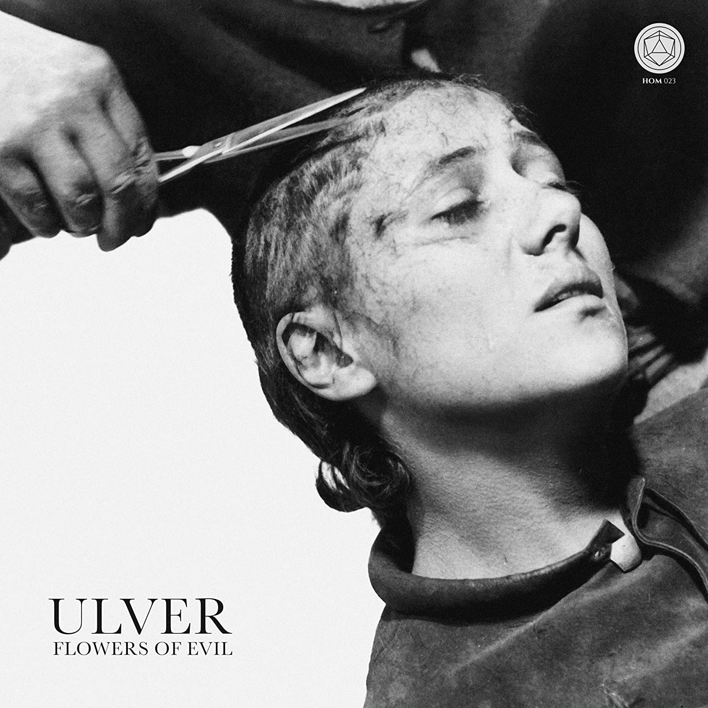
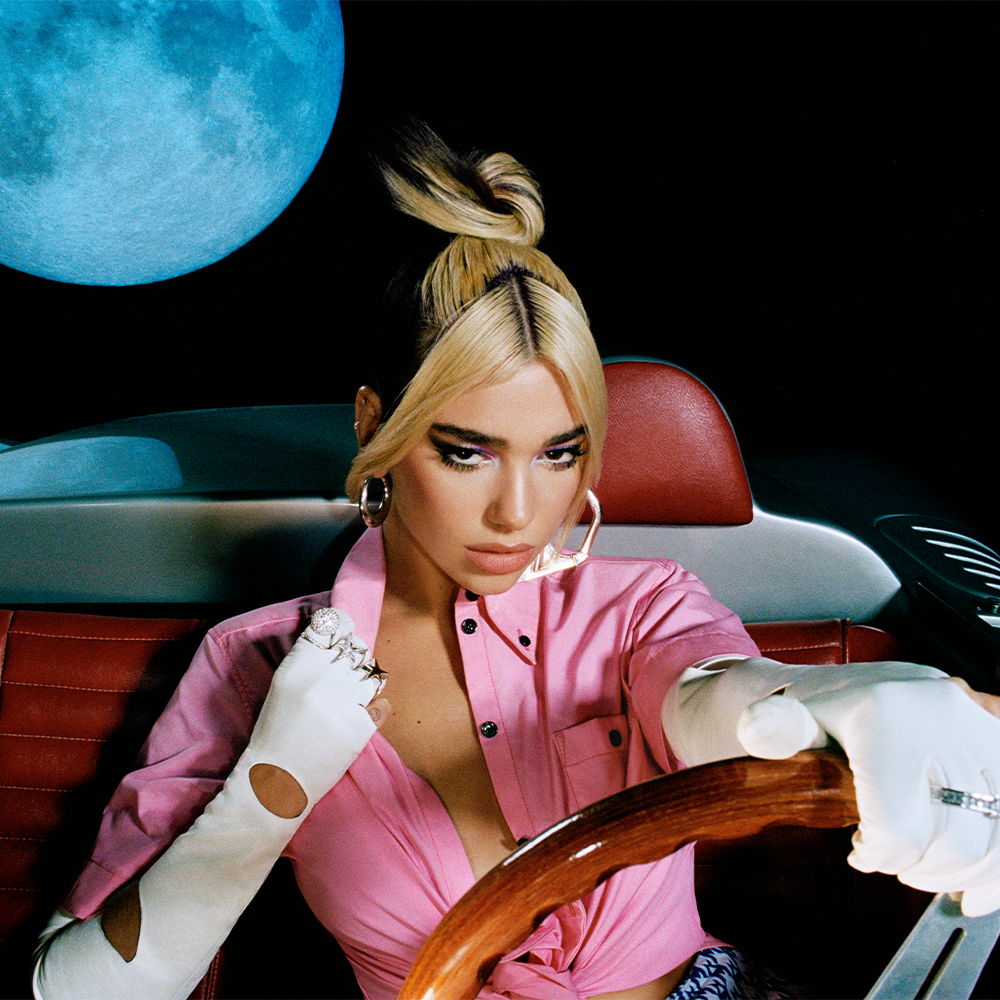
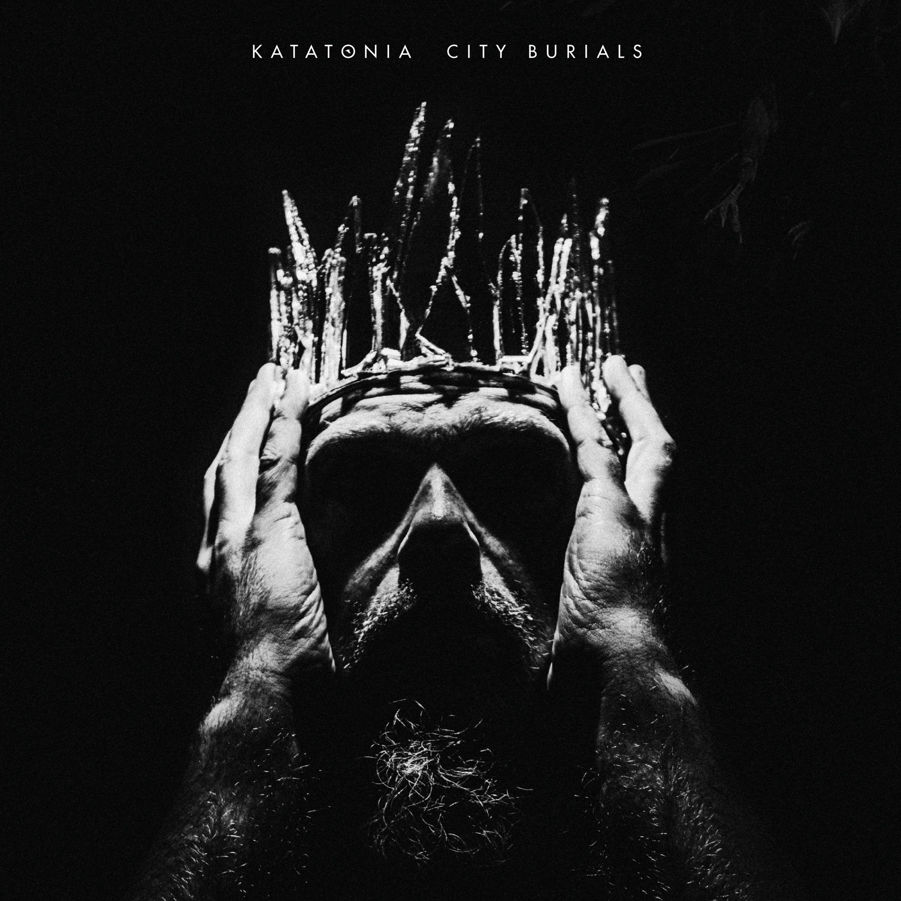
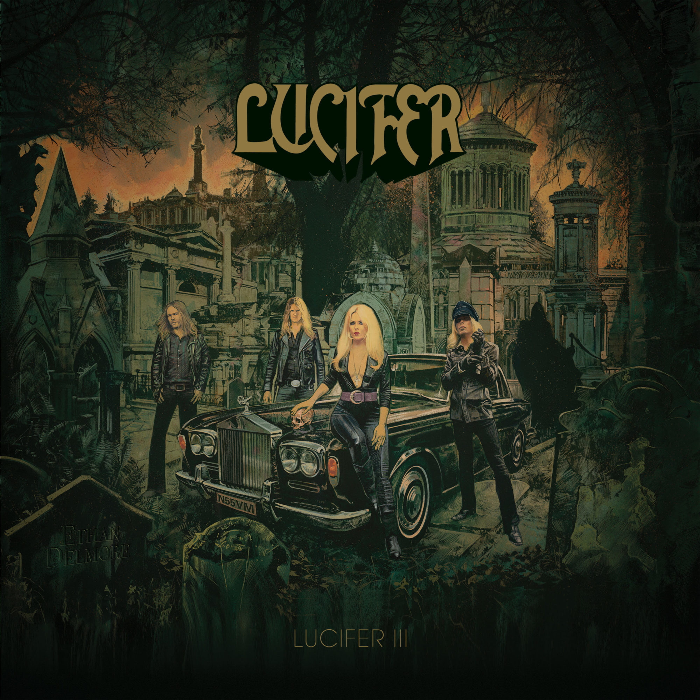
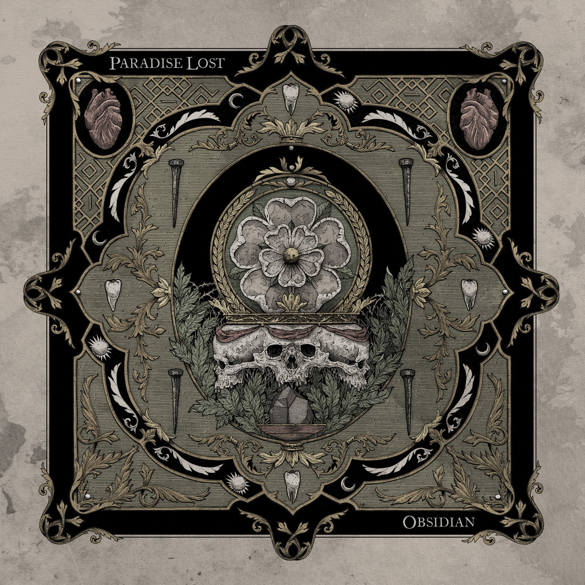
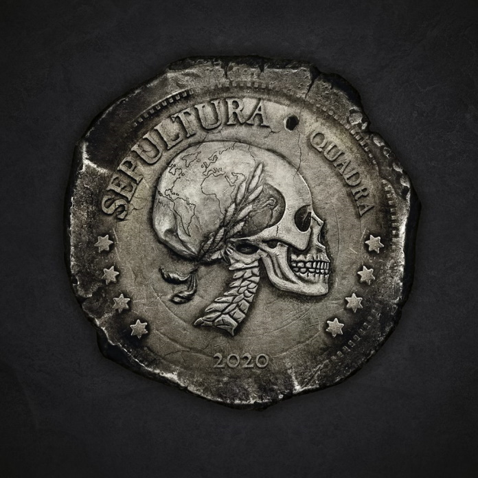
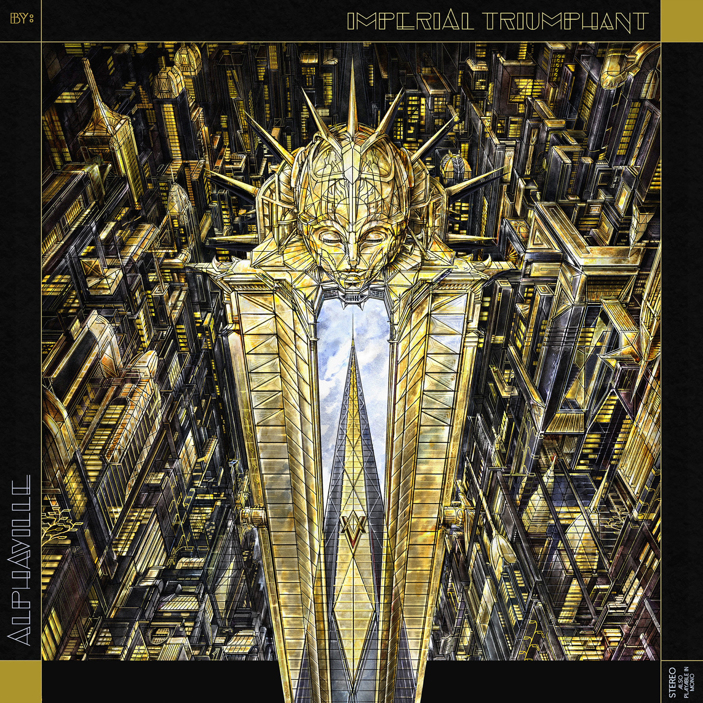
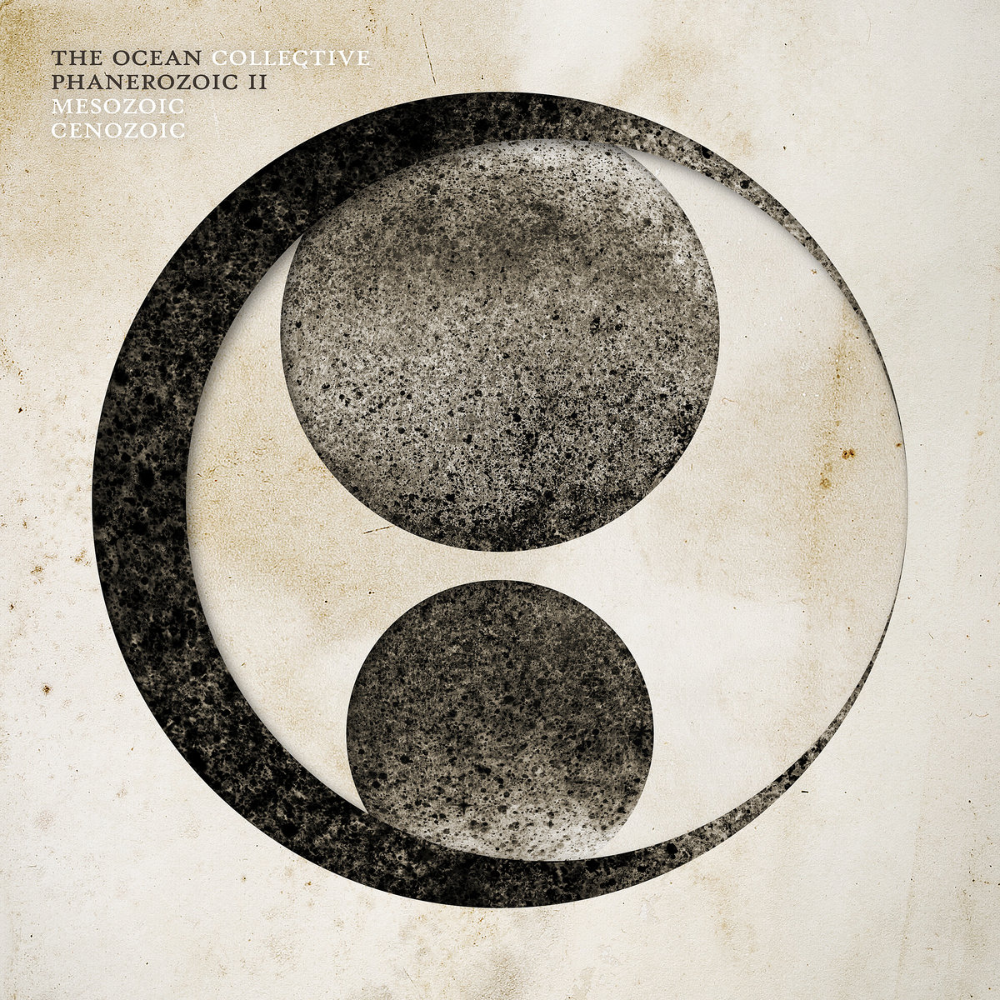
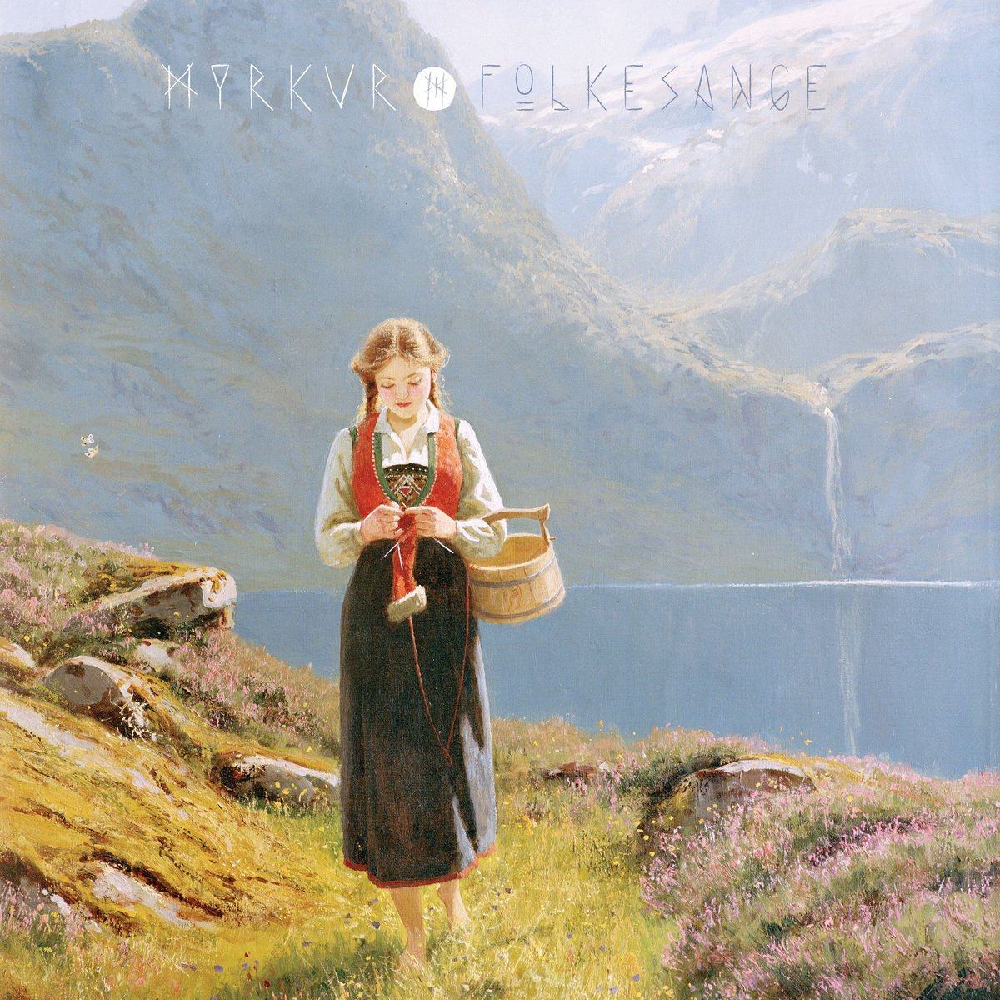

> Photo by <a href="https://unsplash.com/@victrola?utm_source=unsplash&amp;utm_medium=referral&amp;utm_content=creditCopyText">Victrola Record Players</a> on <a href="https://unsplash.com/s/photos/vinyl?utm_source=unsplash&amp;utm_medium=referral&amp;utm_content=creditCopyText">Unsplash</a>

2020 ainda não acabou e tem tudo pra ser o ano que mais iremos lembrar pelo resto de nossas vidas, independente de quem você seja. Perdemos várias pessoas queridas e o vírus continua a solta enquanto estamos à mercê de um fascista que AINDA não teve um plano de controle da pandemia.

Fora isso, aprendemos a conviver mais dentro de casa e sermos mais introspectívos. Isso no meu caso não foi um problema tããããão absurdo pois já trabalho remoto a anos e apesar da introspecção este foi um dos anos mais agitados da minha vida!

Enfim, este blog apesar de ter em sua maioria assuntos técnicos, começarei a falar de mais coisas que gosto. A começar hoje por música. Abaixo seguem os meus top 10 álbums de 2020.

### Top 10 álbums que fizeram meu 2020 musical valer a pena:

#### Ulver - Flowers Of Evil

Já vou abrir de cara com o melhor álbum de todos na minha opinião. O Ulver é aquele tipo de banda que se reinventou totalmente, os últimos dois álbums só carregam de sua fase black metal o ar soturno por que o que vemos aqui e no anterior é uma espécie de tributo ao Depeche Mode em sua fase áurea.

<iframe src="https://open.spotify.com/embed/album/0VYuTYQPftcTUmq2ehYlzV" width="300" height="160" frameborder="0" allowtransparency="true" allow="encrypted-media"></iframe>

#### Lady Gaga - Chromatica

Lady Gaga é uma artista em um patamar acima, o mesmo de Michael Jackson, David Bowie, Bob Marley... alguém que o que toca faz bem feito. Se no passado eu torcia o nariz pra 'Just Dance', hoje eu acho que essa mulher sempre transcendeu qualquer superficialidade e entrega coisas coesas e bem feitas, é só olhar o clipe de 911 e entender do que estou falando.

<iframe src="https://open.spotify.com/embed/album/05c49JgPmL4Uz2ZeqRx5SP" width="300" height="250" frameborder="0" allowtransparency="true" allow="encrypted-media"></iframe>

#### Dua Lipa - Future Nostalgia

O que temos aqui é uma artista colocando tudo o que tem em um álbum cheio de elementos oitentistas, músicas que grudam, fazem dançar e cantar junto. Dua Lipa fez um dos melhores, senão o melhor trabalho de pop de 2020. Impossível não ouvir as referencias a Tina Turner, INXS, Madonna, Kiss e afins. A minha única crítica é que acho que 'Break My Heart' e 'Physical' são músicas melhores de trabalho que a manjada (porém ainda assim boa) 'Don't Start Now'.

<iframe src="https://open.spotify.com/embed/album/7fJJK56U9fHixgO0HQkhtI" width="300" height="200" frameborder="0" allowtransparency="true" allow="encrypted-media"></iframe>

#### Katatonia - City Burial

Desafio alguém ouvir um álbum do Katatonia e não sair com o coração despedaçado. Embora mais eletrônico que os álbuns anteriores, este álbum é um trabalho primoroso de instrumental e vocal, Jonas Renkse faz qualquer ambiente virar uma tarde chuvosa e fria na qual você perdeu as esperanças. O peso ainda está lá, o Katatonia de sempre e sempre entregando peças primorosas.

<iframe src="https://open.spotify.com/embed/album/1DX36PVNNEo2o9RAZN6OYJ" width="300" height="200" frameborder="0" allowtransparency="true" allow="encrypted-media"></iframe>

#### Lucifer - III

O Lucifer é o Black Sabbath que o mundo atual que o mundo precisa atualmente. Johanna Sadonis traz o inferno e o ambiente esfumaçado que a banda de Birmingham trazia em seu auge com Ozzy ou Dio. É só ouvir 'Leather Demon' pra entender do que estou falando. Um trabalho que merece ao menos um primeiro play e deveria estar em mais top 10 por aí.

<iframe src="https://open.spotify.com/embed/album/5FRzeDyVg2GXn6QeOTwrMS" width="300" height="200" frameborder="0" allowtransparency="true" allow="encrypted-media"></iframe>

#### Paradise Lost - Obsidian

Paradise Lost teve inúmeras e bem sucedidas fases, a atual é extremamente promissora, um Doom Metal limpo e pesado com bons refrãos e todos os elementos que os faziam reis do seu nicho. É possível ouvir coisas da época de 'Host', 'Draconian Times' e tudo que a banda ja fez de melhor numa roupagem moderna.

<iframe src="https://open.spotify.com/embed/album/1ameBtOmrJFgiNXx8W7OLx" width="300" height="200" frameborder="0" allowtransparency="true" allow="encrypted-media"></iframe>

#### Sepultura - Quadra

Pra mim, Sepultura é uma das bandas mais injustiçadas da última decada, deve ser pelas viúvas da época dos irmãos Cavalera. O fato é que o Sepultura entregou sempre álbums de extremo peso e qualidade. 'Quadra' com certeza pode figurar entre os melhores, é visceral, é feito na base do ódio, tem muita referência a Mastodon e Gojira sem perder a identidade do Sepultura. É sem dúvida o melhor álbum de metal do ano.

<iframe src="https://open.spotify.com/embed/album/1OyRMXY6FZ4cUTTdzCBPSh" width="300" height="200" frameborder="0" allowtransparency="true" allow="encrypted-media"></iframe>

#### Imperial Triumphant - Alphaville

Imperial Triumphant, ta aí uma banda que conheci esse ano. Black Metal + Jazz, uma subversão, um som que incomoda. Não indicado para não iniciados em sons mais pesados e caóticos. É algo no mínimo curioso o som dos caras, mistura de trilha sonora de filme de terror vintage com black metal noruegues dos anos 90.

<iframe src="https://open.spotify.com/embed/album/1VAxNxcYUKpJ1XEJW12oPY" width="300" height="200" frameborder="0" allowtransparency="true" allow="encrypted-media"></iframe>

#### The Ocean - Phanerozoic II: Mesozoic / Cenozoic

The Ocean mais uma vez me tirou de prumo como fez no seu album anterior e o melhor album de metal na minha opinião em 2013. Phanerozoic vai ainda mais fundo na tecnicalidade, nas letras, instrumental e sentimentos que gera.

<iframe src="https://open.spotify.com/embed/album/26TeqFz1sPbJT6VjAbBtzl" width="300" height="200" frameborder="0" allowtransparency="true" allow="encrypted-media"></iframe>

#### Myrkur - Folkensange

Quando a Taylor Swift lançou Folklore o que eu esperava era isso aqui. Myrkur entregou um álbum de folk. Instrumental acústico pra você ficar horas ouvindo e tentando não surtar nessa pandemia. Parece uma musica de taverna pra quem jogou Witcher 3 e Skyrim. Myrkur é uma verdadeira Skàld.

<iframe src="https://open.spotify.com/embed/album/1aRhu0xtlPbAb1X8us0uOD" width="300" height="200" frameborder="0" allowtransparency="true" allow="encrypted-media"></iframe>

-----------

## **E mais**

▶ FIQUE EM CASA, COMPRE LOCAL, LAVE A MÃO E USE MÁSCARA.

▶ Você não é obrigado a ser produtivo neste momento, cuide dos seus

▶ Leia, e leia muito se possível. Mas também se respeite e descanse.

