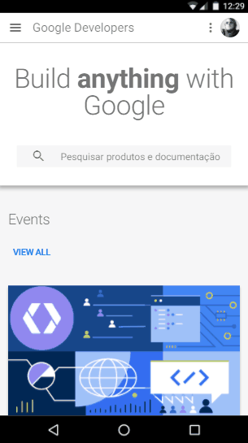

Vamos combinar duas coisas aqui antes de começar, a primeira é que SIM, os PWA são o presente e não mais o futuro, um monte de empresas já estão usando esse paradigma: Forbes, AliBaba, Flipkart e etc.

A segunda é: seu usuário não liga se a aplicação é feita em JS, Kotlin, C# ou então se é feito com uma planilha do Access. O que ele quer é que resolva o problema dele, então, sem preconceito com linguagem, paradigma ou seja lá o que mais você quiser implicar.

> I Can’t believe is not native não é um manifesto, o que está aqui não é lei! É o sentimento que você desenvolvedor/Designer, independente da tecnologia utilizada tem que fazer seu usuário ter. Ele tem que usar seu PWA e nem PERCEBER que aquilo talvez não seja um aplicativo tradicional.

Mas pra começar a falar de Progressive Web Apps a gente tem que voltar um pouco no tempo, tipo, lá nos anos 90. Então bora lembrar da época em que você colecionava tazo, cd do Nirvana e tocava É o Tchan! sem parar.

No início, a web não foi pensada como uma grande plataforma de aplicações poderosa como é hoje. Ela era apenas como uma grande enciclopédia Barsa interativa na qual você ‘navegava’ entre páginas de texto, via algumas imagens e assim por diante. A estruturação e as linguagens de marcação sintetizavam na tela a semelhança do que acontecia em publicações e papers dos anos 90.

Com a popularização da tecnologia, viu-se a necessidade de criar estruturas e artifícios que fizessem da web algo mais atrativo e fácil de usar. Porém nem tudo são flores, além de não ser da noite para o dia, a criação destes artifícios foi sempre marcada por abstrações ‘desvios’, fazendo com que o desenvolvedor web fosse uma espécie de MacGyver e se virasse com o que tinha disponível.

A web não foi projetada para ter aplicações ricas, mas sim documentos, tudo que você vê no seu navegador são abstrações de arquivos de texto e isso é maravilhoso!

Mas se é tão maravilhoso, por que é que a web ainda não passa uma uma confiança, uma firmeza como as aplicações nativas passam?
Nós tivemos que reinventar a web com o que tínhamos em mãos, não tivemos que reescrever do zero para que ela se tornasse incrível, mas fomos refatorando sempre. O problema é que, como toda obra cheia de puxadinhos, melhorias ao longo dos anos, sempre fica alguma coisa pra trás. E justamente, a gente foi fazendo as coisas como dava.

Hoje, esta incerteza e experiência de usuário quebrada na web se devem a 3 fatores:

##### 1 — Sites não são reativos

Como no exemplo abaixo, o site não tem um carregamento interessante quando o link é clicado, o conteúdo não tem uma transição, ele apenas aparece em tela.

##### 2 — Sites não tem um comportamento previsível

Reforçando o argumento anterior, sites em geral não se comportam como se espera de um aplicativo, cada um tem uma forma de ser executado, em geral não possuem suporte à gestures, embora as vezes pareça claro que algo está para acontecer se gestos forem usados. Note abaixo como o usuário tenta chamar o menu lateral e não consegue por gestos, o que num aplicativo nativo isso seria o esperado com o menu hamburguer.

##### 3 — O Usuário nunca está totalmente no controle da situação

Todo usuário comum da web passa por isso em algum momento, está lendo um artigo que acabou de abrir e de repente o conteúdo pula na tela, vai mais pra baixo ou mais pra cima por que um elemento como por exemplo, uma imagem foi carregado na tela e tomou seu lugar na árvore de renderização. Isso é ruim. Deixa o usuário fora do controle e o controle da aplicação tem que ser de quem está utilizando-a.

No exemplo acima você vê exatamente a situação que foi relatada, o artigo é aberto e após o usuário começar a mexer é que a imagem é carregada.

Estes 3 são os principais (não os únicos fatores) que fazem a web ainda ter uma experiência quebrada.

Estes três problemas aumentam algo que quero que você guarde bem o nome: é a **CARGA COGNITIVA**.

> O que então ***pode ser feito*** para melhorar a experiência da web no ***mobile***?

Pois bem, no próximo texto iremos explorar 3 princípios que vão de encontro com o que vimos e deixar algumas dicas para que você faça um PWA incrível.

> Este texto é uma espécie de transcrição da minha palestra de mesmo título onde explico os princípios gerais de como criar uma experiência incrível nos PWAs, meus agradecimentos à [Ana Paula Batista](https://medium.com/@anapbta) que me ajudou a revisar alguns dos pontos que serão publicados em breve por aqui.

Encontrou algum erro? Sugestão? Dúvida? Deixe seu comentário que eu responderei assim que puder, corrigirei e levarei sua sugestão em conta.