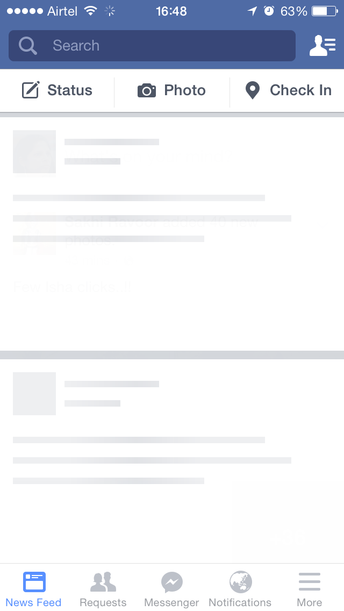
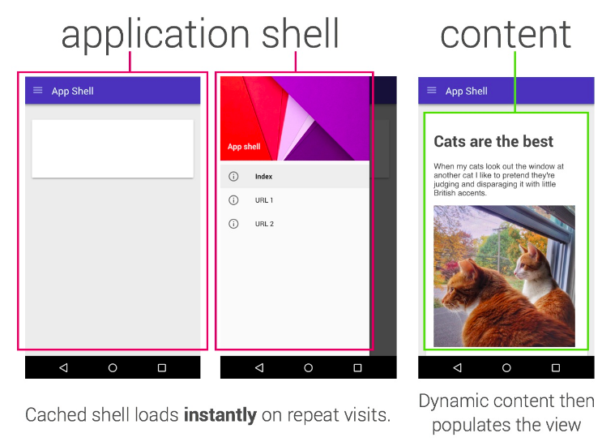
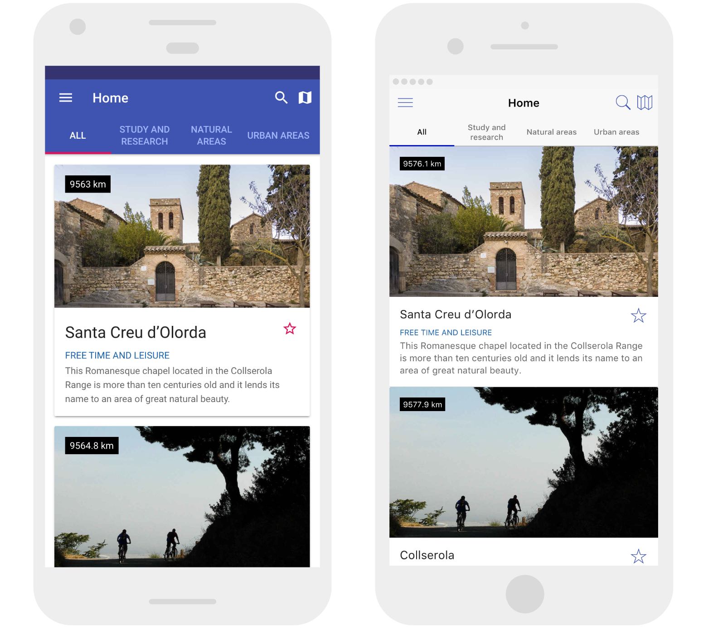
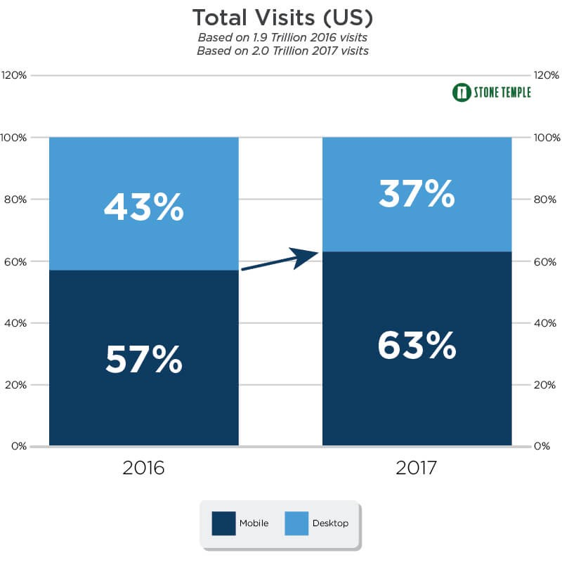

Depois de um longo tempo sem publicar, continuo o post sobre como transformar seu PWA em um aplicativo de verdade.

Olá pessoal, depois de um longo tempo sem publicar, resolvi sentar a bunda na cadeira e fazer este texto sair da cabeça e ganhar vida. Caso você tenha perdido a parte 1, tenha chegado aqui por algum outro meio de busca e não tenha lido o primeiro texto da série, veja no blog o post Parte 1.

### Carga Cognitiva

Se você já leu o texto, pois bem, terminamos o último falando sobre um problema de UX bem comum chamado CARGA COGNITIVA.

> Segundo a [wikipedia](https://pt.wikipedia.org/wiki/Esfor%C3%A7o_cognitivo), _carga cognitiva_ se refere ao nível de utilização de recursos psicológicos como memórias, atenção, percepção, representação de conhecimento, raciocínio e criatividade na resolução de problemas.

Ou seja, para nós que trabalhamos com PWA, é interessante que venhamos a utilizar convenções e padrões já utilizados em aplicações ditas nativas, isso também não quer dizer que absolutamente todo app que você faz tem que ser em material design ou cupertino components (Apple Design), mas sim que você pode tirar o melhor de cada e criar experiências incríveis.

Quanto menos desgastarmos nosso usuário aprendendo a navegar na nossa aplicação, maior pode ser o engajamento dele com o que fizemos.

> Se você quiser se aprofundar um pouco mais sobre carga cognitiva em UX, segue um texto abaixo do [Coletivo UX](https://coletivoux.com/princ%C3%ADpios-do-design-para-reduzir-a-carga-cognitiva-do-usu%C3%A1rio-2c947b9fab96) pra explorar isto um pouco mais.

No texto anterior falamos dos problemas e neste falaremos dos princípios que ajudarão a resolver isto, são eles: REATIVIDADE, PREVISIBILDADE e USUÁRIO NO CONTROLE.

> A percepção humana de tempo é fluida, e pode ser manipulada de maneira proposital e produtiva. — Chris Harrison, Zhiquan Yeo, Scott E. Hudson

Embora a frase acima pareça saída dos ensinamentos que a Grande Anciã passou para Stephen Strange, ela veio na verdade de professores, UX designers e é a pura verdade.

O próprio [Joselito](https://twitter.com/breakzplatform) fala em suas palestras que mais importante que ser é parecer ser, então com base nisso apresentarei alguns exemplos interessantes de como podemos moldar a percepção de performance que nossos usuários tem sem ter que usar o olho de Agamoto.

### SKELETON SCREEN

Você já deve ter visto uma skeleton screen, só não sabia que ela se chamava assim. Se você possui facebook, esse tipo de tela pode ser bem comum quando você está num 3G. É aquela tela que mostra quando você abre o app e ele ainda não carregou os dados.

Existem casos em que a tela só muda quando a nossa request de dados está completa e isso é ruim do ponto de vista de quem está esperando. Nosso senso de percepção de mudança gira em torno de 400ms. Imagina que seu usuário numa internet ruim — ele clica, clica, clica e nada acontece. Pronto, o usuário já xingou sua mãe, fechou a aplicação e foi atrás do seu concorrente (ok, um pouco menos de drama, mas a gente sabe que acontece).

> Ah mas o usuário que espere a request, eu não posso fazer nada até que tenha a resposta.

Em partes sim, o usuário que espere. Não tem como você apressar uma conexão lenta. Porém você pode dar um feedback pro seu usuário. Como? Jogando a próxima view em tela e pré-populando com uma skeleton screen.

Fiz até esse teste aqui no Medium para exemplificar. Por mais rápido que seja o gif, note:

1. Eu clico no post
2. Ele dispara a request
3. Ele abre a view do post pré-populada com uma estrutura básica de esqueleto
4. Ele monta a árvore do DOM com base nos dados da request

É fácil entender a forma com que isso ocorre, são aproximadamente 3 a 4 segundos em uma internet boa, perceba que em nenhum momento fiquei com tela em branco ou com a tela ‘congelada’, então na próxima vez que você for montar uma UI, pense em estratégias de como montar uma tela ‘fake’ para que seu usuário não ache que seu aplicativo simplesmente travou.

### APPLICATION SHELL

Se você acompanha pwas desde o início, já deve saber que esta imagem é mais velha que o jQuery, o Tim Bernerss Lee e a vó do Badanha juntos.

Assim como a skeleton screen temos a application shell, que mostra a estrutura básica da aplicação. É estrutura mesmo, antes de conteúdo, sendo apresentada de forma quase instantânea na tela do usuário, muito parecido com o que se vê em aplicativos nativos.

O shell é composto pelos aplicativos mínimos necessários para montar a tela e se tratando de pwa é uma boa prática mantê-los armazenados em cache off-line para um próximo acesso, sendo assim, ele não será carregado toda vez que a aplicação for acessada, você deixará que apenas o conteúdo estritamente necessário seja carregado. Para SPAs, essa estratégia é essencial — geralmente esse tipo de aplicação possui uma carga enorme, deixar que isso seja carregado toda vez tem um impacto monstruoso em performance.

### MUDAR A UI CONFORME O SISTEMA OPERACIONAL

Eu sei o que você está pensando. É chato, é trabalhoso — mas uma verdade dita desde que o cross-platform existe é: "Aplicativo iOs tem que parecer aplicativo iOs e aplicativo Android tem que parecer aplicativo Android".

Com isso em mente, faz-se interessante utilizar uma regra de css em cada OS e isso é possível

Esse [pwa da prefeitura de Barcelona](https://webapp.barcelona.cat/pics/) tem uma UI de acordo com o OS que você estiver utilizando

Alguns frameworks como Ionic já fazem isso também, é interessante que as estratégias sejam estudadas pois a entrega deste tipo de experiência agrega muito para seu usuário — tudo parece mais natural.

### FEEDBACK DE TOQUE

Seu usuário está acessando sua aplicação de um dispositivo móvel, você sabe que é verdade, o mouse dele é um dedo — NÃO EXISTE HOVER.

Dar feedback de toque é essencial, então pelo amor de Addy Osmani, cuide com os feedbacks de toque, seja utilizando ripple ou tilt, ou então o ::active do css. Você deve prover feedback de UI para seu usuário. Abaixo algumas libs interessantes:

- [TILT.JS](https://rikschennink.github.io/tilt/#demo)
- [RIPPLE.JS](https://github.com/samthor/rippleJS)

> Se você leu até agora e se perguntou, como faríamos para jogar os recursos básicos iniciais para montar a tela e ficou achando que eu era meio maluco de querer fazer preload de tudo, saiba que aí é que irei parar de falar um pouco de UX/UI, olhar um pouco melhor para técnicas, estratégias e explorar a técnica do padrão PRPL — tudo isso no nosso próximo post!
