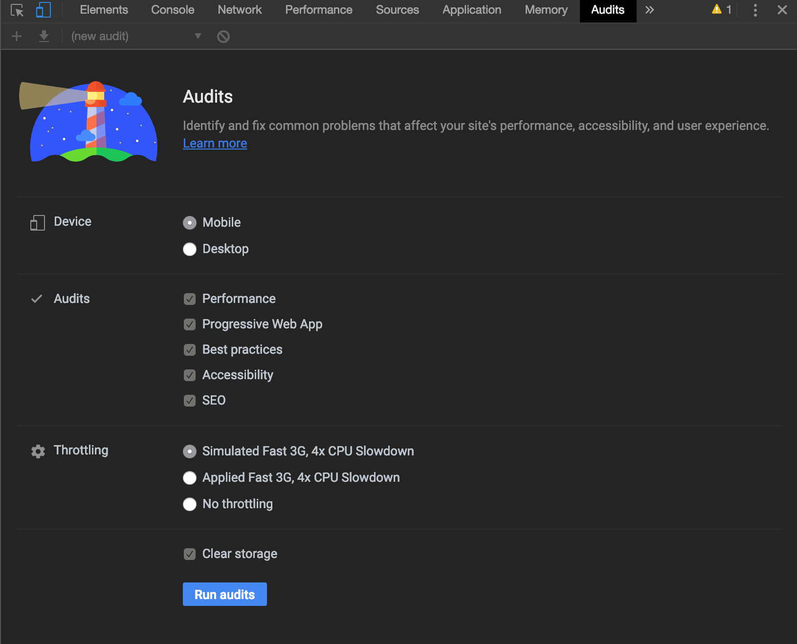
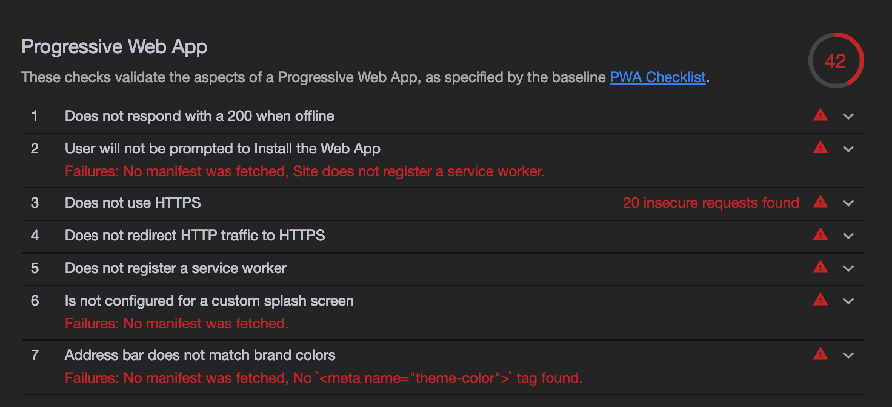

> Photo by Adrien Tutin on Unsplash

Continuando nossa série sobre PWAs, Performance e UX, trago dessa vez uma das ferramentas essenciais para quem quer construir um PWA incrível. O **Lighthouse**.

> o primeiro post da série você vê [aqui](https://blog.wmitrut.co/cant-believe-1/) e o segundo [aqui](https://blog.wmitrut.co/cant-believe-2/).

Segundo o Google, criador da ferramenta

> O Lighthouse é uma ferramenta automatizada de código aberto que aprimora a qualidade de apps da Web. Ele pode ser executado como extensão do Chrome ou na linha de comando. Informe ao Lighthouse um URL que você quer auditar. Ele executará uma série de testes na página e gerará um relatório sobre o desempenho da página. Nesse relatório, você poderá usar os testes que apresentaram falha como indicadores do que pode ser feito para aprimorar o aplicativo.

Ou seja, é uma ferramenta que vai fazer toda uma varredura da sua aplicação e lhe dar um relatório com todas as dicas do que pode ser feito para melhorar sua performance.

Durante muito tempo o lighthouse foi uma [extensão do chrome](https://chrome.google.com/webstore/detail/lighthouse/blipmdconlkpinefehnmjammfjpmpbjk), mas hoje, desde o Chrome 60 (na data da publicação deste post ele estava na 72) ele vem embutido no Chrome Dev Tools na aba **Audits**. Você pode acompanhar o projeto no Github [aqui](https://github.com/GoogleChrome/lighthouse).

<iframe width="560" height="315" src="https://www.youtube.com/embed/Qnmb2YhkQmQ" frameborder="0" allow="accelerometer; autoplay; encrypted-media; gyroscope; picture-in-picture" allowfullscreen></iframe>

> Vídeo do release do Chrome 60 explicando a adição do Lighthouse nos Audits.

Uma mão na roda né?

### Mas Mitrut, eu nunca ouvi falar nisso!

Tudo bem, estamos aqui pra isso. Este blog foi construido totalmente de olho no que ocorre no score do lighthouse dele - ou seja. Pensado para ter performance e um score alto. No [post anterior](https://blog.wmitrut.co/welcome-back/) eu mostrei o score básico e como este blog foi construido para ser um PWA:


> Resultados do Blog no Lighthouse

### Usando o lighthouse

Partindo do princípio que você está utilizando o Google Chrome como navegador na versão 60+ desktop aperte:

- _Windows/Linux_: F12 ou Ctrl+Shift+I
- _MacOs_: Cmd + Option + I
- _Todas_: Botão direito > inspecionar

> Observação: O lighthouse só pode ser usado no desktop.

Isso vai abrir o seu Chrome Dev Tools. Procure pela aba Audits:


Quando você abrir esta aba, ele já vai te mostrar o Lighthouse com todas as opções possíveis para serem auditadas, sendo elas: _Performance_, _Progressive Web App_, _Best Pratices_, _Accessibility_ e _SEO_ - sim, SEO, ele te ajuda desde como seu app está se comportando performaticamente até de como ele pode ser melhor indexado pelos buscadores.



Ainda existem opções de teste para mobile e desktop, bem como simular redes para ver como ele se sai em 3Gs e afins. Pense no lighthouse como um Pagespeed com esteróides.

Agora, depois de selecionados os filtros, é só clicar em **Run Audits** e esperar. Ele vai demorar mesmo (uns 30 - 40 s), vai fazer uma varredura completa no seu app.


Neste meio tempo ele testa tudo: como seu site se comporta em redes móveis lentas, se ele tem webapp manifest, como ele se comporta com JS desabilitado, se ele possui suporte offline, se ele é acessível, como estão as chamadas de JS e se elas demoram muito e no final ele te dá um relatorio.


É importante salientar que você não precisa perder o sono se seu app não bateu 100% de primeira em tudo, muitos blogs, sites e apps já o fazem mas se você ainda não chegou lá tudo bem. O importante é você estar preocupado com estas métricas.

Meu blog antigo passou pelo lighthouse com os seguintes resultados:


### Entendendo o relatório

As 5 seções do lighthous que já citamos aqui possuem subsessões que são os checks auditados. Caso esteja tudo bem em uma sessão você vai encontrar o seguinte:


Senão...



E é aqui que você vai pegar as dicas principais do que você precisa melhorar. O lighthouse vai te dar dicas do que pode ser feito para melhorar o score, coisas tais quais: criar um webapp manifest, suporte offline, minificar JS, requisições que estão bloqueando a renderização, classes css não utilizadas, falta de metatags importantes...

Aqui entra um outro post que veremos futuramente sobre padrão PRPL de entrega de assets para sua aplicação rodar, o que é intrinsecamente ligado ao Lighthouse e performance.

### Usando Lighthouse no CI

Digamos que você já está habituado com o Lighthouse e possui um serviço de integração contínua tal qual o TravisCI. É possível automatizar a checagem do Lighthouse e colocar "metas" de score.

Para isso existe o [LighthouseBot](https://github.com/GoogleChromeLabs/lighthousebot)


O LighthouseBot pode ser colocado junto à sua integração e deixar essa checagem automatica e mais fácil, ele comenta nos seus pull requests e ainda pode impedir que um build ruim vá para produção


Abaixo você pode ver um build com lighthouse com métricas ruins sendo barrado.


### CLI

Sim, também é possível rodar o lighthouse via CLI - para quem prefere ter o Firefox como navegador é uma boa pedida. Para testar o CLI é só instalar:

```javascript
    npm install -g lighthouse
```

Depois de instalado você roda apenas

```javascript
    lighthouse <url>
```

Sendo que <url> é o parâmetro da URL a ser auditada. Existe uma série de flags que podem ser adicionadas como --verbose, --output json e etc. para personalizar o report ao seu gosto.

A [documentação](https://github.com/GoogleChrome/lighthouse#readme) é bem completa e vai te ajudar com tudo. Ele gerará um arquivo HTML com as mesmas informações que você vê no Audits do Chrome Dev Tools.

Ainda existe uma série de integrações interssantes e possíveis com ele bem como uma gama enorme de projetos derivados.

Abaixo um vídeo com mais detalhes de como usar o Lighthouse:

<iframe width="1600" height="664" src="https://www.youtube.com/embed/UvK9zAsSM8Q" frameborder="0" allow="accelerometer; autoplay; encrypted-media; gyroscope; picture-in-picture" allowfullscreen></iframe>

---

### Enfim...


Se você se importa com performance e você **_DEVE_** se importar, o lighthouse é uma ferramenta indispensável para se criar um bom PWA. Indico aqui dois posts para que você se aprofunde mais no assunto, um do [Addy Osmani](https://addyosmani.com/blog/shine-a-light-javascript-performance/) e outro [post](https://willianjusten.com.br/medindo-performance-do-seu-site-com-lighthouse/) onde o William Justen também fala da experiência dele em melhorar o seu blog e ter um bom score no lighthouse.

---

<div class="dicas">


- O meu projetinho que você pode contribuir, o [AWESOME BRAZILIAN DEV BLOGS](https://github.com/Wmitrut/awesome-brazilian-devblogs). Uma compilação de blogs de desenvolvedores e comunidades brasileiros que estejam em PORTUGUÊS. Visa ser um hub/ponto de partida pra quem busca bom conteúdo de desenvolvimento em português - PRs bem vindas!

- Como a Netflix fez o Bandersnatch do ponto de vista de desenvolvimento:

<iframe width="560" height="315" src="https://www.youtube.com/embed/WLqc0EX8Bmg" frameborder="0" allow="accelerometer; autoplay; encrypted-media; gyroscope; picture-in-picture" allowfullscreen></iframe>

- O blog ganhou share buttons (em beta por que não implementei o do whats)! Só testar abaixo!

</div>
