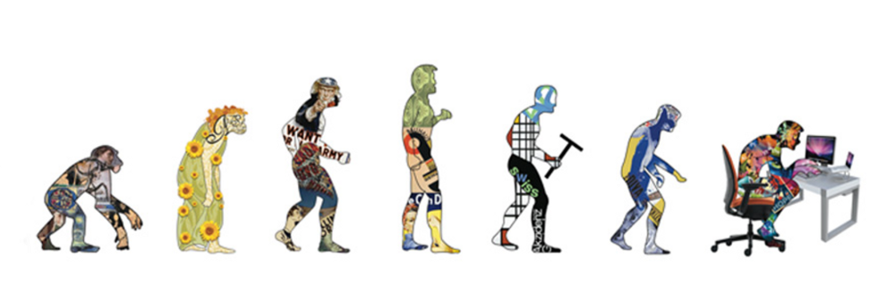

> Opa, voltando aqui pro blog com um texto menor que o usual mas não menos importante, espero voltar com a mesma periodicidade publicando aqui e no blog da Tampa. Estou preparando uma série de conteúdos novos e novos formatos, até mesmo alguns conteúdos baixáveis interessantes para você desenvolvedor que quer aprender um pouco mais de design e vice-versa.

Eu estou nessa de desenvolvimento e design a quase 6 anos, desenvolvendo aplicações web, front-end, Android Nativo, React, Angular, SCSS e mais uma quantidade sem fim de siglas, tecnologias e formatos.

A maioria dos meus designs no começo eram coisas que hoje me dão uma dor nos olhos e uma certa vergonha, mas imagino que esse seja justamente o caminho para que se evolua, olhar pra trás e enxergar os erros e não achar que é o melhor dev/designer que já pôs os pés nessa terra.

Os meus designs eram por assim dizer, ocos. Ou seja, bonitos até certo ponto, legais, mas ainda tinham um ‘quê’ de que faltava alguma coisa. Muitos dos meus amigos desenvolvedores as vezes me vem com exatamente o mesmo dilema, como fazer designs que não pareçam pobres, vazios e sem espírito? Como entregar algo de valor, funcional e que seja bonito

Aliás, lá no Tableless tem um texto bacana sobre design oco que aprofunda um pouco mais do que irei abordar aqui:

#### [Sobre o design oco](https://tableless.com.br/o-design-ordinario-oco/)

É clichê citar **Don Norman** para a maioria dos designers mas foi graças ao livro dele que as coisas deram uma mudada e me fizeram pensar duas vezes e até mesmo enriquecer minhas estratégias de produzir um design de qualidade para meus aplicativos. As coisas mudaram quando li o livro dele **“The design of everyday things”**.

Se você não conhece esse cara, ele é uma espécie de pai do UX design e ajudou a explorar fundamentos que as principais linguagens de design usam hoje. E o melhor, ele não fica com aquela papagaiada que muitos de nós quando tratamos de design achamos que se trata, ele vai direto ao ponto. Mostra como o design está em tudo.

Um dos melhores vídeos de Norman é este abaixo, onde sem segredos ele da a real do que é UX.

<iframe width="1581" height="900" src="https://www.youtube.com/embed/9BdtGjoIN4E" frameborder="0" allow="accelerometer; autoplay; encrypted-media; gyroscope; picture-in-picture" allowfullscreen></iframe>

E bem, aqui vão algumas das dicas que aprendi:

1. **Pense qual a forma mais estúpida** em como executar uma ação dentro do app, essa é provavelmente a que seu usuário irá percorrer.

2. **Usuários fazem cagadas, e isso é bom.** Usuários (e isso inclui você) erram o tempo todo, nas coisas mais simples e mesmo que o fluxo sejá único, eles sempre vão achar um jeito. O seu trabalho é minimizar esses erros ao máximo e fazer com que o usuário se sinta a pessoa mais incrível do mundo ao executar uma ação.

3. Você tem que ter no mínimo **3 personas** e estar preparado para elas. Quanto mais personas maiores possibilidades e maior chance de prever os erros do usuário.

4. Usuários conseguem lembrar apenas dos 3 últimos passos. É sério. passou disso a chance de eles se perderem na aplicação é alta.

5. **Pense** em modelos mentais e fluxos.

6. **Forneça contexto**, sem contexto seu usuário está num mato sem cachorro.

7. **A navegação que você projetar pro app tem que ser baseada nesses fluxos.**

8. Na dúvida, **fale** com o usuário!

9. **Não tenha medo de ‘roubar’ ideias.** Grandes aplicativos são famosos e fáceis de usar por algum motivo. Replique padrões dos AAA se isso se aplicar ao seu contexto e entenda o por que eles são usados e isso não tem nada a ver com querer ser o Uber de XYZ ou então o AirBnb de XPTO, tem com aprender como se faz. Você só vai aprender a fazer um estado vazio fazendo.

10. **Cometa erros.** Pelo amor de deus, cometa erros, cagadas e faça designs feios, só tomando na cabeça pra você aprender de verdade como tudo isso funciona, experimentando!

Tem coisa nova vindo aí, fique ligado nas redes e aqui no blog
