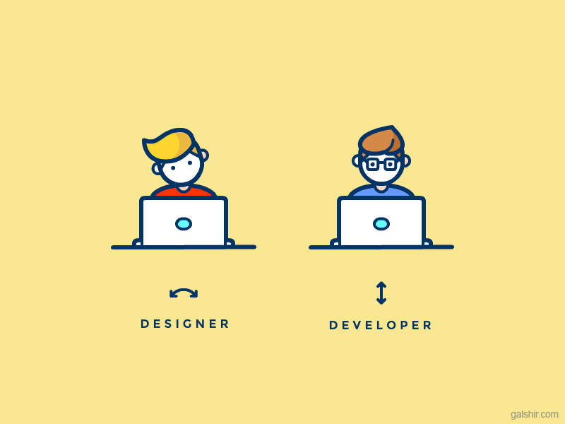

> Este é um texto traduzido e adaptado de [Desingineering: Why I Code](http://jon.gold/2011/12/why-i-code/) do [Jon Gold](https://medium.com/@jongold) do AirBnb, me identifiquei demais com a ideia e achei interessante que vocês também lessem, para facilitar eu traduzi e trouxe um pouco do meu contexto do dia a dia.

> “Desingineer” -> mythical person startups are looking for who can do UI, UX and also excellent front- and back-end coding. — Chris Dixon

Ou no bom e velho português:

> “Desingineer”: Esta criatura mitológica que as startups estão procurando que sabe UI, UX e ao mesmo tempo é um excelente front-end e back-end — Chris Dixon

### Você não precisa saber programar.

Se você é um designer talentoso, você provamente não precisa aprender Ruby On Rails, React, Angular, Node, Swift ou qualquer que seja a linguagem que a sua equipe trabalhe. Saber Objective-C ou qualquer SDK está fora da sua alçada ou da descrição do que é um designer (ou ao menos deveria), sério. Você nem ao menos precisa saber escrever o mais semântico HTML ou o CSS mais foda do universo — O Trabalho do designer é fazer designs. Tipo isso.

Mas aí seguindo esta linha, você teria licença poética pra deixar de lado qualquer tipo de configuração, ou inventar uma escala tipográfica, ou fazer tudo sem grids ou alinhamentos, ou até mesmo esquecer conceitos de pixel-perfect.

O ponto é, não é porque você pode cortar caminhos, pegar atalhos que você DEVE.

Sujar as mãos é o que faz os melhores designers e, de forma semelhante, os designers mais curiosos e diversos são os mais bem empregados.

Não, você muito provavelmente não irá trabalhar para o Google projetando interfaces ou projetar componentes prontos para produção, escaláveis, mas ser curioso sobre essas coisas o torna mais aberto às oportunidades, mais capaz de corrigir um buraco em uma emergência e um designer mais completo e competente como um todo.

Se você é um pé no saco com cada pixel, acho que é irresponsável não querer entender todas as outras camadas da pilha. Interessar-se por coisas demais é uma preocupação legítima — ninguém quer ser um designer medíocre e um programador medíocre.

No entanto, acho que não é um destino predeterminado. Em vez disso, eu prefiro meter um pouco a cara mais em código e menos em layouts e me manter à par com a tecnologia do que ficar atrasado e ser aquele Diretor de Arte de 30 e poucos pedante mas que tem medo de algo além de arquivos do Photoshop, Corel e Illustrator.

Eu? Eu posso nunca escrever um jogo completo em vanilla JavaScript, mas posso fazer todas as magias em Sass que eu preciso saber no dia-a-dia. Chamadas AJAX e coisas de interação. Posso escrever aplicativos simples no Rails e no Angular— pode ser que seja apenas o suficiente para que eu possa obter um protótipo funcional de ‘mais nova e revolucionária startup’ sem depender totalmente dos outros. Eu posso até me considerar medíocre e muita gente também pensa assim em muita coisa sobre si. **Mas eu não me limito.** E você?
