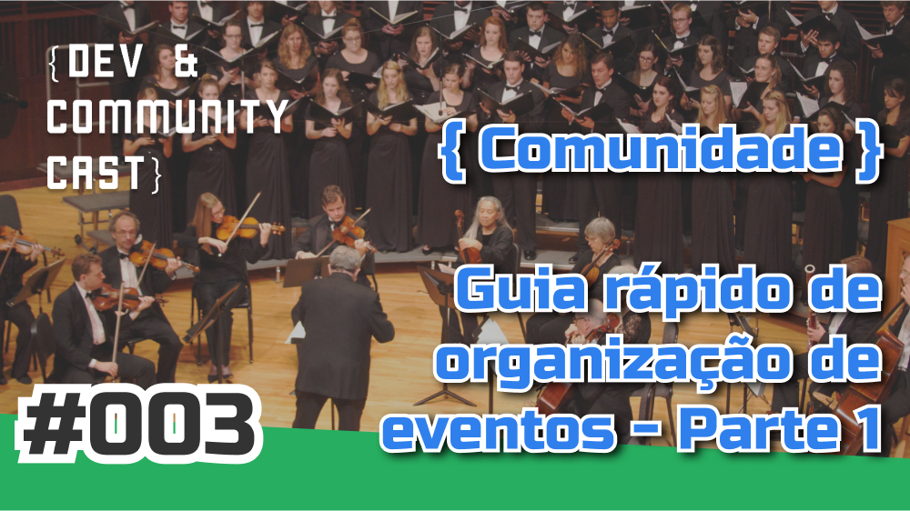

Organizar eventos para a comunidade pode ser um grande desafio para os organizadores, e por ter tantos detalhes com que se preocupar, alguma coisa pode acabar ficando para trás. E para ajudar você a lembrar de alguns detalhes importantes, nesse episódio, Alê Borba e Neto Marin vão falar sobre o objetivo do evento, público alvo, data e local, patrocínio e inscrições para o evento.

Esse é o último episódio do Dev & Community Cast de 2016, e faremos uma pequena pausa. Na terceira semana de janeiro de 2017, vamos publicar a segunda parte, e os tópicos serão comunicação / site, grades e palestrantes, dia do evento e o pós evento.

Gostou do episódio? Falamos alguma besteira? Ou simplesmente quer conversar mais sobre o assunto?
Então comenta aqui no post que vamos responder o mais rápido possível. Vamos movimentar essa seção de comentários!

Visite nossa nova página no Facebook: <a href="http://www.facebook.com/devcommunitycast" target="_blank">facebook.com/devcommunitycast</a> e siga nosso perfil no Twitter: <a href="http://www.twitter.com/devcommunitybr" target="_blank">@devcommunitybr</a>.

**Assine e avalie nossos podcast no iTunes:**

Se você usa o iTunes no seu computador, tablet ou smartphone, <a href="https://itunes.apple.com/br/podcast/dev-community-cast/id1101607027?mt=2" target="_blank">assine e avalie nossos podcasts clicando aqui!</a>

Contato:
Se quiser entrar em contato, pode nos achar nas redes sociais acima ou envie seu e-mail para <a href="mailto:contato@devcommunitycast.com.br">contato@devcommunitycast.com.br</a>.

Participantes: Neto Marin (<a href="https://twitter.com/netomarin" target="_blank">@netomarin</a>) e Alê Borba (<a href="https://twitter.com/ale_borba" target="_blank">@ale_borba</a>)

Vitrine criada por Wellington Mitrut (<a href="https://twitter.com/Wmitrut" target="_blank">@Wmitrut</a>)

Locutor da introdução: Renato Rios (<a href="http://www.twitter.com/taquiupaRios">@taquiupaRios</a>)

Edição de Neto Marin