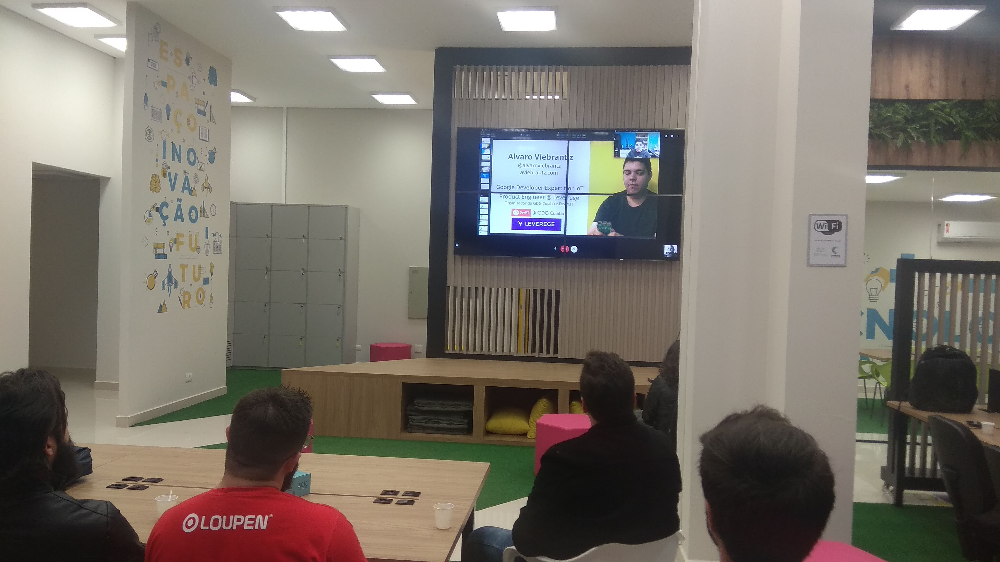

> Photo by Wellington Mitrut

No último dia 15 de maio de 2019 aconteceu o **Meetup #001 - Construindo projetos com Google Assistant e IoT** no ACIC Labs, meetup este que coordenei pelo GDG Cascavel, cidade na qual moro atualmente. Neste meetup, eu chamei meu amigo [Alvaro Viebrantz](https://aviebrantz.com.br/) para falar um pouco sobre seus projetos de IoT envolvendo o Google Assistant - projetos tais quais: "Como falar com Plantas", onde Alvaro consegue através de parâmetros diversos informados por sensores de humidade, ar, temperatura -  medir a saúde de suas plantas e - por que não - ouvi-las e saber o que elas precisam verbalmente.

> Alvaro Viebrantz

Interfaces conversacionais são muito interessantes e quero construir em breve algo parecido, logicamente irei compartilhar aqui com vocês.

> Photo by Wellington Mitrut

Era uma noite fria mas o público compareceu bem e tirou as mais diversas dúvidas. O aprendizado nesse tipo de evento é incrível. Se você mora em Cascavel, sinta-se convidado para os próximos meetups, são gratuitos e de altíssima qualidade - basta se cadastrar no [link](https://www.meetup.com/pt-BR/GDG-Cascavel/).

## Links

Não por menos, abaixo seguem os links dos principais tópicos que foram comentados na palestra:

▶ 🔗 [Website pessoal do Alvaro Viebrantz](https://aviebrantz.com.br/) 
▶ 💬 [Slides da palestra](https://www.slideshare.net/alvarowolfx/construindo-projetos-com-google-assistant-e-iot) 
▶ 📺 [Canal do Alvaro no youtube](https://www.youtube.com/channel/UC89Gzw1wIFXganAibMAnCOg) 
▶ [Loja dos apps para assistant](https://assistant.google.com/explore) 
▶ [Tutoriais oficiais do Google para Assistant](https://codelabs.developers.google.com/?cat=Assistant) 
▶ [Dialogflow](https://dialogflow.com/) 
▶ 📺 [Novidades do assistant em 2019](https://www.youtube.com/watch?v=3kODsHcrs2c)

Agradecimentos ao palestrante, ao Women Tech Maker Cascavel e a ACIC que cedeu o espaço para nós.