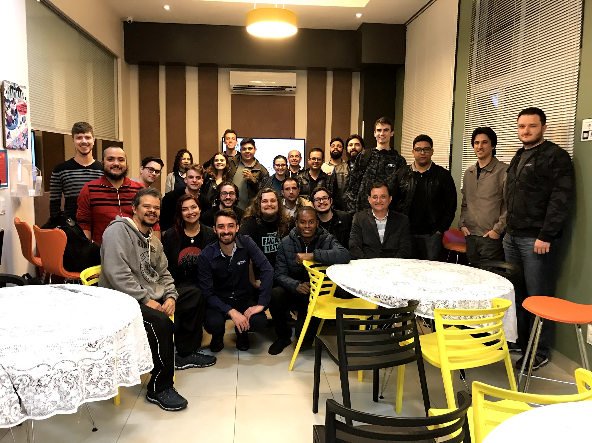
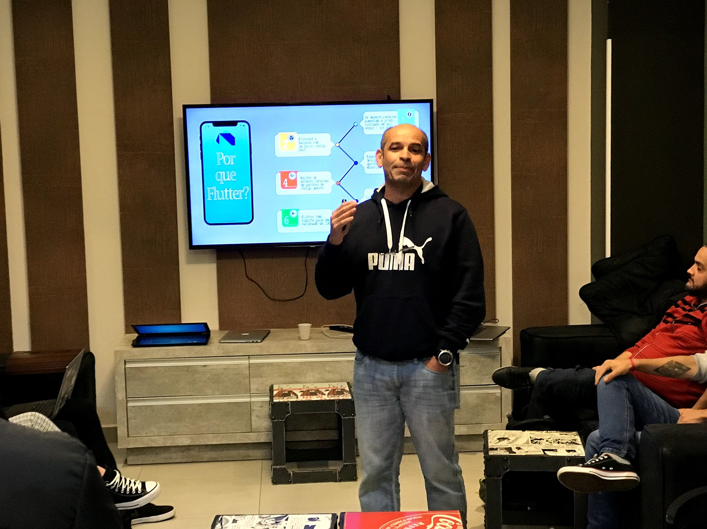
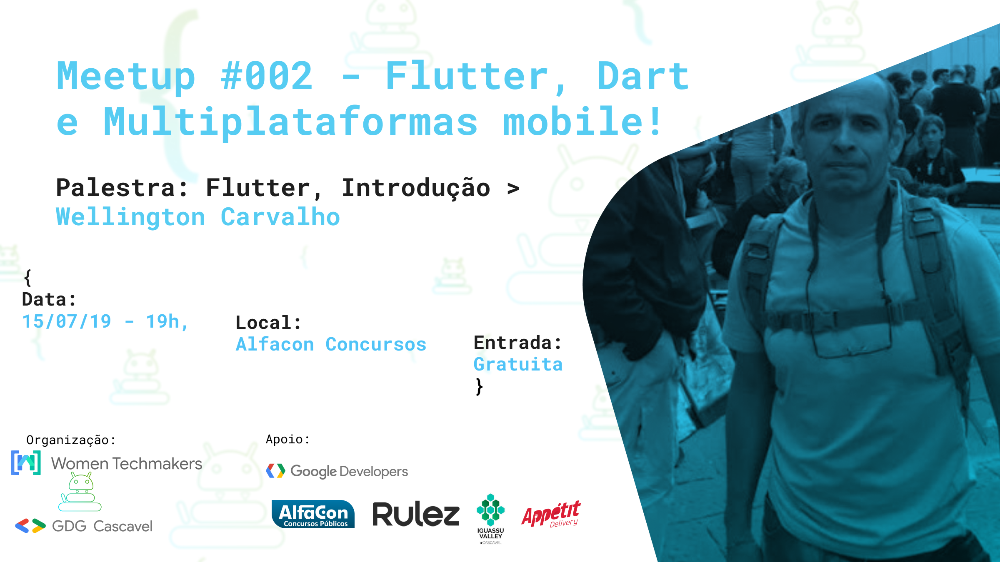
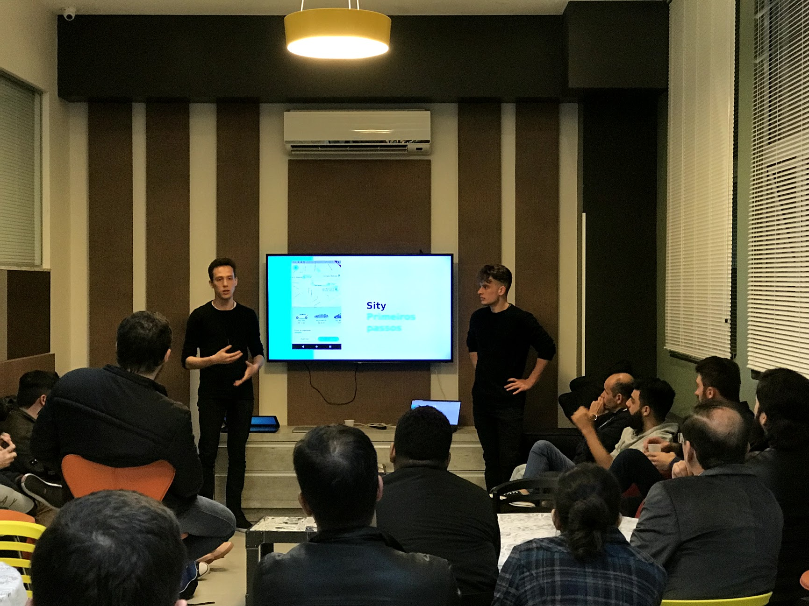
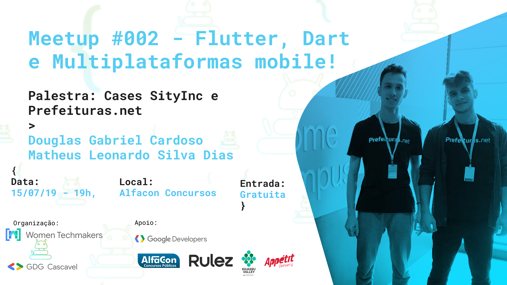
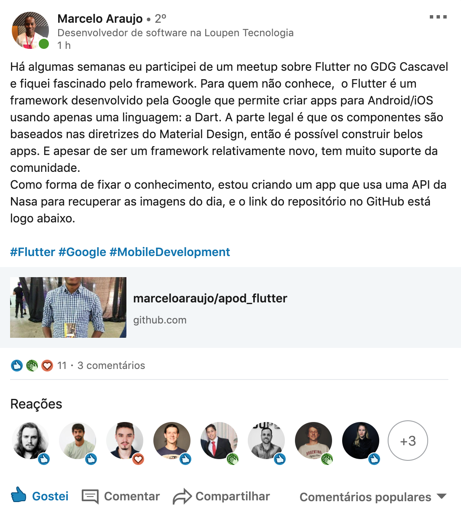
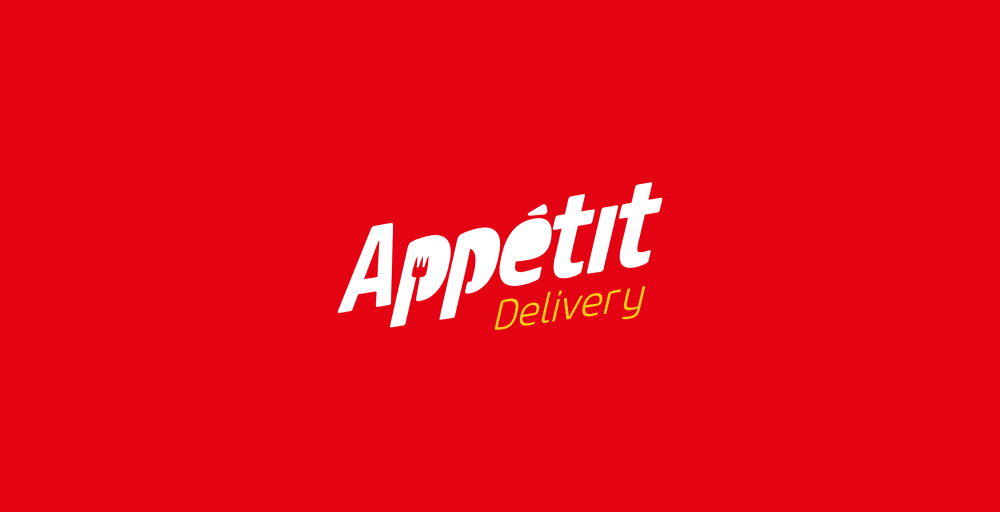

> Photo by Guilherme Serrano

No último dia 15 de Julho de 2019 aconteceu o **Meetup #002 - Flutter, Dart e Multiplataformas mobile!** na Alfacon - Concursos Públicos, meetup este que coordenei pelo GDG Cascavel junto com o WTM. Neste meetup, Wellington Carvalho se ofereceu para falar um pouco sobre suas experiências com o aprendizado com flutter, a nova tecnologia multiplataforma para dispositivos móveis da Google.

### Introdução ao Flutter

> Wellington Carvalho explicando o Flutter.

Wellington, que é um militar da reserva está a poucos meses estudando a tecnologia e se mostra muito empolgado e obtendo ótimos resultados com o Flutter. Inclusive, já está convidado para futuros meetups para demonstrar ainda mais seus avanços.

> Foto da chamada das redes sociais para a palestra do Wellington

### Casos do mundo real

Ainda na mesma pegada, mantendo o tema do Flutter, o Douglas Cardoso e o Matheus Leonardo vieram falar sobre os 2 cases de flutter que já possui inclusive publicados nas lojas: SityInc, um aplicativo voltado ao transporte numa linha semelhante a Uber, 99, Lyft e um aplicativo do Prefeituras.net - Startup na qual trabalham e que tem auxiliado diversas partes do poder público.

> Douglas Cardoso e Matheus Leonardo.

Trazendo conceitos mais avançados, problemas e acertos da escolha da tecnologia, mostraram como é lidar com uma tecnologia tão nova em aplicativos já em produção.

> Foto da chamada das redes sociais para a palestra de Douglas e Matheus.

### Pós-Evento

Pouco antes da publicação deste post, o [Marcelo Araújo](https://www.linkedin.com/in/marcelo-araujo-3179a364/) compartilhou sua experiência conosco sobre como tem estudado flutter. Abaixo é possível conferir o post e um vídeo com seu projeto.

<blockquote class="imgur-embed-pub" lang="en" data-id="a/2WTgIMm"  ><a href="//imgur.com/a/2WTgIMm">Vídeo com o sample de Flutter do Marcelo Araújo</a></blockquote>

### Sorteio

> Appétit Delivery

Finalizando o encontro, a startup cascavelense Appétit Delivery, que oferece delivery de refeições com cashback nos disponibilizou R\$ 50,00 para ser sorteado entre os presentes do evento, fizemos e quem ganhou foi o participante Samuel Pares.

Era uma noite fria mas o público compareceu bem e tirou as mais diversas dúvidas. O aprendizado nesse tipo de evento é incrível. Se você mora em Cascavel, sinta-se convidado para os próximos meetups, são gratuitos e de altíssima qualidade - basta se cadastrar no [link](https://www.meetup.com/pt-BR/GDG-Cascavel/) - e para Agosto já temos data e tema marcados, se você é entusiasta Front-End e curte Vue, é só cliar [aqui](https://www.meetup.com/pt-BR/GDG-Cascavel/events/263654959/).

## Links

Não por menos, abaixo seguem os links dos principais tópicos que foram comentados na palestra:

▶ 🔗 [Website do Flutter](https://flutter.dev/) 
▶ 🔗 [Conheça apps feitos em Flutter](https://flutter.dev/showcase) 
▶ 🔗 [Tutoriais oficiais do Google para Flutter](https://flutter.dev/docs/codelabs) 
▶ 🚘 [Site da Sity](https://www.sityinc.com/) 
▶ 🍔 [Conheça o Appétit Delivery](http://appetitdelivery.com.br/) 

Agradecimentos aos palestrantes, à Alfacon, Women Tech Maker Cascavel, e a startup Appétit Delivery.
