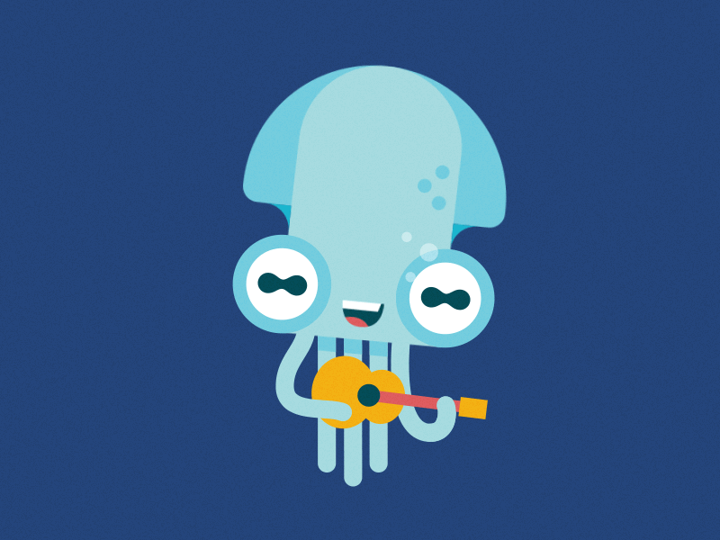
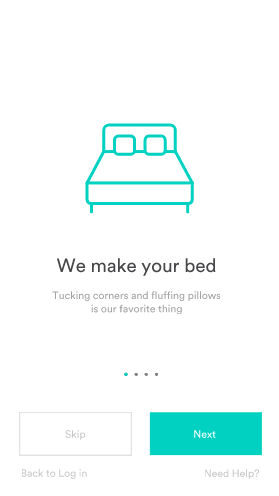
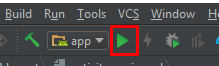
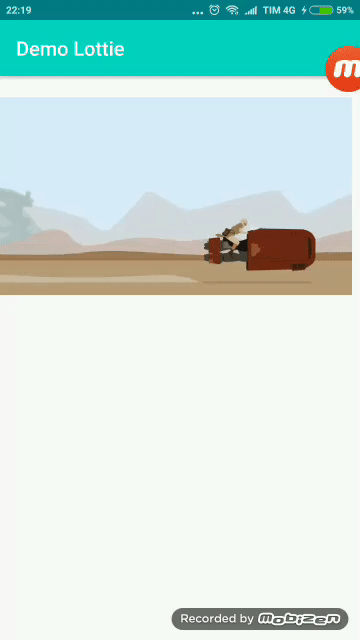
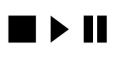
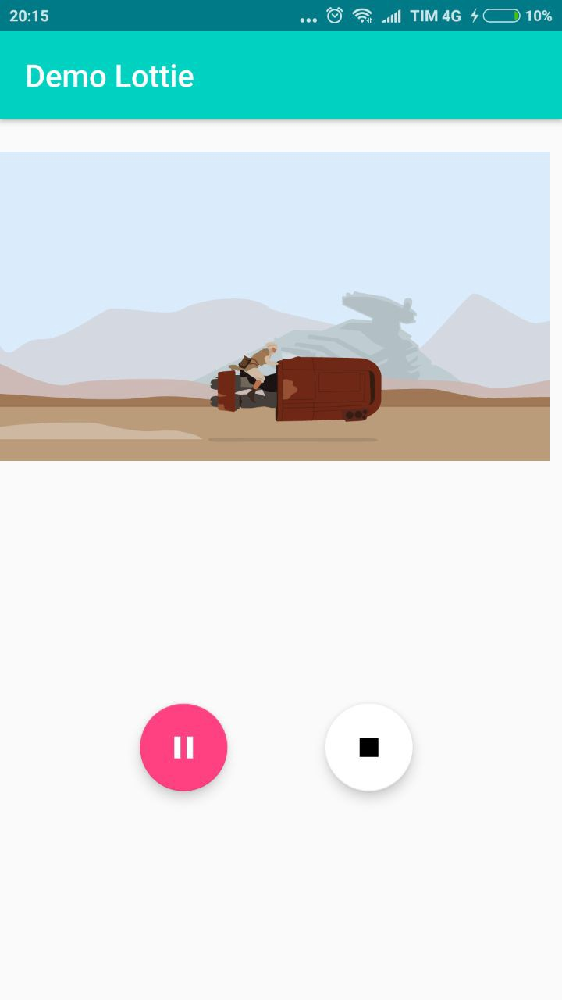

Fala pessoal, o post demorou um pouco mas não falhou! Aqui estamos mais uma vez para falar de **Lottie** e pra fazer o combo, de **Kotlin**.

Se você acompanha o blog sabe que fiz no final de 2017 um post falando um pouco sobre Lottie, uma biblioteca do [AirbnbEng](https://medium.com/@airbnbeng) que trata de processar animações do After Effects em tempo real e permite que estas mesmas animações sejam tão facilmente usadas e manipuladas quanto arquivos estáticos em aplicações web e mobile.

O Lottie, faz algo mais ou menos nessa linha, animações para a sua aplicação de forma simples e performática, utilizando um port de animações do After Effects com bodymovin — O efeito é interessante:



Agora, o que nós vamos fazer neste post é uma aplicação demonstrativa em Android nativo utilizando Kotlin com alguns dos principais métodos desta biblioteca.

Pega papel, caneta e uma tesoura sem ponta que _eu vou mostrar para a moçada como fazer…_

Você pode baixar do Github abaixo ou fazer passo a passo (o que eu particularmente recomendo).

[Repositório do projeto do post](https://github.com/Wmitrut/Wmlottie)

### Iniciando nosso projeto

Primeiro de tudo, peço para que você tenha a última versão do Android Studio, que até a data deste post era a 3.0.1.

Segundo, crie um projeto no Android Studio com uma _Empty Activity_. Por quê? Porque ela tem o básico para o que vamos precisar nesta primeira aplicação: uma toolbar.

Isto feito, deixe que o Android Studio baixe as bibliotecas básicas com o Gradle e abra o arquivo **_build.gradle_**.

na área de dependencies instale as seguintes bibliotecas:

```json
    dependencies {
        ...
        compile 'com.airbnb.android:lottie:2.5.0-rc1'
        compile 'com.android.support:design:27.0.2'
        ...
    }
```

> Importante, caso estas bibliotecas estejam desatualizadas, tente usar a versão corrente da data que você está lendo.

Isto feito, deixe o Gradle baixar as dependências do seu projeto novamente, o que instalamos aqui é o próprio Lottie e a Design Support Library do Android, que é essencial para componentes do material design. Mais à frente você vai entender o por que de utilizarmos esta mesma.

### A Animação

Eu particularmente não sei fazer animações no After-Effects, mas isto não é algo que irá nos limitar. Existe um site chamado [Lottie Files](https://www.lottiefiles.com/) com um monte de arquivos JSON de animação gratuítos.

O Lottie Files é um repositório da comunidade, então vá lá e escolha uma animação legal para testarmos.

No nosso repositório do Github eu coloquei 3 animações dentro da pasta Assets: _rey.json, shape_types.json e spirit_geek.json_. Todas encontradas no Lottie Files.

Para este post utilizei a _rey.json_. Importante ressaltar que a pasta Assets não é uma pasta que vem de forma ‘nativa’ junto ao projeto quando ele é criado no Android Studio, então dentro da pasta _main_, você pode criar a pasta assets e colocar os arquivos lá.

A paleta de cores que utilizei é a seguinte: Dentro da pasta **_res/values_** existe o arquivo **_colors.xml_** ele vai ser nosso arquivo de cores básicas, abaixo o que eu utilizei:

```xml
    <color name="colorPrimary">#00D1C1</color>
    <color name="colorPrimaryDark">#007A87</color>
    <color name="colorAccent">#FF4081</color>
    <color name="colorStop">#FF5252</color>
    <color name="colorWhite">#ffffff</color>

```

### Implementando nossa primeira animação

Depois de nosso projeto configurado, nossas animações baixadas e tudo mais, estamos prontos para rodar e ver nossa animação viva na tela do dispositivo.

Abaixo está o trecho de código inicial onde já chamo o componente de tela do lottie e recupero o arquivo de animação.

```xml
        <android.support.constraint.ConstraintLayout
            xmlns:android="http://schemas.android.com/apk/res/android"
            xmlns:app="http://schemas.android.com/apk/res-auto"
            xmlns:tools="http://schemas.android.com/tools"
            android:layout_width="match_parent"
            android:layout_height="match_parent"
            tools:context="com.wmitrut.ktl.wmlottie.MainActivity">

            <com.airbnb.lottie.LottieAnimationView
                android:id="@+id/animation_view"
                android:layout_width="match_parent"
                android:layout_height="240dp"
                android:layout_alignParentStart="true"
                android:layout_alignParentTop="true"
                android:layout_marginEnd="8dp"
                app:layout_constraintEnd_toEndOf="parent"
                app:layout_constraintStart_toStartOf="parent"
                app:lottie_autoPlay="true"
                app:lottie_fileName="rey.json"
                app:lottie_loop="true"
                tools:layout_editor_absoluteY="16dp"
                tools:ignore="MissingConstraints" />

        </android.support.constraint.ConstraintLayout>
```

Repare nas propriedades que utilizamos exclusivas do Lottie.

**app:lottie_fileName=”rey.json”** — Aqui fica explicitado o arquivo que iremos utilizar, no caso rey.json.

**app:lottie_autoPlay=”true”** — Aqui estamos dizendo para o Lottie que, quando ele renderizado em tela ele poderá tocar a animação automaticamente.

**app:lottie_loop=”true”** — Por último, o loop, onde dizemos para tocar a animação sem parar.

Isto posto, damos play no Android Studio…



Esperamos a compilação, escolhemos o dispositivo e…



_Voilá!_ Nossa animação rodando bonita!

> Tá, mas é só isso? Sério que você levou 2 posts pra falar isso?

Calma lá jovem. Agora que vem a parte legal. O Lottie não apenas ajuda a renderizar estas animações, bem como nos dá algum controle sobre elas.

### Play, Pause, Stop

Como já disse anteriormente, esta pequena aplicação se preocupará em criar a experiência básica, rodar e dar algum controle sobre a nossa aplicação, num próximo e breve post iremos falar de coisas um pouco mais complexas como Compositions, Propriedades dinâmicas, Caching e preloading dentre outras pequenas coisas.

Com o post de hoje, no entanto, apesar de você ver o básico, é possível já criar um Empty State interessante e melhor que aquela velha imagem parada que você utilizava. Eu já falei de empty states e as vantagens de utiliz-a-los aqui no blog.

Mas vamos lá, para continuar a implementação da nossa aplicação, antes de tudo é interessante baixar 3 ícones, sabe aqueles de play, pause e stop já tradicionais? Então, eu fui no [MaterialDesignIcons](https://materialdesignicons.com/), um banco de ícones sensacional e baixei estes 3 ícones em formato _VectorDrawable_, que é uma espécie de SVG/XML que o Android entende e renderiza. É importante que ele seja um VectorDrawable para manter a qualidade, pois não sei qual a resolução da sua tela e esses Drawables mantém a qualidade, independente da sua resolução. Se você não sabe quais são os ícones, pode se orientar com a imagem abaixo.



Outra grande vantagem de se utilizar VectorDrawables é o fato que eles são arquivos de texto editáveis, o que nos dá liberdade de alterar propriedades dos mesmos via programação.

Isto posto, lembra lá atrás quando adicionamos a Android Design Support Library? Pois bem, aqui iremos utilizar esta lib para criar nossos dois FABs.

FAB é o diminutivo para Floating Action Button, que são aqueles botões circulares que tem geralmente no canto direito das aplicações Android que serve como um atalho para as principais funções da aplicação.

Já falamos do uso de FAB também em outro post antigo.

Os nossos botões servirão como respectivamente o play/pause e o botão stop, os quais usaremos para manipular a nossa animação.

Para implementar na sua activity, é só fazer como no exemplo abaixo:

```xml
        <android.support.constraint.ConstraintLayout
            xmlns:android="http://schemas.android.com/apk/res/android"
            xmlns:app="http://schemas.android.com/apk/res-auto"
            xmlns:tools="http://schemas.android.com/tools"
            android:layout_width="match_parent"
            android:layout_height="match_parent"
            tools:context="com.wmitrut.ktl.wmlottie.MainActivity">

            <com.airbnb.lottie.LottieAnimationView
                android:id="@+id/animation_view"
                android:layout_width="match_parent"
                android:layout_height="240dp"
                android:layout_alignParentStart="true"
                android:layout_alignParentTop="true"
                android:layout_marginEnd="8dp"
                app:layout_constraintEnd_toEndOf="parent"
                app:layout_constraintStart_toStartOf="parent"
                app:lottie_autoPlay="true"
                app:lottie_fileName="rey.json"
                app:lottie_loop="true"
                tools:layout_editor_absoluteY="16dp"
                tools:ignore="MissingConstraints" />

            <android.support.design.widget.FloatingActionButton
                android:id="@+id/button_pause"
                android:layout_width="wrap_content"
                android:layout_height="wrap_content"
                android:layout_gravity="center"
                android:layout_margin="10dp"
                android:layout_marginBottom="8dp"
                android:layout_marginEnd="8dp"
                android:layout_marginStart="8dp"
                android:layout_marginTop="8dp"
                app:layout_constraintBottom_toBottomOf="parent"
                app:layout_constraintEnd_toEndOf="parent"
                app:layout_constraintHorizontal_bias="0.28"
                app:layout_constraintStart_toStartOf="parent"
                app:layout_constraintTop_toBottomOf="@+id/animation_view"
                app:layout_constraintVertical_bias="0.502"
                app:srcCompat="@drawable/pause" />

            <android.support.design.widget.FloatingActionButton
                android:id="@+id/button_stop"
                android:layout_width="wrap_content"
                android:layout_height="wrap_content"
                android:layout_gravity="center"
                android:layout_margin="10dp"
                android:layout_marginBottom="8dp"
                android:layout_marginEnd="8dp"
                android:layout_marginStart="8dp"
                android:layout_marginTop="8dp"
                app:backgroundTint="@color/colorWhite"
                app:layout_constraintBottom_toBottomOf="parent"
                app:layout_constraintEnd_toEndOf="parent"
                app:layout_constraintHorizontal_bias="0.698"
                app:layout_constraintStart_toStartOf="parent"
                app:layout_constraintTop_toBottomOf="@+id/animation_view"
                app:layout_constraintVertical_bias="0.502"
                app:srcCompat="@drawable/stop" />

        </android.support.constraint.ConstraintLayout>

```

O resultado esperado é algo próximo disto aqui ó:



### Implementando a lógica com Kotlin

Agora é que a nossa mágica acontece. Vamos implementar os 3 componentes da nossa tela e manipular a animação utilizando o Kotlin.

O primeiro passo disso tudo é atrelar nossos elementos de UI à lógica. A declaração é bem simples, primeiro os botões:

```kotlin
    val pauseButton = findViewById<View>(R.id.button_pause)
    val stopButton = findViewById<View>(R.id.button_stop)
```

E depois a nossa view de animação do Lottie

```kotlin
    val animationView = findViewById<View>(R.id.animation_view) as LottieAnimationView
```

Referenciando a biblioteca.

Depois, criamos os métodos de Pause e Delete da nossa aplicação, repare o quão simples é:

```kotlin
    pauseButton.setOnClickListener{
        if (animationView.isAnimating()) {
            animationView.pauseAnimation()
            button_pause.setImageResource(R.drawable.play)
        }else {
            animationView.resumeAnimation()
            button_pause.setImageResource(R.drawable.pause)
        }
    }
```

Explicando, chamamos a referência do nosso pauseButton, depois verificamos usando o método isAnimating, como nossa view já carrega a animação executando, nós iremos primeiro passar o método pauseAnimation que irá instantaneamente pausar a animação, depois só trocamos o drawable do botão, aquele mesmo que você baixou anteriormente. No caso de não estar animando, fazemos o inverso e continuamos a animação do frame em que parou.

Para o botão de stop, o processo é mais simples ainda:

```kotlin
    stopButton.setOnClickListener{
        animationView.cancelAnimation()
        animationView.setProgress(0F)
        button_pause.setImageResource(R.drawable.play)
    }
```

No caso, cancelamos a animação, você vai ver que se fizer apenas isto ele ficará no mesmo frame, dando a impressão que apenas pausou, então neste caso, para dar a impressão que a animação foi parada mesmo, como um vídeo, temos que setar para o frame inicial da animação, com setProgress para o frame 0, da mesma forma, altero o drawable do nosso botão de pause para play.

A minha activity ficou assim:

```kotlin

    package com.wmitrut.ktl.wmlottie
    import android.support.v7.app.AppCompatActivity
    import android.os.Bundle
    import android.support.v4.content.ContextCompat
    import android.view.View
    import com.airbnb.lottie.LottieAnimationView
    import kotlinx.android.synthetic.main.activity_main.*

    class MainActivity : AppCompatActivity() {

        override fun onCreate(savedInstanceState: Bundle?) {
            super.onCreate(savedInstanceState)
            setContentView(R.layout.activity_main)

            val animationView = findViewById<View>(R.id.animation_view) as LottieAnimationView
            val pauseButton = findViewById<View>(R.id.button_pause)
            val stopButton = findViewById<View>(R.id.button_stop)

            pauseButton.setOnClickListener{
                if (animationView.isAnimating()) {
                    animationView.pauseAnimation()
                    button_pause.setImageResource(R.drawable.play)
                }else {
                    animationView.resumeAnimation()
                    button_pause.setImageResource(R.drawable.pause)
                }
            }

            stopButton.setOnClickListener{
                animationView.cancelAnimation()
                animationView.setProgress(0F)
                button_pause.setImageResource(R.drawable.play)
            }

        }
    }
```

Agora é só rodar e testar.

E é assim, de forma simples e com cada detalhe explicado que temos o nosso primeiro app rodando uma animação com o Lottie.

Para os próximos posts, iremos explorar como utilizar em outros elementos, como listas, sliders e etc. Como já frisei, é possível apenas com este tutorial você já ter estados vazios e outras animações mais pontuais mas nada impede você de continuar os estudos. Leia sempre a [documentação](http://airbnb.io/lottie/).
