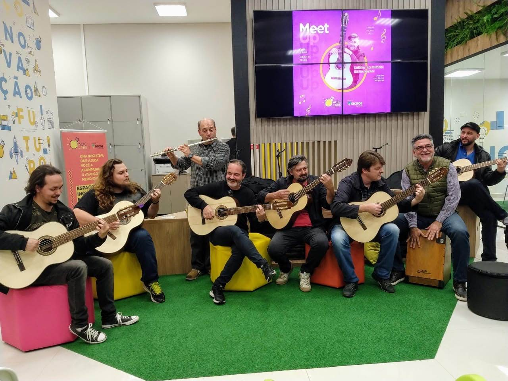
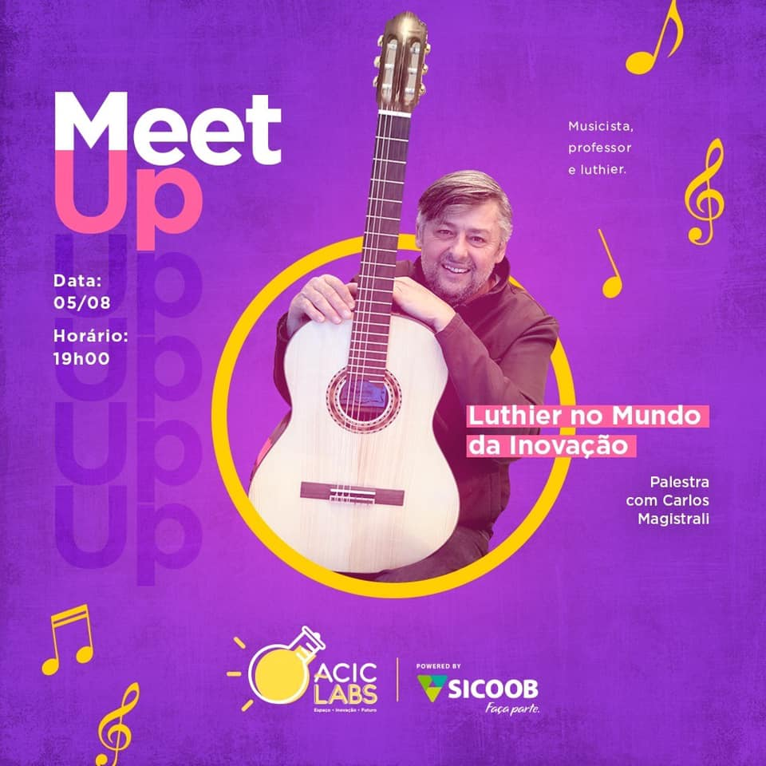
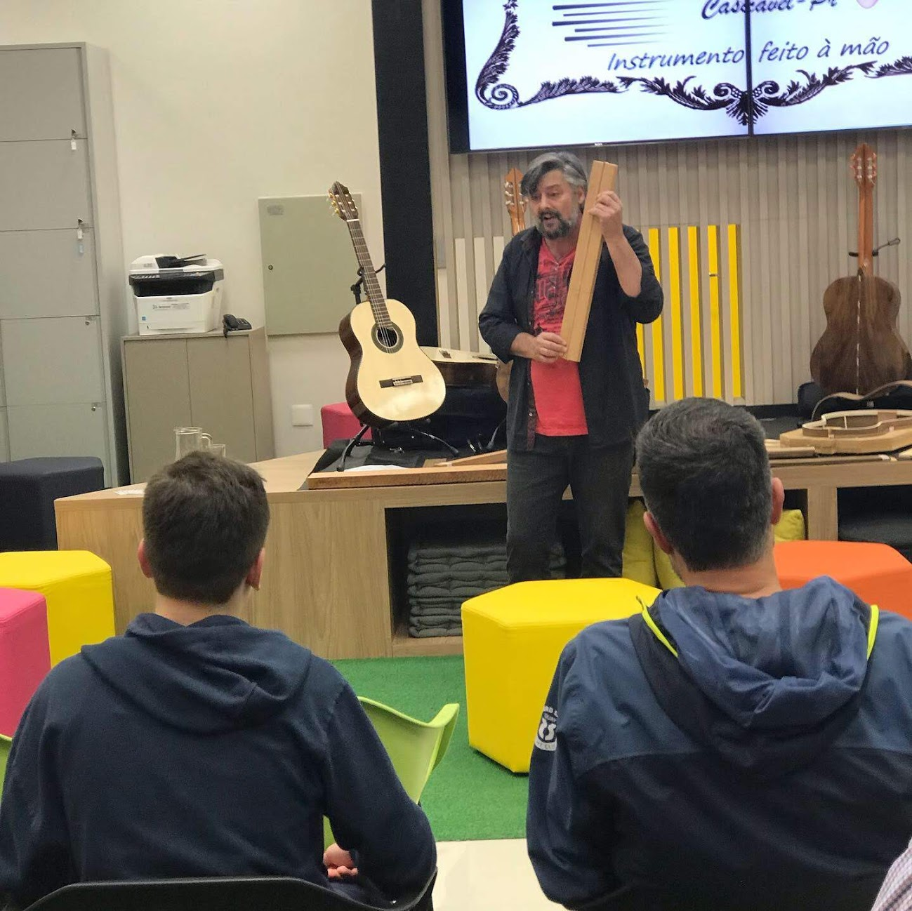
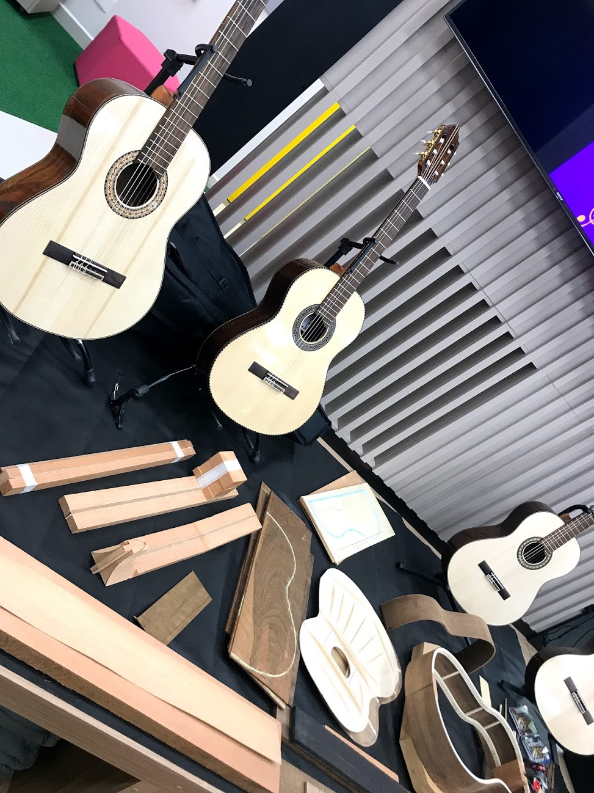
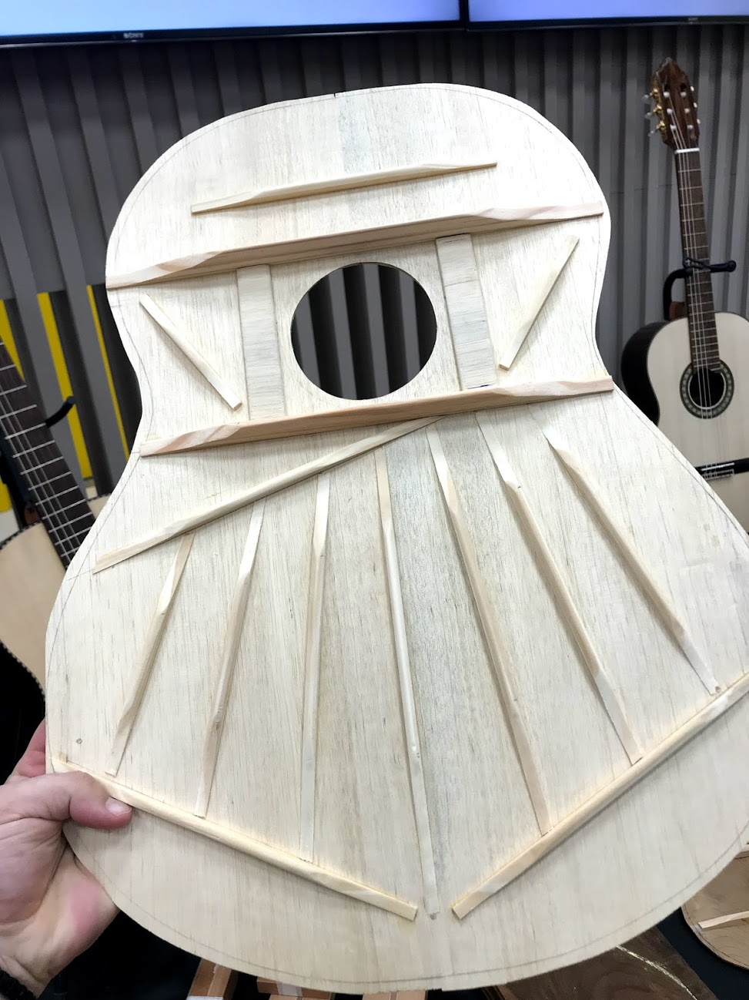

> Esse é um texto-ensaio, um pouco diferente do que você está acostumado por aqui então sente, relaxe, leia com calma.

> Photo by ACIC Labs

> Recomendo fortemente que você leia o texto ao som abaixo.

<iframe src="https://open.spotify.com/embed/track/0I4zQbi4OxnlVJ13GKJHGC" width="300" height="380" frameborder="0" allowtransparency="true" allow="encrypted-media"></iframe>

### Solve / Coagula

Eu queria mesmo era ser músico.

Essa é a verdade. Não falei ou manifestei muito isso mas durante bom tempo da minha vida era isso que eu queria fazer (e ainda quero). Música pra mim tem um poder mágico, quase etéreo, quase divino - todo aquele papo new age de vibrações, número 7, 7 escalas, 7 notas... Aquele papo viajado mas que fazia sentido quando se falava de música pois música é essência humana. É uma das nossas produções culturais mais antigas. Positiva ou negativamente TODOS somos de alguma forma impactados por músicas. Mente quem nega.

Infelizmente não deu pra ser músico até hoje, não profissionalmente... arrisco tocar com meu violão, compor algo no GarageBand, mas confesso que não fiz nada que seja decente de se ouvir e dizer: "
PQP, FIZ UMA MÚSICA". Escolhi então uma profissão desafiadora e igualmente criativa em outros meios. Programar.

Talvez num sentido mais físico, programar tenha se tornado a verdadeira forma de magia do mundo moderno. Palavras que viram ações - do nada você ordena bytes, comandados por palavras que numa certa ordem, mexem elétrons que enviam informações e transformam o mundo ao seu redor - BAM! - chamou um carro e é só esperar que em 5 minutos você está a caminho de algum lugar. É trivial chamar um Uber, mas pensa que louco isso seria a 10, 15 anos? Somos todos pequenos magos modernos.

Mas deixando os pequenos devaneios de lado, vamos falar do encontro com o luthier.

### O meetup

Pipocou na minha timeline um meetup e o convite para conhecer o que luthieria e inovação tem em comum. Apesar de ter deixado em segundo plano, a música sempre esteve presente em minha vida, umas vezes mais, outras menos, enfrentei a preguiça e fui ver qual era.

> Photo by ACIC Labs

Carlos Magistralli vive de música, da aulas de violão e a pouco mais de 3 anos começou a fabricar violões em casa mesmo. Explicou a escolha das madeiras de cada peça, a orígem da palavra LUTHIER - que significa: <i> aquele que faz alaúde</i> (do francês Luth), o porque madeira x ou y servem, qual não pode ser usada por questões ambientais, por que se usa um tensor por dentro do braço de certos instrumentos, quais as técnicas usadas para colar todas as peças... enfim, eu que não conhecia nada do processo com detalhes mesmo sendo músico a pelo menos uns 15 anos aprendi e muito.

> Acervo pessoal

### A internet

Aleister Crowley já dizia

> "a Verdadeira Vontade deve saltar, uma fonte de Luz, de dentro de nós, e fluir desimpedida, fervente de Amor, para o Oceano da Vida."

Ao ler isto solto no texto vocês devem estar pensando:

- <i>Mas Mitrut, o que isto tem a ver com instrumentos musicais, inovação e luthieria?</i>
- <i>Quero ver onde esse papo de programação, música, magia e luthieria vai chegar...</i>
- <i>Tu ta mexendo com coach?</i>
- <i>Vish, agora só falta citar Foucault...</i>
- <i>Pirou na batatinha...</i>

<iframe width="560" height="315" src="https://www.youtube.com/embed/G3LvhdFEOqs" frameborder="0" allow="accelerometer; autoplay; encrypted-media; gyroscope; picture-in-picture" allowfullscreen></iframe>

Pois bem, com isto em mente e com o leitor achando que eu deveria ser internado pois o devaneio tá demais, eu trago mais um mago a mesa, Alan Moore - um dos maiores escritores de literatura e quadrinhos dos tempos modernos disse em seu documentário:

> Existe alguma confusão sobre o que é realmente mágico. Acho que isso pode ser esclarecido olhando para as descrições mais antigas de magia. A magia em suas formas mais primitivas é normalmente designada como “arte”. Acho que isso é bastante literal. Eu acredito que a magia é arte e que a arte, quer por escrito, música, escultura ou qualquer outro meio é literalmente mágica. A arte é, como mágica, a ciência de manipular símbolos,palavras ou imagens para realizar mudanças na consciência. A verdadeira linguagem da magia trata tanto da escrita como de arte e também sobre o sobrenatural.

E onde voltamos ao Magistralli nisso tudo?

Bem, o Carlos contou que a vontade de fazer instrumentos se originou MUITO antes do que o ato de realmente fazê-los por um simples motivo: acesso a informação. Sendo músico desde jovem, Carlos não podia nos anos 80 ter acesso a algum material completo sobre luthieria. Isso só se deu com a democratização da informação que a nossa era tem (pro bem e pro mal). Na internet foi possível encontrar não só como fazer um violão mas até mesmo outros luthiers. A tecnologia como meio para se alcançar a verdadeira vontade. Fechamos o ciclo.

### Os instrumentos

A qualidade é impecável, é apenas o que posso dizer para resumir o que são os instrumentos de Magistralli. Para quem entende de música, os instrumentos tem voz firme, acústica excelente. Nunca havia tocado um violão clássico com tamanha presença como estes. Fiquei uns bons 20 minutos viajando nas 6 cordas.

Ao final do evento a única coisa que pensava era: preciso aprender a fazer isto. Guitarra, violão, seja lá o que for, transformar a mais bruta madeira em uma ferramenta mágica musical. Magistralli vendo meu interesse ofertou para me ensinar o ofício.

Nesse encontro também conheci Luciano Dallastra, que hoje é meu mestre nas 6 cordas que é um gênio do Jazz-Fusion que você pode conferir abaixo:

<iframe width="560" height="315" src="https://www.youtube.com/embed/7BYyKBTn3Yw" frameborder="0" allow="accelerometer; autoplay; encrypted-media; gyroscope; picture-in-picture" allowfullscreen></iframe>

### Procrastinação, postergação e 2020

Apesar de tudo se encaixar nesse dia, de tudo ser bonito e tudo mais, eu ainda não fui atrás das aulas, infelizmente ainda não consigo me multiplicar pra fazer tudo que quero.

Pra você ter uma ideia, demorei meses pra publicar este texto. 6 pra ser exato, vários problemas, tempo, cansaço (acredite, escrever cansa), outras prioridades, estudo, problemas pessoais, familiares...

Mas isso é passado. 2020 quero construir um blog com mais textos voltados ao envolvimento de tecnologia, dados e música, um pouco do que vejo e trabalho na [Playax](https://www.playax.com/), além é claro, do bom e velho Javascript.

Também te prometo Magistralli. Ainda esse ano vamos fazer um violão incrível.

<i>Perdurabo</i>
