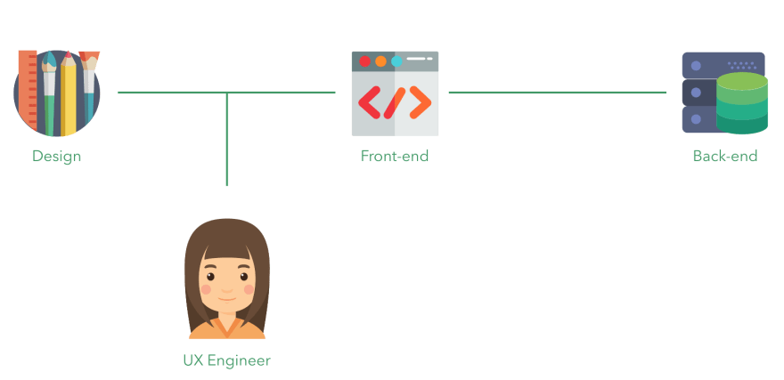
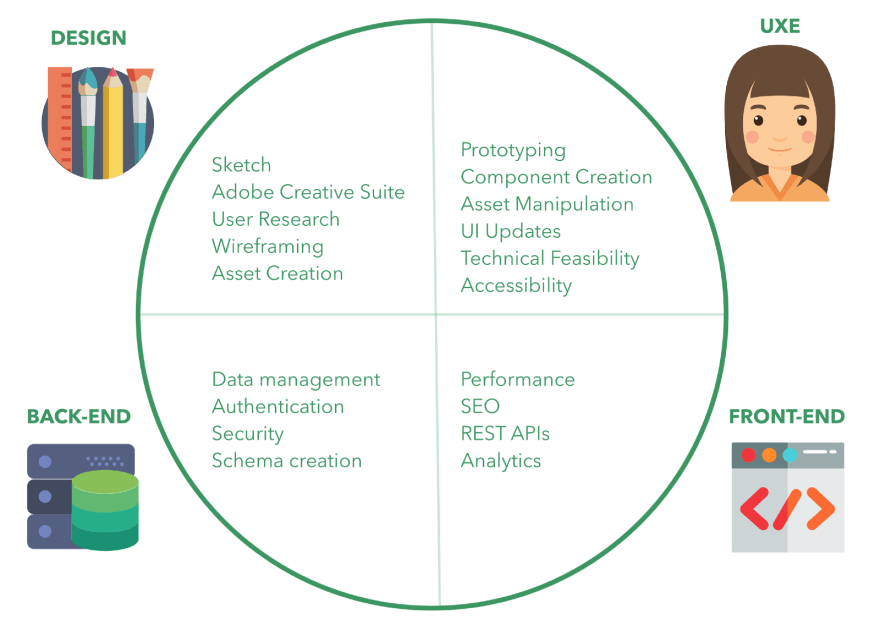

> Photo by Zanilik -  [@zanilik](https://unsplash.com/@zanilik) peguei lá no Unsplash

*Este é um texto traduzido e adaptado de [UX Engineering]([https://dev.to/emmabostian/ux-engineering-3hem](https://dev.to/emmabostian/ux-engineering-3hem)) de [Emma Bostian]([https://twitter.com/EmmaBostian](https://twitter.com/EmmaBostian)) do Spotify. Tradução autorizada pela autora.*

Há alguns meses, fiquei emocionado por ser oficialmente considerado pelo meu time um "Engenheiro de experiência do usuário" (UXE). Eu teria a chance de construir Design Systems! Mas assim que os ânimos se acalmaram, eu rapidamente percebi o quão indefinido é o papel do UXE. Eu tentei pesquisar a posição no Google, mas fiquei a ver navios.

Embora algumas empresas, como Google e Etsy, estejam começando a contratar UXEs, a posição difere bastante entre as empresas.
Assim, depois de muita pesquisa no campo, acredito que finalmente resumi o que é um UXE, as habilidades necessárias para ter sucesso e as responsabilidades.

*Observe que esse papel é um apanhado não apenas de todas as pesquisas que fiz, mas também de minhas experiências pessoais. Se você está considerando se tornar um UXE, revise os requisitos para essa posição com seu potencial empregador.*

### O que é um Engenheiro de UX

Um engenheiro UX (UXE) é um engenheiro front-end que faz parte de uma equipe multifuncional de design e ajuda a facilitar a colaboração entre os times de design e engenharia.

Os UXEs possuem o conjunto de habilidades de um engenheiro front-end, mas com conhecimento prático dos princípios de design de UX. Seu domínio principal se concentra na camada de componentes de design / interface do usuário de um aplicativo e se afasta da camada de middleware entre o desenvolvimento front-end e back-end.

### Onde os UXEs se encaixam no processo?

Os UXEs ficam entre o design e a engenharia de front-end.

### Como eles se diferem dos engenheiros front-end?

Como os UXEs são os principais engenheiros de front-end, deve haver sobreposição entre eles, mas os UXEs empregam habilidades de design e são mais focados na interface do usuário do que na camada de middleware.

### Design Systems

Em geral, os UXEs trabalham na construção de Design Systems.

Um Design System é um conjunto de diretrizes e recursos que expressam a identidade em vários produtos digitais ou aplicativos de uma empresa. É composto por três partes: a linguagem de design, a biblioteca de componentes e o guia de estilos.

### Linguagem de Design

Pode ser chamada pelo inglês DESIGN LANGUAGE. São os recursos visuais de design e as diretrizes de marca necessárias para criar seu sistema. Aqui estão alguns exemplos de diretrizes de marca que você pode ver:

- Paleta de cores
- Diretrizes de acessibilidade
- Tipografia
- Bibliotecas de animação

### Biblioteca de componentes

São os componentes codificados usados para dar vida à linguagem de design. Esses componentes são criados geralmente usando-se HTML, CSS e JavaScript. Alguns dos Design Systems mais populares usam bibliotecas e estruturas JavaScript mas também podem incluir componentes da web nativos (vanilla JS) - abaixo algumas das principais bibliotecas JS:

- React
- Vue.js
- Angular
- Polymer

### Guia de estilo

É o documento que elenca e encapsula a linguagem de design e a biblioteca de componentes. O [IBM Carbon](https://www.carbondesignsystem.com/) é um ótimo guia de estilo que eu recomendo.

### O que os UXEs fazem?

Como dito anteriormente, essa é uma área que varia muito de empresa para empresa, mas aqui estão algumas das principais responsabilidades de trabalho dos UXEs:

- Transformar a linguagem de design em uma biblioteca de componentes vivos, codificada em uma biblioteca JavaScript popular (ou vanilla JS).
- Tornar um protótipo de projetos de baixa fidelidade em protótipos de alta fidelidade usando a biblioteca de componentes.
- Trabalhar para melhorar a colaboração e a comunicação entre a equipe de design e as equipes de engenharia.
- Promover o valor e a adoção do design system em toda a organização.
- Criar e manter o site do guia de estilo para o Design System.

### Quais as qualificações para ser um UXE?

As qualificações para um UXE variam de empresa para empresa, no entanto, incluem principalmente habilidades de desenvolvimento front-end com uma pitada de conhecimento de experiência do usuário.

### Habilidades de UX Design

Aqui estão alguns exemplos de conhecimento de design do UX que se espera que um UXE entenda:

- A capacidade de olhar para um componente e entender como e por que as peças se encaixam. - *Por que o texto está alinhado à esquerda? (o texto deve ser justificado na direção em que seu público-alvo lê. Como a maioria das pessoas no mundo lê da esquerda para a direita, é por isso que é melhor justificar o texto quando você tem uma bloco de texto com mais de três linhas.)*
- Por que os parágrafos não devem ter mais de 50 a 70 caracteres por linha (quanto maior a linha, mais cansados os olhos de nossos usuários).
- Por que é melhor colocar texto de cor escura em fundos de cores claras do que vice-versa (o contraste é muito mais acentuado com essa combinação).
- Por que você nunca deve colocar texto sobre uma imagem de fundo sem sobreposição de fundo, sombra projetada ou contraste ou reduzir a opacidade da imagem (o texto, preto, branco ou colorido, se misturará com os diferentes tons da imagem; se tivermos um texto branco sobre uma imagem, ela se destacará nas áreas mais escuras e sumirá nas partes mais claras.)

### Habilidades de desenhar UI

Você também pode se familiarizar com algumas das ferramentas usadas pela equipe de design. Isso pode incluir o seguinte:

- Sketch
- Adobe Creative Suite
- Figma

Normalmente, se você tem experiência com uma dessas ferramentas, as habilidades básicas se replicams para as outras; Sketch e Figma são as ferramentas extremamente fáceis de aprender.

Se você deseja mesmo se aprofundar para função UXE, recomendo o livro [Refactoring UI](https://refactoringui.com/) e o curso Design For Developers, de [Sarah Drasner](https://frontendmasters.com/courses/design-for-developers/).

### Habilidades de Front-End

Como a função primária de um UXE é o desenvolvimento front-end, você deve estar habituado com os princípios básicos de engenharia e  desenvolvimento front-end.

Aqui estão algumas habilidades que você pode aprender antes de se candidatar a uma função UXE:

- **HTML, CSS e JavaScript:** não subestime esses "conceitos básicos". Aprender a usar essas habilidades de maneira eficaz e correta não é difícil, mas é extremamente importante.
- **Build Tools**: Você precisará saber trabalhar com o [Webpack](https://webpack.js.org/) ou [Gulp](https://gulpjs.com/), pois são essenciais para a criação de componentes.
- **Pré-processadores e ferramentas de CSS:** é comum encontrarmos [Sass](https://sass-lang.com/) ou [Less](http://lesscss.org/) em uma estrutura de UI ou  em uma biblioteca de componentes, portanto, você pode querer aprende trabalhar com eles. Além disso, eu recomendo aprender uma arquitetura de nomeação de classes como [Block-Element-Modifier (BEM)](http://getbem.com/) ou [Scalable and Modular Architecture for CSS (SMACSS)](http://smacss.com/). Eles são muito úteis ao usar as ferramentas acima citadas.
- **Acessibilidade:** você deve entender como usar HTML semântico para garantir que sua biblioteca de componentes esteja em conformidade com o [W3C](https://www.w3.org/) e pessoas com necessidades especiais venham poder acessar sua aplicação sem problemas.
- **Algoritmos *:** coloquei um asterisco nessa habilidade porque, como veremos na seção de entrevistas deste post, espera-se que você tenha alguma compreensão dos algoritmos, tempos de execução e técnicas de otimização. Dito isto, você provavelmente não utilizará tantos algoritmos no seu dia-a-dia, ao contrário de um Engenheiro Front-End em uma equipe de desenvolvimento.
- **Solução de problemas:** Você deve ser capaz de ter habilidades de resolução de problemas na construção da biblioteca de componentes.
- **Design Patterns:** Pode ser útil ter algum conhecimento de design patterns (as maneiras pelas quais podemos arquitetar nossos componentes). Addy Osmani publicou um [livro](https://addyosmani.com/resources/essentialjsdesignpatterns/book/) incrível sobre padrões de design que eu recomendo.
- **Design Responsivo:** Você deve construir componentes responsivos que devem funcionar em diferentes resoluções. Portanto, você deve conhecer os princípios do design responsivo.
- **Testes e debugging:** familiarize-se com testes. O [Jest](https://jestjs.io/) é uma tecnologia para testes em JavaScript popular e fácil de aprender. É frequentemente usado com a [Enzyme](https://github.com/enzymejs/enzyme) para testar componentes feitos em React. O [Sentry.io](http://sentry.io/) é outra ótima ferramenta para aprender a debugar e encontrar erros em seus componentes.
- **Controle de versão:** você deve se sentir confortável em usar o controle de versão. O [Git](https://git-scm.com/) é um dos mais populares, por isso não deixe de aprimorar suas habilidades!
- **Gerenciadores de pacotes e dependências:** você trabalhará para criar um pacote que suas equipes de engenharia possam aproveitar em seu fluxo de trabalho; portanto, você deve ter conhecimento sobre **[npm](https://www.npmjs.com/)** e **[yarn.](https://classic.yarnpkg.com/en/)**

### Habilidades interpessoais

Como UXE, você será a interface com as partes interessadas do Design System: a equipe de design, as equipes de engenharia e o gerente de produtos. Como resultado, você deve ter ótimas habilidades de comunicação.

Aqui estão algumas outras habilidades que você precisa para ser um UXE eficaz:

- **Comunicação escrita:** você criará a documentação do componente e do guia de estilo.
- Proatividade: Como UXE, você pode ter mais autonomia em relação aos seus objetivos ou trabalho cotidiano. Como tal, você deve procurar ativamente por trabalho e poder priorizar.
- Empatia: precisamos ter empatia com nossos usuários. No final das contas, é a razão pela qual estamos construindo esses aplicativos incríveis.

### O processo de entrevista

Como o UXE é um campo relativamente novo, o processo de entrevistas ainda não foi claramente definido. Não passei pelo processo de entrevista do UXE, pois já estava trabalhando na empresa, por isso mudei para essa função com bastante facilidade.

Em geral, o processo de entrevista será o mesmo de um engenheiro de front-end; portanto, estude seus algoritmos e JavaScript parça.

### Artigos relacionados

Existem várias empresas que contratam UXEs. Abaixo estão algumas ofertas de emprego para UXEs que podem fornecer mais informações sobre a função.

- [Google Careers](https://careers.google.com/jobs/results/4617646772518912-ux-engineer-front-end-web/)
- [My Google UX Engineer Interview](https://medium.com/@DementedScript/my-google-ux-engineer-interview-d79bb5854c06)
- [Who Is A UX Engineer?](https://medium.com/@alexewerlof/what-is-a-ux-engineer-1286d4b6d0e8)
- [20 Skills Needed To Become A UX Engineer In 2019](https://uxengineer.com/skills-needed-become-a-ux-engineer/)
- [Top 10 UX Engineer Portfolios](https://uxengineer.com/ux-engineer-portfolios/)

### Conclusão

A Engenharia de UX me deu um presente; permitiu juntar meu amor pelo design com os aspectos técnicos do desenvolvimento. Adoro ter as habilidades necessárias para me comunicar efetivamente com designers e engenheiros.

Se você acha que o UXE é o papel certo para você, encorajo você a fazer isso; Eu nunca fui tão feliz em um papel.

Não desanime se você não conseguir encontrar uma infinidade de trabalhos UXE; o campo ainda está em sua engatinhando e continuará a crescer.

Estou animado para ver aonde essa carreira me leva.