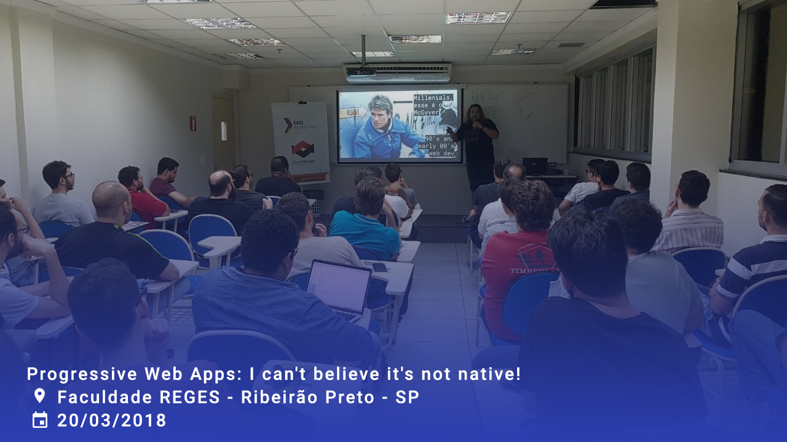
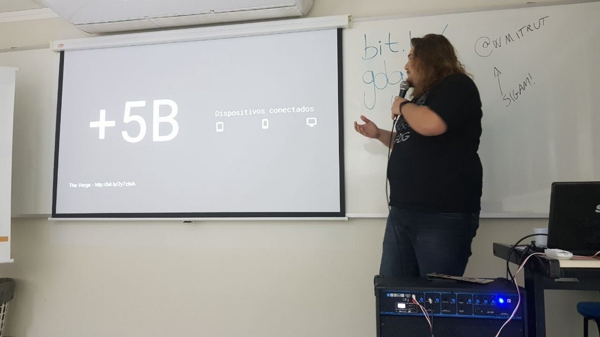
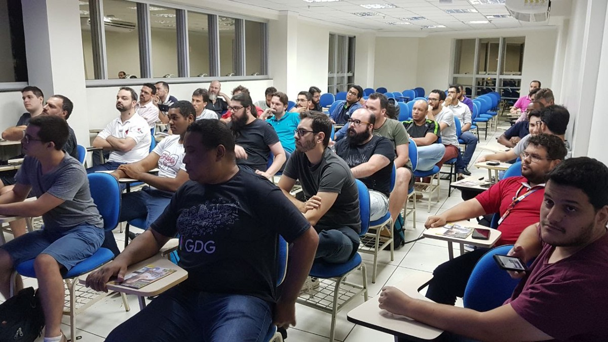
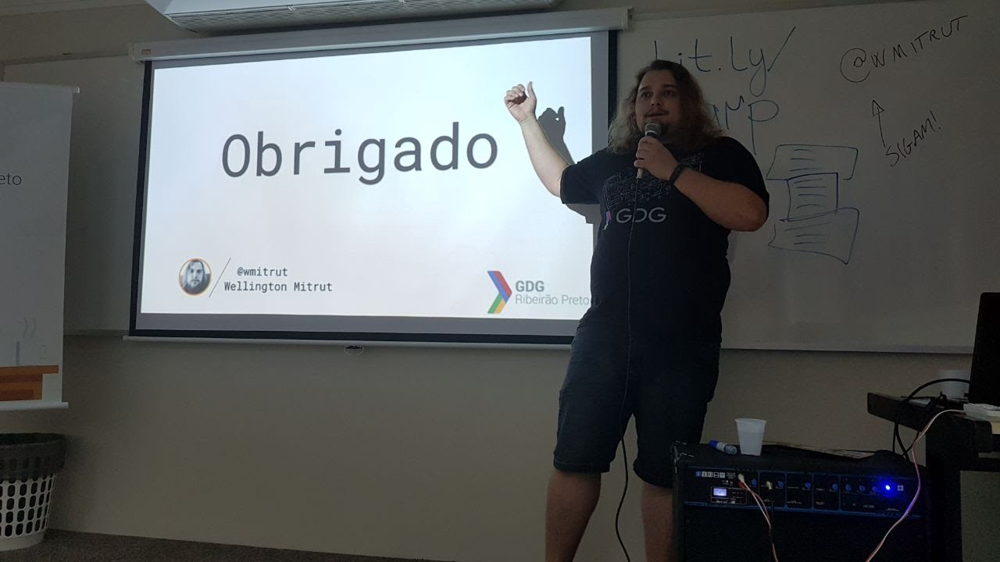
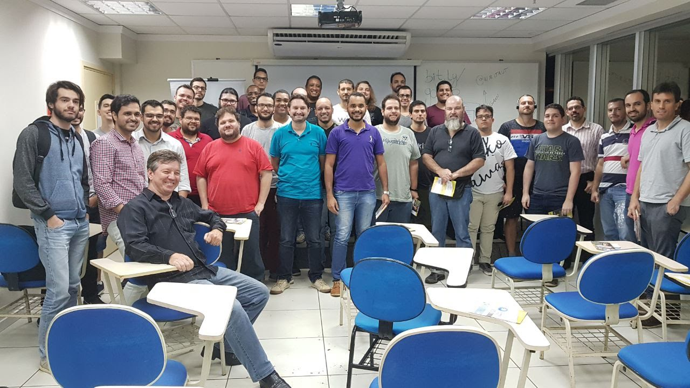

No último dia 20 de Março de 2018 tive a oportunidade de me apresentar e conhecer um pouco mais os eventos e integrantes do GDG Ribeirão Preto. Já que estava na cidade a trabalho, aproveitamos e marcamos um meetup rápido para falar sobre PWAs e tendências de aplicações web/mobile.

[Link do Evento no Meetup](https://www.meetup.com/pt-BR/gdgribeirao/events/248431741/)

O evento foi bem interessante, com a presença de profissionais que trabalhavam com as mais diversas tecnologias Web, do React ao PHP.

Apesar de estarmos estudando PWA a praticamente dois anos, é uma novidade que ainda causa euforia e desconfiança aos desenvolvedores num geral. O debate se focou bastante nas limitações que as APIs web ainda enfrentam e em como os PWA estão superando estas dificuldades e se integrando cada vez mais no dia a dia.

<blockquote class="twitter-tweet">
Meetup Top sobre Progressive Web App com <a href="https://twitter.com/Wmitrut?ref_src=twsrc%5Etfw">@Wmitrut</a> em RP ! Vlww <a href="https://t.co/ATBQsb8PkM">pic.twitter.com/ATBQsb8PkM</a>
&mdash; Hugo Costa ☕ (@HugoCostaDev) <a href="https://twitter.com/HugoCostaDev/status/976289967163895808?ref_src=twsrc%5Etfw">March 21, 2018</a></blockquote> 

Mas o que fica mais ainda de palestras assim não é o número de aplicantes e sim a motivação que podemos deixar, esse é o verdadeiro trabalho de quem faz uma talk, abrir horizontes. Não vou me recordar o nome do participante do meetup (porém fica aqui meu agradecimento)que me soltou a seguinte frase:

> As vezes a gente precisa ouvir sobre UX pra entender pra quê que serve e esse meio campo que tu fez abriu minha visão pra muita coisa.

Soa prepotente colocar essa frase aqui mas é uma verdade. As vezes estamos tão preocupados com o framework, infraestrutura ou então fazendo aquela ‘gambiarrinha’ pra funcionar que esquecemos que o mais importante é quem vai usar a nossa solução. São frases como essa que fazem a pena sair do interior do Paraná e ir aonde quer que seja compartilhar um pouco do que sabemos.

Fica meu agradecimento ao GDG Ribeirão Preto, Ivan, Caio Tarifa e os demais que se fizeram presentes no meetup! Em breve estarei novamente por estas bandas levando mais uma palestra e aprendendo um pouco mais com vocês!

Você que tem interesse de ver os slides da palestra pode dar uma olhada nos slides [aqui](https://speakerdeck.com/wmitrut/i-cant-believe-its-not-native).

Outra dica legal, estou transformando esta palestra em post aqui do blog pois irei aposentá-la.
