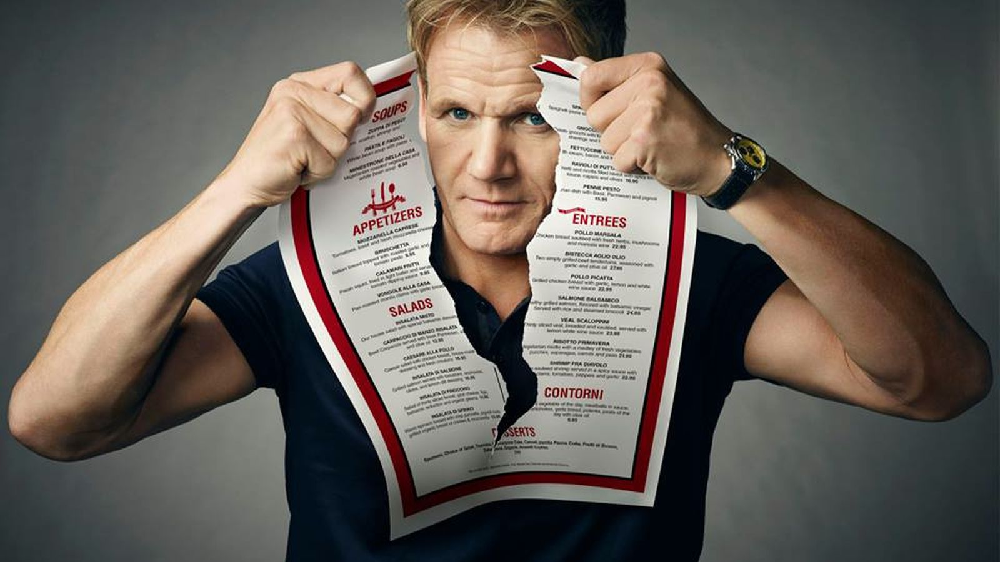

O mundo das startups é uma loucura atrás da outra. De pessoas com idéias maravilhosas à ideias que não sobrevivem a conversa com o amigo da mesa ao lado. De especialistas qualificados que sentam e conversam com você na mesa do bar depois das 23:00 e te dão conselhos para toda a vida à mentirosos que mentem pra deus e o mundo que trabalham na 'mega-empresa-bam-bam-bam-do-silicon-valley'.

Vivemos certamente uma época de grandes realizações e de pessoas que tem a 'cabeça fervendo'. Aqui na WMITRUT é raro o dia que não nos chega a conversa de uma idéia 'revolucionária', de uma proposta de 'UBERIZAR'(já podemos usar este termo?) as coisas ao extremo. 

*Nossas idéias podem sim chegar aqui amigos, mas demos um passo por vez.*

Porém, aquilo que temos que ter em mente é que: STARTUPS não são brincadeira e podem acabar com sua produtividade, te frustrando mais do que fazendo você se realizar.

Mas como manter o equilíbrio entre estar com os pés no chão e sonhar alto? É impossível ter os dois? Por acaso você não está sendo muito pessimista?

##### Não.

Podemos ouvir mil vezes. Podemos fazer mil Startup Weekends... O que esquecemos é de nos mantermos enxutos. Uma metodologia bem conhecida no design de interfaces - KISS: **KEEP IT STUPID SIMPLE**.

Abaixo elenco 5 dos 10 itens que estão me ajudando a manter os pés no chão e fazer as coisas funcionarem direito, baseado na filosofia do 37 Signals.

## 01 - 'Mártires' são superestimados.

É ótimo ouvir as experiências dos outros. Porém, não siga EXATAMENTE como as outras pessoas fizeram e não permita que os outros criem as regras de como as coisas devem funcionar para você. Os erros dos outros são os erros dos outros! Não tem nada a ver com você. Quando você aprende com seus erros, você aprende o que não fazer, mas não necessariamente o que você deve fazer em seguida. Aprender com o seu sucesso vai sempre lhe dizer o que fazer a seguir, por isso, é importante compreender também que o fracasso não é um pré-requisito para o sucesso.

## 02 - Se preciso, mude os planos.

Planos são importantes, mas não são imaculáveis. Não planeje pensando no que já passou. Eles são um bom palpite, mas você tem que aprender a ir em novas direções, isso nunca foi tão adequado quanto hoje.

Muitas vezes, são elaborados  longos planos baseados em coisas que já foram feitas há muito tempo, e isso pode não fazer emais sentido para o presente, quiçá para o futuro. Não chame-os de planos, chame de suposições estratégicas, e refaça-os semanalmente. Não planeje com muita antecedência, é desperdício e quase sempre impreciso. OUTRA COISA: Se você quebrar suas tarefas em tarefas menores, é muito mais provável que você chegue onde quer.

## 03 - Foco! Foco! Foco!

Quando você é uma startup, ser limitado é uma coisa boa, porque assim você aprende a ser criativo e se virar com o que você tem. No entanto, como você sabe o que é importante? Ignore os detalhes, faça bem o básico. Um arquiteto não planeja os azulejos do chão quando ele está começando a trabalhar em um edifício.

Se você se concentrar no que você pode fazer BEM FEITO agora, em vez de lá na frente, você vai aprender a fazer aquilo em que é bom o suficiente. 

A coisa é, você não tem que viver para sempre na mesma coisa, porque você sempre pode mudar de 'suficientemente bom' para 'ótimo!'

>"Build half a product, not a half-ass product."

Aprenda a ser um curador e ficar com o que é verdadeiramente essencial. Se você tem um grande problema, não tente resolver todo o problema melhor. Reduza o problema o máximo que puder.

Pense em quando o Gordon Ramsay vai a um restaurante no Kitchen Nightmares, muitas vezes estes restaurantes têm centenas de pratos. Ele diminui o cardápio e se concentra em apenas 10 pratos para deixa-los excelentes.

Foque-se em resolver o problema.

*Concentre-se nos 'pratos' que você 'cozinha' BEM.*

## 04 - Durma.

DURMA! As pessoas subestimam a importância do sono. No momento que você para de dormir, você deixa de ser criativo. É completamente insustentável trabalhar de forma eficiente quando se dormo pouco. Seja criativo, e faça seu o produto ter um pouco de você. Não copie ninguém, foco em injetar o que é único sobre você em seu produto.

## 05 - Não seja WORKAHOLIC.

Workaholics criam mais problemas do que resolvem. Eles querem compensar sua falta de inteligência por meio da força. Eles fazem isso para se sentir bem, não para resolver problemas. Eles até mesmo fazem isso, por vezes, para menosprezar os outros. Trabalhe duro quando necessário, não o tempo todo - Não deixe para ouvir isso quando estiver na maca do hospital.

*- Pessoal, esta foi a primeira parte deste post, a segunda vem na semana que vem com mais alguns cometários sobre a cultura de startups que está se formando no Vale Digital do sudoeste do Paraná.*
 
 
*- Estamos oferecendo no dia 15/08 um workshop de Introdução ao design de interfaces clique <a href="http://migre.me/qXpW4">AQUI</a> para detalhes e inscrição.*
