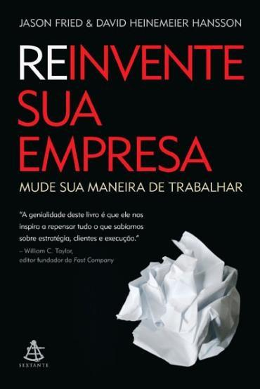
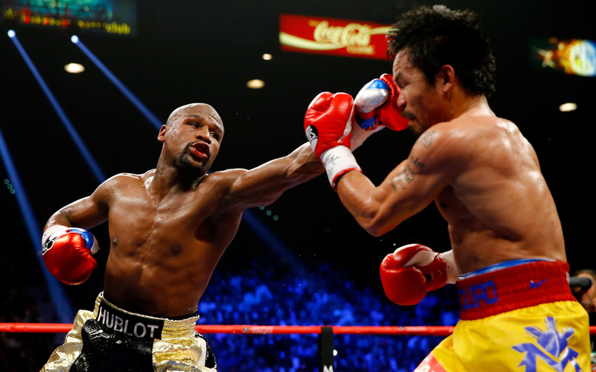

Olá pessoal! Estamos aqui com o segundo post sobre o livro REWORK, do pessoal da antiga 37Signals (hoje conhecida como Basecamp), que criou o framework Ruby On Rails. Durante a semana algumas pessoas me pediram mais sobre o livro e como achá-lo aqui no Brasil. Pois bem, aqui ele saiu com o nome de 'Reinvente sua empresa', pela editora Sextante e é bem fácil de encontrar nas diversas lojas online do ramo.

Mas chega de enrolação por aqui. Vamos direto ao assunto, as últimas 5 lições que aprendi neste livro, caso não tenha visto a parte um, <a href="http://wmitrut.github.io/2015/07/28/rework-1/">clique aqui</a> 

## 06 - Desligue suas notificações

Eu adoro trabalhar em grupo, coworkings e colaboração mútua, mas uma regra que vale ouro aqui é : Defenda-se do ataque de interrupções, se for preciso se isolar do mundo para trabalhar bem, faça. Desligue as notificações, nada é mais irritante que você estar no meio de uma codificação e receber um email de propaganda da loja xyz. Defina um horário para concentração total no trabalho. Use meios não interruptivos como o e-mail, se possível, para aumentar sua concentração, utilize a <a href="http://pomodorotechnique.com/">técnica pomodoro</a>.

## 07 - Compre briga com seus concorrentes.

Quando falo de ‘compre briga’, não estou falando para você sair no tapa com ninguém, estou aqui me referindo sim a uma briga ideológica, um confronto de valores. Um exêmplo: mais da metade dos ‘empresários’ com quem eu converso sobre a filosofia de REWORK não acreditam que ela funciona, aqui na WMITRUT simplesmente executamos este conceito, e isso os incomoda. Um conflito como este desperta paixões, empolga as pessoas e faz com que elas tomem partido.

> Não é bem disso que to falando, mas o resultado pode ser um knockout na concorrência.

## 08 - "O que você faz é o seu legado".

Para fazer um grande trabalho, você precisa sentir que você está fazendo a diferença. Que você está colocando uma marca significativa no universo. Que você é parte de algo importante. Não pense que é por que você é muito velho, muito jovem, falido que você não pode fazer algo.

Minha mãe sempre fala: Mete a cara. Levanta da cama, lava o rosto e põe tudo o que você aprendeu pra funcionar.

Você vai errar, você vai acertar, você vai aprender. Mas enquanto você ficar reclamando, você vai apenas ficar reclamando. Faça a diferença.

## 09 - Ensine mais que a concorrência.

Construa um público. Ensine mais que a concorrência. Siga o exemplo do chef de cozinha. Publique seus segredos. Mostre os bastidores. O Jamie Oliver é quem é pois ensina seus segredos! E mesmo assim é o chefe mais badalado do mundo.

> Os chefs de cozinha estão bem presentes nos nossos posts não é?

Sempre compartilhe conhecimento com a sua audiência, tweets, blog, faça o que for necessário para manter o compartilhamento de informações e ensinar-lhes algo. Lembre-se, as pessoas pensam que é um desperdício de tempo ensinar e ninguém mais faz isso. É, portanto, formar um vínculo e construir a confiança com seus consumidores.

Conheço caras com 15-20 anos de mercado que tem medo de abrir seu conhecimento pois acha que as pessoas vão ROUBAR a idéia deles. Meu amigo, as pessoas estão pouco se lixando para as suas ideias.

## 10 - Reuniões: como fazer?

Reuniões em geral são tão vagas que elas nunca têm um objetivo. Em geral servem para massagear o ego de alguém e para marcar uma próxima reunião pra definir uma subsequente reunião. Se você não puder evita-las, sua reunião deve ter um tempo bem definido e você deve fazê-la com um despertador, quando ele tocar, a reunião acabou.

Convide o mínimo de pessoas possível, e tenha uma agenda clara, um assunto bem definido. Seja específico. Foque em resolver o problema, não em definir quando seu clube do bolinha fará outra reunião para fazer as pessoas perderem mais tempo.

*Estamos oferecendo no dia 15/08 um workshop de Introdução ao design de interfaces clique <a href="http://migre.me/qXpW4">AQUI</a> para detalhes e inscrição.*
