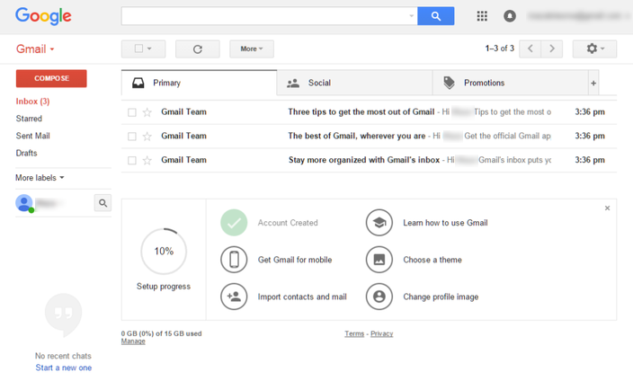
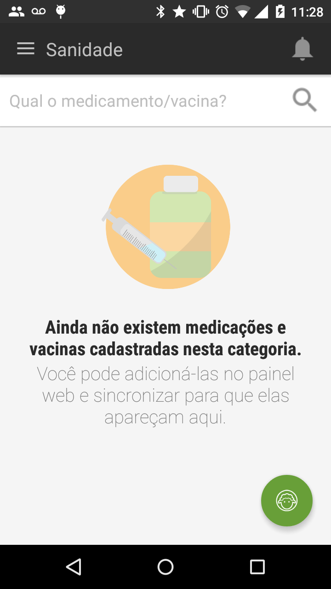
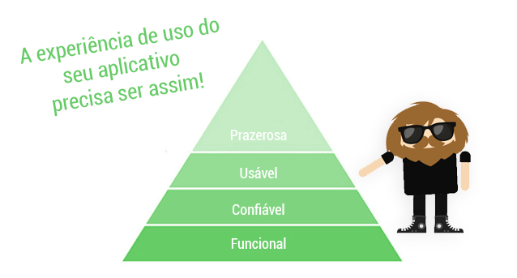
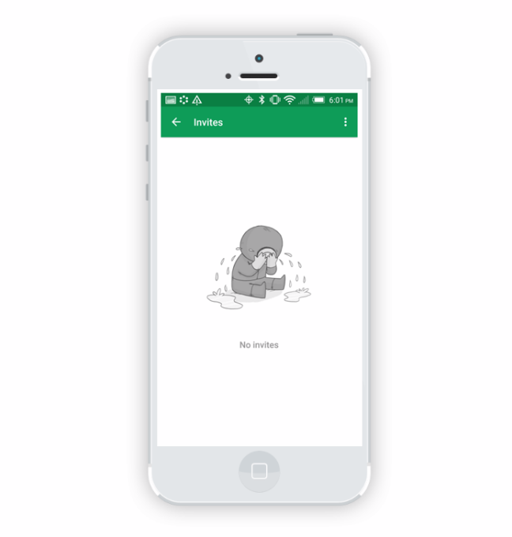
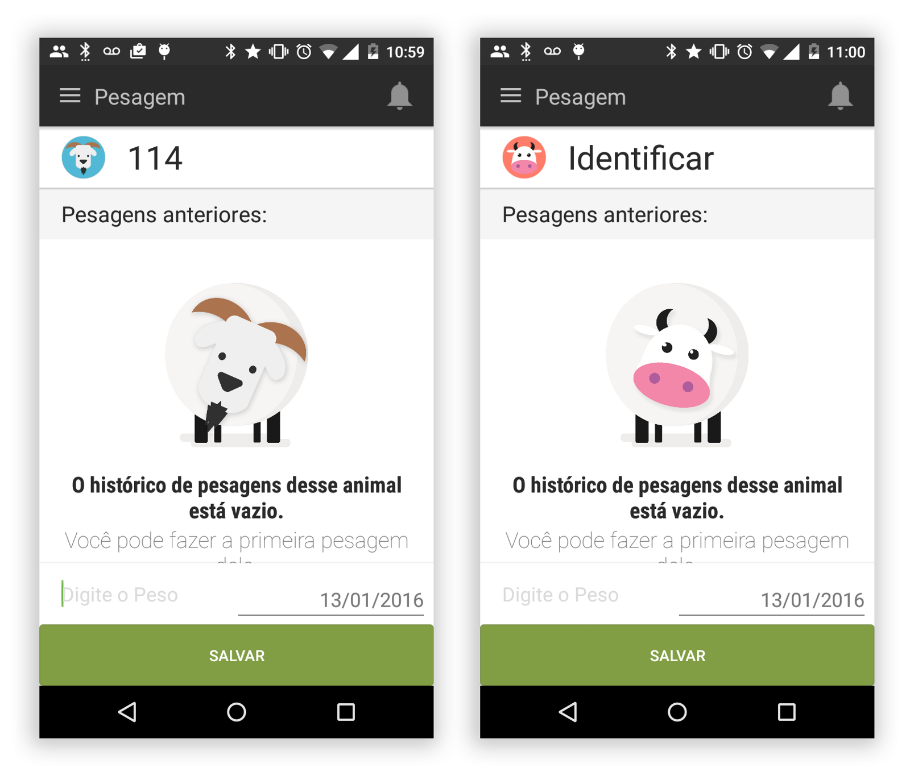

>Não subestime a beleza de um estado vazio, mas saiba como deixar um bom espaço vazio!

A experiência de uso de um aplicativo é algo interessante de se projetar, muitas vezes nos focamos em pensar já na aplicação finalizada e cheia de dados providas pelo usuário sem ao menos lembrar em como vai ser a recepção deste mesmo em seu primeiro uso.

Este esquecimento pode nos levar a um problema mortal para toda aplicação: transformar o primeiro uso em algo frustrante, fazendo com que o usuário abandone a aplicação. E é isto que estamos aqui para evitar!

O que é um estado vazio?
Basicamente, um estado vazio é o que o usuário vê quando não há dados para mostrar na tela. Simples. A idéia é que mesmo que não haja nenhum dado a retenção do usuário no app não caia ou ele venha tomar uma ação indesejada.

Uma abordagem interessante do uso de estados vazios é como o Gmail recebe seus usuários:

Tela de OnBoarding no Gmail quando o usuário faz seu primeiro acesso.
A maneira que o Gmail recebe seus novos usuários é bem interessante, observe: As informações básicas vem no mesmo formato que você vai ter outras informações e usá-lo no futuro: **e-mails**.

Nestes e-mails, a própria aplicação envia instruções sobre como você pode obter mais valor do aplicativo, todos projetados para aumentar o sucesso de uso pelo usuário (e, posteriormente, de retenção).

Um outro tipo de estado vazio, quando você procura um amigo no Snap.
Um estado vazio útil diz o que é e por que você está vendo-o bem como de que maneira você pode preenchê-lo.

> Um estado vazio tem que ser bonito mas acima de tudo útil.

### Como projetar um estado vazio?

Ao projetar um estado vazio você tem que ter em mente três perguntas e respondê-las de forma a reengajar o usuário **o quê, porquê e como preencher**.

Observe a tela abaixo:

- **o quê**: Não existem vacinas e medicações.
- **porquê**: Por que nenhuma foi cadastrada.
- **Como preencher**: Acessando o painel web e cadastrando novas.

> Obs: Claro que seria mais fácil cadastrar já no aplicativo, mas por causa das especificidades no sistema e o tanto de dados pedidos para cadastro da medicação e registro perante orgãos responsáveis, foi optado por orientar o usuário a usar o painel web neste aplicativo.

### Obtendo a atenção do usuário com os estados vazios

Este é um grande problema. É a forma mais eficiente de continuar o seu processo de integração e manter seus usuários engajados.

Como eu disse no início, estados vazios **podem** e **devem** ser utilizados para envolver os usuários e ajudá-los a obter uma melhor experiência e satisfação no uso do app.

### Trabalhando branding em estados vazios

Os estados vazios são uma excelente oportunidade para fazer uma conexão humana com seus usuários e obter toda a personalidade de seu aplicativo.

Assim como como podemos ser <a href="http://fab404.com/" target="_blank">engraçadinhos e criativos com páginas 404</a>, estados vazios também são uma oportunidade pra esse tipo de situação.

Aaron Walter, especialista em Design emocional fez uma associação com a pirâmide de Maslow que mostra hierarquia das necessidades humanas para uma explicação sobre o que torna a experiência do usuário de um aplicativo bem-sucedida; enquanto que a sua aplicação deve ser funcional, confiável e útil, ele também deve ser *prazerosa*.

> A pirâmide de Walter sobre a usabilidade de um aplicativo.

### Usando emoções nos estados vazios

Voltando as tópico de caixas de entrada, note algo interessante sobre os diferentes tipos estados vazios; isto é, como algumas caixas de entrada parabenizam você por não ter tudo resolvido, enquanto outros aplicativos incentivam a preenchê-los.

> Exêmplo do uso de sentimentos em estados vazios feito pelo Google Hangouts.

O tipo de sentimento seus estados vazios transmitem depende da finalidade do seu aplicativo. O Google Hangouts por exêmplo, fica triste e quer que você adicione conteúdo falando com alguém, enquanto Inbox foca em motivar você a ler todos os seus e-mails.

Um dos aplicativos que trabalhei, o <a href="http://farmin.com.br/" target="_blank">Farmin</a>, incentiva o usuário a tomar uma ação de registro dependendo do contexto, a imagem abaixo mostra uma view vazia para adicionar o peso dos animais com um animal fazendo *‘carinha-de-cachorro-que-caiu-da-mudança’* (o animal também muda a imagem conforme o contexto do rebanho previamente configurado).

> Exêmplo que fiz num empty states para o aplicativo Farmin. Encontre Farmin na Google Play.

Use e abuse das emoções para incentivar seu usuário a preencher o estado vazio, como disse anteriormente, o importante não é ele ser bonito, é ser funcional, então não se apegue aos estados vazios como se fossem obras de arte, mas seja criativo ao implementá-los.

### Quais são as principais lições a se aprender com estados vazios?

Assim como nos video-games porque você fez todo o caminho até o fim, você recebe uma recompensa especial, eis um TL;DR do texto:

- NUNCA deixe uma estado vazio realmente vazio, forneça feedback ao usuário
- Lembre sempre o por que que seu usuário deve preencher esses espaços.
- Se possível, use ilustrações e emoção para ‘forçar’ o usuário a preencher estas informações.
- Use filtro solar, nunca deixe de usar filtro solar.

Quer outros exêmplos para entender melhor os espaços vazios? Então acessa essa coleção aqui ó: http://emptystat.es/, e sempre é bom lembrar o bom e velho <a href="http://pttrns.com/?scid=30" target="_blank">PTTRNS!</a>

São milhares de exêmplos de espaços vazios nos mais diversos apps.

Atente-se sempre em não deixar o usuário sem feedback!