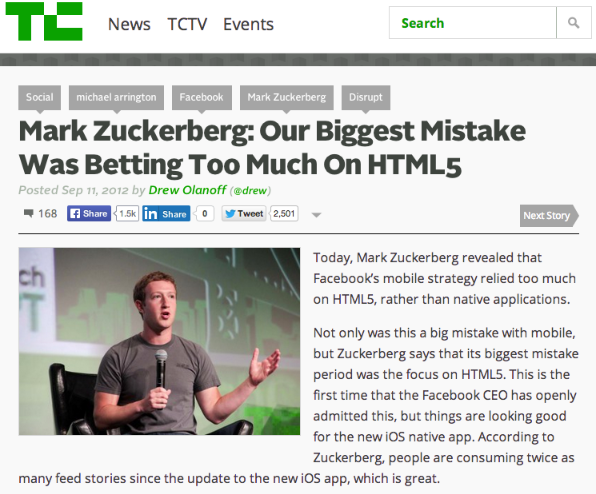
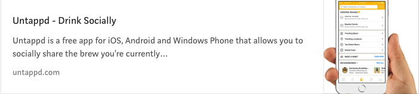
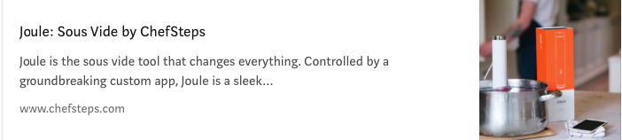
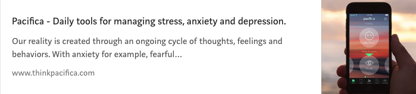
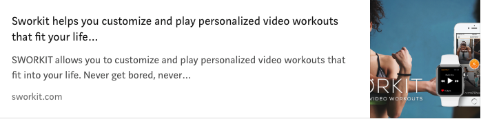

Vamos começar este texto sendo adultos e combinar duas coisas: a primeira é que não importa a tecnologia que ele é feito, aplicativo bom é aplicativo bom e aplicativo ruim é aplicativo ruim, seja ele feito com Javascript, C#, Swift, Java, Cobol, React , Lisp e seja lá o que for e a segunda é: **as pessoas estão pouco se f@#$% para a tecnologia que você utilizou pra fazer esse app, elas querem que ele funcione!**

> Isto posto, seguimos em frente.

Você deveria mesmo prestar mais atenção no Ionic. É sério! Se você é desenvolvedor de aplicativos mobile / web com toda certeza deve ter ouvido falar do Ionic 2 ou 3 nos últimos meses, senão sobre o Ionic, com certeza ouviu falar sobre o Angular 4, Typescript, Cordova ou então webpack.

Garanto que também deve ter ouvido de alguém a seguinte frase:

> “Ionic só trava, Ionic é lento, Ionic é ruim, feio e tem cara de melão.”

Pois bem, **NÃO** é esse tipo de pensamento sobre o Ionic que você tem que prestar atenção.

### Indo além dos limites

Já faz algum tempo que as aplicações web deixaram de ser uma simples manipulação de Javascript, CSS e HTML e se tornaram bem mais complexas, elaboradas, estamos com o advento do [PWA](https://addyosmani.com/blog/getting-started-with-progressive-web-apps/?utm_content=kuku.io&utm_medium=social&utm_source=facebook.com&utm_campaign=kuku.io/?target=_blank) a todo vapor e existem pessoas que até consideram os aplicativos nativos estão condenados ao limbo.

[Isso é verdade](https://medium.com/javascript-scene/native-apps-are-doomed-ac397148a2c0).

Bem, [em partes](https://www.novoda.com/blog/native-apps-are-not-dead/). Digamos que as tecnologias web tornaram a coisa bem mais complicadas para os apps nativos pois cresceram tanto em performance quanto em versatilidade.

Não necessariamente é o fim dos aplicativos nativos, mas digamos que temos uma nova e eficiente alternativa. Trataremos de PWA de forma detalhada em algum post futuramente.

O Ionic tem chamado muita atenção com um princípio básico. É o velho paradigma: “Write Once, Run everywhere”. Com o Ionic, você consegue um aplicativo para todas as plataformas **com a mesma base de código**.

> Mas se você ta dizendo que é tão bom, por que então existe tanto preconceito com os aplicativos feitos com tecnologias híbridas e por que você está querendo tanto que a gente preste atenção no Ionic?

### Falando sobre o elefante branco na sala ou “Por que você não é o Mark Zuckerberg”.

Eu admito, no começo sim, as aplicações feitas com HTML, Cordova e afins perdiam feio em performance, design e usabilidade para aplicativos ditos nativos. Mas convenhamos, nossos smartphones também não eram essa coca-cola toda né.

O Iphone 7, último até a data de publicação deste texto tem 2GB de RAM e é considerado um dispositivo High-end, ou seja, top de linha, assim como o Galaxy S8 que tem absurdos 4GB de RAM! O meu primeiro PC tinha míseros 512Mb.

Tá, mas o que isto quer dizer? Isto quer dizer que em questão de desempenho, aquele velho papo que “Smartphone não aguenta aplicações pesadas”, é balela.

Hoje, seu smartphone é uma ferramenta poderosa, e não é nenhum exagero falar que ele já é capaz de fazer até café (obrigado IoT), imagina abrir uma página web!

Mas prosseguindo, uma coisa que pode ter gerado bastante preconceito foi uma [declaração lá em 2012](https://www.google.com.br/webhp?sourceid=chrome-instant&ion=1&espv=2&ie=UTF-8#q=mark+zuckerberg+html5) que o Mark Zuckerberg fez sobre aplicativos web:

>Um pouco dramática esta posição, mas ok… ele tem toda liberdade.

Bom, talvez para a estratégia do facebook isso seja correto, embora tenhamos hoje um boom de aplicativos da própria empresa feitos com tecnologias web e até mesmo um [framework](https://facebook.github.io/react-native/) disso. Talvez você não saiba mas o seu querido [Instagram](https://engineering.instagram.com/react-native-at-instagram-dd828a9a90c7) é um app feito em HTML, CSS e Javascript.

Só que você tem que ter consciência que você não é o Markito e que talvez (estatisticamente falando) esse seu aplicativo não venha a ser o novo Facebook e nem sofrer os mesmos problemas de escalabilidade. É necessário se fazer algumas perguntas:

- Você tem milhões pra investir no desenvolvimento deste app?

- Você tem dois times de desenvolvedores experiêntes e prontos para fazer este aplicativo de forma nativa?

- O seu dinheiro, sua vida e bilhões dependem do seu app para se comunicarem?

Se sim, faz nativo. Senão, considere alguns pontos bem legais sobre usar Ionic.

### 1 — HTML, CSS e Javascript são fáceis de aprender

Nem que seja um pouquinho, nem que seja o mínimo, a maioria dos devs começou brincando com HTML e CSS e mesmo que você me diga “ah, eu não sei HTML”, não é ciência de foguetes aprender um pouco. Além do mais, o Ionic oferece uma [documentação mais do que completa](http://ionicframework.com/docs/components/).

### 2 — Novamente, você possivelmente não será o novo facebook

É uma verdade que tem que ser dita, as pessoas gostam de sonhar que vão ser o novo disruptivo, quebrador de paradigmas, magnânimo e proparoxítono empreendedor que criou o *“Uber para Xyz”*, mas é difícil que isso aconteça, e mesmo que aconteça, você tem que considerar algumas estatísticas dos aplicativos nativos atualmente:

- 60% das aplicações na Google Playstore nunca foram baixadas.

- O usuário médio baixa menos de 3 aplicativos por mês. Metade dos usuários de smartphones baixam zero aplicativos por mês.

- Os usuários de celular gastam a maior parte de seu tempo em aplicativos, mas 94% da receita de aplicativos vem de 1% dos editores e os usuários gastam 80% de seu tempo usando apenas 5 aplicativos (aqueles 5 que você sabe quais são).

- 80% dos usuários que baixam um aplicativo não se tornam usuários ativos.

### 3 — Esteja preparado para ter seu PWA

Os Progressive Web Apps estão aos poucos se tornando mais parte do nosso dia-a-dia. Cada vez mais você recebe aquela solicitação de adicionar o ícone a sua tela inicial, isso diminui e bastante a fricção que um app nativo possui. Novamente, esses aplicativos estão bem performáticos, tem cara de aplicativo e não ocupam tanto espaço quanto os instalados em seu celular.

**E sim, tem gente já trocando os aplicativos nativos pelo PWA**

E imagine, você vai estar no celular do seu cliente sem ter que passar pela sabatina que algumas stores colocam. O Ionic já está preparado para os PWAs.

Mais sobre PWAs aqui:

<iframe width="560" height="315" src="https://www.youtube.com/embed/0Cc96N1EkZI" frameborder="0" allow="accelerometer; autoplay; encrypted-media; gyroscope; picture-in-picture" allowfullscreen></iframe>

### 4 — Tecnologias web amadureceram

Hoje é possível ter acesso aos mais diversos recursos desde hardware como Câmera, GPS, armazenamento até os mais diversos recursos que só os apps ‘nativos’ tinham. Uma outra vantagem é o [Ionic Native](https://ionicframework.com/docs/native/) que é um conjunto de wrappers para Ionic que usam as tais APIs nativas e dão ainda mais poder para o seu app.

### 5 — Velocidade alta, custo baixo

Um aplicativo nativo demanda primariamente de duas coisas, uma equipe que saiba desenvolver na linguagem nativa e DINHEIRO pra manter esta equipe.

Imagina que para cada plataforma você vai ter que gastar o mesmo tanto para fazer o mesmo aplicativo com os mesmos recursos em CADA uma.

Eu garanto que você ou o seu chefe querem estar em todas as lojas possíveis e no maior número de dispositivos possível.

Só que garanto que vocês também querem estar lá o quanto antes e com o menor custo. Pois bem, com o Ionic é possível se chegar lá em um tempo bem menor, com apenas uma equipe e com o custo consideravelmente reduzido.

### 6 — Comunidade

Seja no twitter, seja no Github, o Ionic me impressiona quando se trata de comunidade. Basta você acompanhar o [Github do projeto](https://github.com/driftyco/ionic) e ver o tanto de stars, pull-requests, issues abertas e acompanhar o changelog do projeto. Isso é garantia de manutenibilidade, suporte e evolução da plataforma. E olha que eu nem vou falar de Angular 4 por hoje.

Tá, mas e existe algum aplicativo grande feito em Ionic?
Já falei umas dez vezes aqui que você não é o Facebook e possívelmente, quase que 100% de certeza, você não enfrente os mesmos problemas de escalabilidade e mesmo que tenha e se torne um grande projeto absurdo com milhões de usuários há grandes chances de que se bem feito, você permaneça utilizando o Ionic como ferramenta padrão para seus aplicativos, quer uma prova? Abaixo elenquei alguns aplicativos que usam Ionic, talvez você até conheça, use alguns e não sabe:

### Tá, mas e existe algum aplicativo grande feito em Ionic?

Já falei umas dez vezes aqui que você não é o Facebook e possívelmente, quase que 100% de certeza, você não enfrente os mesmos problemas de escalabilidade e mesmo que tenha e se torne um grande projeto absurdo com milhões de usuários há grandes chances de que se bem feito, você permaneça utilizando o Ionic como ferramenta padrão para seus aplicativos, quer uma prova? Abaixo elenquei alguns aplicativos que usam Ionic,talvez você até conheça, use alguns e não sabe:

#### Untappd

O que dizer desta rede social de cervejas artesanais que conheço e considero pacas? o **Untappd** talvez seja o melhor caso, é uma rede social em que você compartilha notas, opiniões, fotos, adiciona amigos, encontra pubs, cervejarias e ainda pode pedir um carro para ir pra casa depois de uma noite de degustação. Talvez o melhor exêmplo, extremamente bem feito e funcional.

#### Joule

O **Joule** é um assistente de cozinha pra quem quer dar uma de master chef, extremamente bonito e fácil de usar

#### Pacifica

O **Pacifica** é um aplicativo de meditação e voltado para ideia de mindfulness, uma espécie de assistente para suas meditações diárias

#### Sworkit

Ainda na onda de assistentes, o **Sworkit** é perfeito para você que gosta de academias e de fazer tracking dos seus exercícios.

### Enfim…

Espero mesmo que eu tenha feito ao menos você considerar brincar um pouco com Ionic. Ele tem evoluído cada dia mais e se preparado para as novas tendências. Além de fácil de aprender, é moderno e segue as melhores práticas de desenvolvimento da atualidade.

Não menos importante, o Ionic também está se tornando relevante para aplicações desktop, com um grid muito bom, split pane e integrações com Elektron e afins.

Acompanhe sempre o [blog oficial](https://blog.ionicframework.com/) para as novidades além das contas de twitter oficiais.

### Tente, Ionic Vale a pena :D