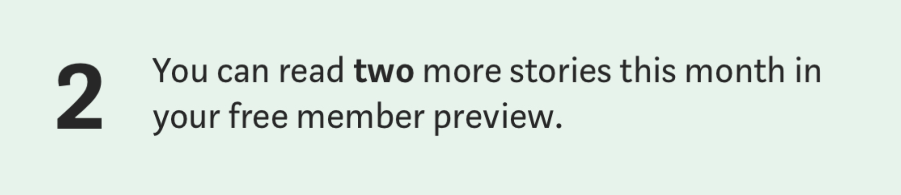
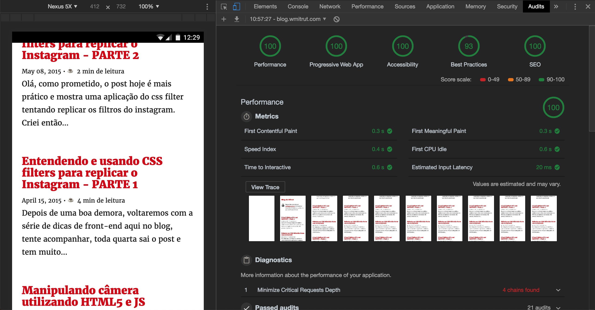
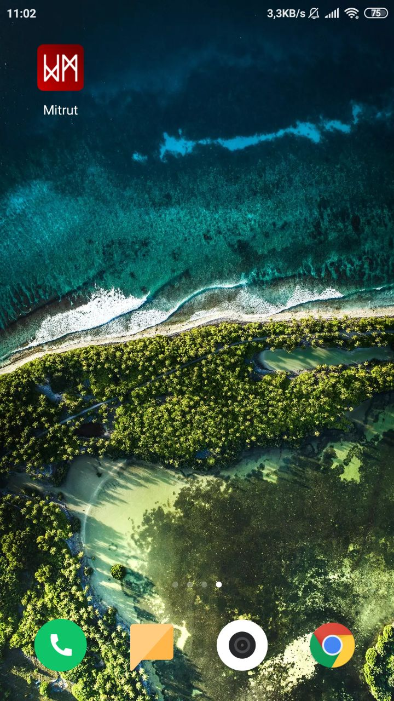

> O título é uma referência a esta música de Emerson, Lake & Palmer que você pode acompanhar abaixo - os tópicos do texto são movimentos dessa música:

<iframe src="https://open.spotify.com/embed/track/0nDQu5i6B93GvUJH8iJ0y9" width="100%" height="80" frameborder="0" allowtransparency="true" allow="encrypted-media"></iframe>

Manter um blog não é exatamente a coisa que faço com o maior afinco nessa vida. Envolve muita pesquisa, dedicação e tempo. Invejo amigos que conseguem manter blogs incríveis e informativos como no caso do [William Justen](https://willianjusten.com.br/). Só que nesta mesma pegada de ser algo que é trabalhoso, que demanda dedicação e tempo eu tenho sentido a necessidade de expor minhas idéias e criar.

Um dos fatores que me deixaram fora da escrita por um certo tempo é a parte psicológica, as vezes é difícil estar sintonizado com o ânimo de escrever, as vezes estou depressivo ou as vezes tenho a [síndrome do impostor](https://www.huffpostbrasil.com/2014/04/07/7-sinais-de-que-voce-e-uma-das-vitimas-da-sindrome-do-impostor_a_21667908/). São inúmeras as vezes em que tentei escrever algo e no final desistia pois achava que "estaria falando merda". Pois bem, decidi deixar esse medo de lado e "falar merda".

### 1st Impression, Part 1

Meu primeiro princípio ao escrever um post é de compartilhar conhecimento, isso me foi ensinado desde o primeiro dia em que sentei numa sala com o [Jonatas Paganini](https://ideia.me/) lá em 2013, de lá para ca o blog teve pelo menos 3 vidas. Esta que você acessa provavelmente é a quarta. Os posts sempre estiveram acessíveis para quem quisesse ler, comentar, contestar. A primeira e a segunda vida deles foram no github pages, a terceira foi no [Medium](https://medium.com/blog-do-mitrut) e é aqui que nossa história começa.

O Medium era um lugar lindo onde o design e a interação eram incríveis, não tinhamos propagandas e o foco era o conteúdo. Um dia o Medium precisou se pagar e começou a cobrar uma área de membros, quem quisesse monetizar um texto podia o fazer e (eu não sei até que ponto isso seria viável) ganhar um dinheiro com isso. 

Nada de errado com isso até por que toda startup precisa ganhar dinheiro e a gente publicava lá de graça, só que as coisas começaram a ficar esquisitas.

### 1st Impression, Part 2

Um belo dia, lendo um texto lá em dezembro de 2018 eu me deparei com isso aqui:

Eu não estava na área de membros fazendo um trial, eu não sou usuário premium e o post era gratuito, era público mas se isso estava acontecendo com um post público qualquer então estaria também ocorrendo com os meus naturalmente. Isto ia contra todo um princípio que já falei aqui no blog em [outro post](https://blog.wmitrut.com/im-back/) sobre licença Beerware (ainda válida ta galera?) e sobre ser Open Source por natureza.Foi aí que eu decidi recriar o meu blog da maneira antiga. Sob meu controle.

O primeiro passo foi encontrar uma maneira rápida de criar um site estático e limpo, como estou estudando React diariamente o [GatsbyJS](https://www.gatsbyjs.org/) me pareceu a maneira mais sensata de começar essa nova etapa, usei o [Gatsby Starter Blog](https://github.com/gatsbyjs/gatsby-starter-blog), dei uma personalizada de leve e passei para a segunda e mais morosa etapa: migrar os posts para markdown. Os posts mais antigos, da epoca que usava Jekyll foram faceis, alguns ajustes nas pastas, no markdown dos textos e eles já estavam prontos, o que deu trabalho foi o Medium e lá se foi meu janeiro/2019.

### 2nd Impression 

Minha experiencia com React foi no começo não das melhores - trabalhei numa empresa onde as coisas eram assim por que eram assim e eu me sentia bem perdido - mas desde final de 2017 eu tenho me rendido mais e mais a experiência e entendido melhor como o React funciona, o que fez com que me apaixonasse pela biblioteca.

Quanto ao GatsbyJS, ele tem se mostrado cada dia mais uma escolha acertada. Mesmo depois de personalizar, colocar plugins de incorporação, comentários e etc. ele continua com métricas lindas no [Lighthouse](https://developers.google.com/web/tools/lighthouse/) - O lighthouse que em breve terá post por aqui continuando a série de PWAs.

> Umas métrica dessa bixo, da até vontade de mostrar pra mãe, o difícil é explicar cada uma!

O que isso significa? Que o site é bem feito. Outra coisa que ajuda nisso é deixar o blog no [Netlify](https://www.netlify.com/) que não brinca em serviço quando o negócio é hospedagem e deploy contínuo.

Outra coisa legal é que este blog também é um PWA, um progressive web app - ou seja, ele é um site que se comporta como um aplicativo. Ao acessar você será solicitado para adicioná-lo à tela do seu celular e ele ficará assim:

Para o futuro talvez (E SÓ TALVEZ) eu implemente notificações no blog quando um post novo for lançado.

### 3rd Impression

E o futuro do blog? Bom, eu me empolguei quanto a recriar essa experiência e decidi criar um backlog e ir melhorando este lugar aos poucos. Os planos incluem:

- **Temas**: implementar o tema dark para o blog.
- **Melhorias de OpenGraph**: Para que as postagens apareçam melhor nas redes sociais e afins.
- **Share buttons**: pra que você consiga compartilhar estes posts do Face ao Zap.
- **Tags**: Você poderá filtrar todos os posts por temas.
- **Paginação**: carregar menos posts por vez, o que deixaria o site mais rápido ainda
- **Busca**: Você poderá buscar por um post específico ou termo.

e coisas menores que talvez faça: 

- **Notificações**: Sempre que um post novo for criado você receberá uma notificação no celular
- **Newsletter**: Com links legais que achei durante a semana, podcasts, projetos do github e afins.

Enfim, tem muita coisa legal que estou afim de compartilhar e muita, mas muita novidade vindo por aí em 2019 - posts, vídeos, podcasts, [projetos Open Source](https://github.com/mvfsillva/dialetus-service) - É coisa pra caramba. Mesmo esse sendo um ano notoriamente difícil e conturbado onde o obscurantismo e a desinformação se tornaram regra farei tudo que for possível para manter o conhecimento acessível e **LIVRE** para todos.

**Acompanhe este blog. Até semana que vem!**