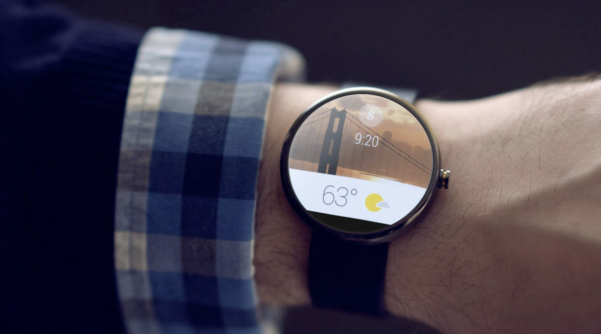
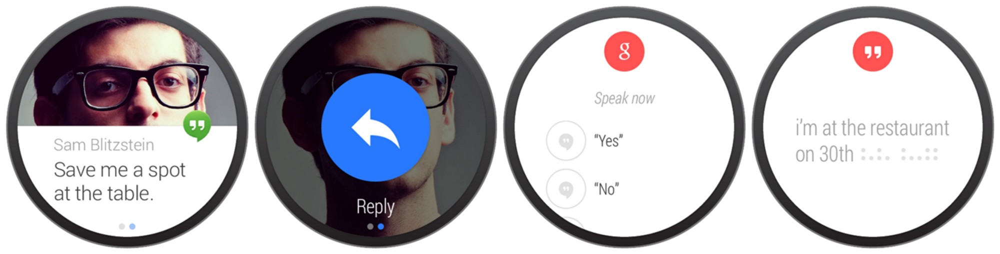
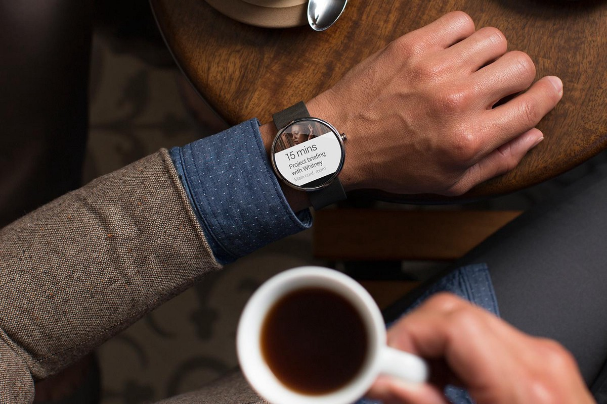
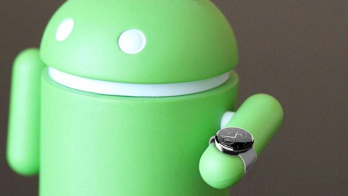

A internet e as interações estão saindo das telas e ganhando as ruas, para nos garantir uma boa interação e praticidade é necessário começar a pensar JÁ nas interações com wearables.

Talvez a tarefa mais difícil em UX e criação de aplicativos seja simplificar. Simplificar ações, torná-las óbvias o suficiente para que qualquer pessoa possa interagir, entender e se sentir bem usando uma aplicação.

Como você sabe se vai chover amanhã? Como você faz um check-in no Swarm para ter mais pontos que aquele seu amigo? Como você visualiza aquele SMS que acabou de chegar? Ou então a tomada de decisão daquela nova solicitação de amizade?

É comum pensar que a resposta geral destas perguntas é tirar seu smartphone do bolso para abrir um aplicativo e procurar seja lá o que for. Mas é este mesmo o jeito mais simples? E aqui vai mais uma pergunta:

> Qual seria a forma mais simples de você ver a hora?

Certamente você diria que olha para o relógio e vê logicamente que horas são. Mas e se você pudesse tomar todas as ações que imaginou ao ler as perguntas acima em menos tempo? Se pudesse não precisar tirar o smartphone do bolso a toda hora? Qual é a maneira mais fácil?

Exêmplo de uso prático do app Hangouts para Android Wear.

Hoje em dia temos uma boa possibilidade que é a de criar aplicações para dispositivos vestíveis. Os smartwatches!

Os wearables não são smartphones. Fato. Devem ser encarados como serviços contextuais. Eles devem dar ao seu usuário a possibilidade de informá-lo sobre coisas importantes no momento certo (como por exêmplo eventos de calendário e todos os outros citados nas perguntas acima) ou então devem dar a possibilidade de obter informações muito rápido (por exemplo, busca por voz).

Quando as pessoas compram esses dispositivos eles querem ter um uso para ele — caso contrário, não faria sentido usar mais um dispositivo junto ao corpo sem utilidade alguma. Mais uma tela para tirar o nosso foco. Mais uma tomada ocupada do lado da cabeceira a noite.

O <a href="http://saudebusiness.com/noticias/gartner-preve-crescimento-da-area-de-wearable-devices/" target="_blank">Instituto Gartner</a> aposta que os consumidores estão despertando um desejo de medir índices e números referentes à saúde e querem compartilhar estes dados com os profissionais equivalentes.

> “Os consumidores que estão preocupados com seu coração escolhem wearable devices para monitoramento de pulso ou com eletrocardiograma. Eles vão querer compartilhar as informações dos seus wearable devices com seu médico.”

O mercado é grande. É por isso que devemos olhar este mercado com uma boa atenção. Estimasse também que até final de 2016 serão 26 milhões de smartwatches ligados.

Apesar de ser incrível, projetar para Wearables não é uma tarefa fácil.

Bem, projetar para smartphones também não é a mais simples das tarefas… apode ser extremamente complexo simplificar as coisas, pergunte para qualquer designer e ele sempre vai dizer que de qualquer maneira não há espaço suficiente na tela para construir interfaces satisfatórias para permitir aos usuários desfrutar 100% das aplicações.

O Android Wear por exêmplo tem uma tela de apenas 1,5 polegadas com uma resolução de xhdpi e cerca 280X280 px. Um nada.

Isso já me aconteceu com um job no passado. Um cliente possuia um lançamento de dados rápidos para o dia-a-dia, uma ação que não deve levar mais que 15 segundos. Em nossos levantamentos acabamos tomando a decisão de dar suporte para Android Wear.

O principal objetivo do projeto Android Wear é manter informações bem organizadas e de facil relação com a aplicação correspondente no smartphone. Também as interações entre usuários e dispositivos portáteis deve ser imediata, como disse antes, uma tela pequena não permite tarefas complexas. A propria guideline recomenda interações não muito longas com a tela do dispositivo. Cai como uma luva no nosso projeto.

interações rápidas, ações livres de distração, gestos intuitivos: estes são pontos-chave de uma aplicação para wearables e representam uma maneira totalmente nova de conceber UX.

---

#### Conclusões:

Os wearables são uma nova plataforma, em constante evolução e em 2 anos ele vai encontrar o espaço certo na nossa vida quotidiana.
Vai ser uma das próximas grandes coisas e nós, designers e desenvolvedores, temos que estar prontos para a transição entre o móvel e o fácil de usar, devemos encarar esse desafio de simplificar as coisas... porém, ficar de olho e pensar também no que está a um pulso de distância.
