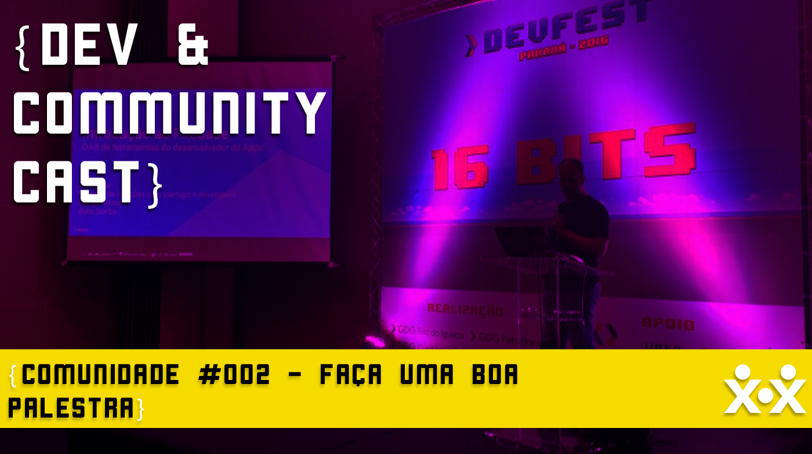

Apresentar palestras é uma das maneiras mais fáceis de se colaborar em uma comunidade, e a porta de entrada para muitos que hoje participam ativamente dessas comunidades. Mas, fazer uma boa palestra requer um bom planejamento, preparo e atenção em diversos detalhes.

E para ajudar você a fazer uma boa palestra, nesse episódio, Neto Marin e Alê Borba vão compartilhar algumas dicas e boas práticas que coletaram depois de alguns anos apresentando palestras e organizando eventos. Dicas que vão desde de como se apresentar e conduzir sua apresentação, preparação dos slides, cuidados na hora de fazer as demos e muito mais.

<a href="http://devcommunitycast.com.br/devcommunitycast-comunidade-002-faca-uma-boa-palestra/" target="_blank">OUÇA AQUI</a>

Visite nossa nova página no Facebook: <a href="http://www.facebook.com/devcommunitycast" target="_blank">facebook.com/devcommunitycast</a> e siga nosso perfil no Twitter: <a href="http://www.twitter.com/devcommunitybr" target="_blank">@devcommunitybr</a>.

Participantes: Neto Marin (<a href="https://twitter.com/netomarin" target="_blank">@netomarin</a>) e Alê Borba (<a href="https://twitter.com/ale_borba" target="_blank">@ale_borba</a>)

Vitrine criada por Wellington Mitrut (<a href="https://twitter.com/Wmitrut" target="_blank">@Wmitrut</a>)

Locutor da introdução: Renato Rios (<a href="http://www.twitter.com/taquiupaRios">@taquiupaRios</a>)

Edição de Neto Marin

### Links citados no episódio:

- <a href="http://anna-oz.tumblr.com/post/150934823825/conference-speaking-faq" target="_blank">Conference Speaking FAQ</a>
- <a href="http://thespeakerlab.com/100-motivational-speaker-tips/" target="_blank">100 Tips On How To Become A Motivational Speaker</a>
- <a href="https://www.troyhunt.com/how-i-prepared-for-the-ndc-keynote-and-other-speaker-tips/" target="_blank">How I prepared for the NDC keynote (and other speaker tips)</a>
- <a href="https://www.ted.com/talks/chris_anderson_teds_secret_to_great_public_speaking" target="_blank">TED’s secret to great public speaking</a>
- <a href="https://www.ted.com/talks/julian_treasure_how_to_speak_so_that_people_want_to_listen" target="_blank">How to speak so that people want to listen</a>
- <a href="http://alicebartlett.co.uk/blog/how-to-do-ok-at-slides" target="_blank">A white-label slide deck</a>
- <a href="http://jvns.ca/blog/2016/06/06/make-better-conference-talks/" target="_blank">Ideas for making better conference talks & conferences</a>
- <a href="https://rachelandrew.co.uk/archives/2016/05/27/what-i-learned-from-posting-a-survey-of-conference-speakers/" target="_blank">What I Learned From Posting a Survey of Conference Speakers</a>
- <a href="http://larahogan.me/blog/my-presentation-workflow-and-challenges/" target="_blank">My presentation workflow and challenges</a>
- <a href="https://www.youtube.com/playlist?list=PLOU2XLYxmsIJCljbqWadE1AbnWRdqBHiQ" target="_blank">Public Speaking Pro Tips (playlist de videos)</a>
- <a href="http://www.heidiwaterhouse.com/2016/06/19/how-to-write-a-lightning-talk/" target="_blank">How to write a lightning talk</a>
- <a href="https://www.techsmith.com/camtasia.html" target="_blank">Camtasia</a>

**Música de introdução e encerramento:**
Motherlode Kevin MacLeod (incompetech.com)
Licensed under Creative Commons: By Attribution 3.0 License
http://creativecommons.org/licenses/by/3.0/
