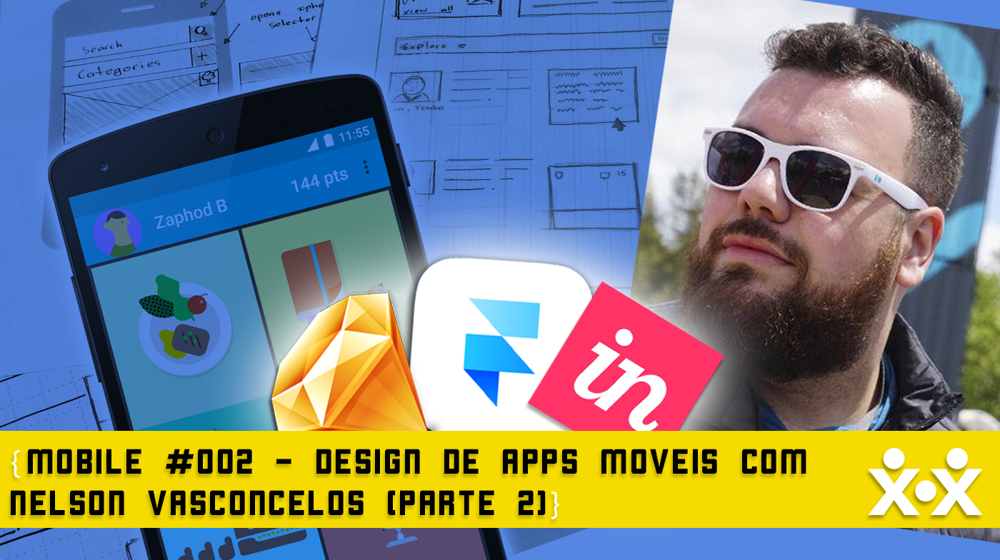

Em 2014 o Google apresentou o Material Design, um conjunto de especificações, recomendações e boas práticas que, de certa forma, revolucionou a forma de se pensar em design para aplicativos Android e mobile em geral.

Nesse episódio, Neto Marin conversa com o Google Expert Nelson Vasconcelos (<a href="https://twitter.com/nvasconcelos_" target="_blank">@nvasconcelos\_</a>) sobre os princípios do Material Design, as implicações no design e como você deve aplicar isso nos seus projetos de aplicativos.

<a href="http://devcommunitycast.com.br/devcommunitycast-003-mobile-material-design/" target="_blank">OUÇA AQUI</a>

Links citados no Post:

- <a href="http://material.google.com/" target="_blank">Material Design</a>
- <a href="http://talk.maemo.org/" target="_blank">Maemo</a>
- <a href="http://www.howdesign.com/resources-education/online-design-courses-education/gestalt-theory-typography-design-principles/" target="_blank">Princípios Gestalt</a>
- <a href="https://play.google.com/store/apps/details?id=com.bhphoto" target="_blank">B&H Photo App</a>
- <a href="https://br.udacity.com/course/material-design-for-android-developers--ud862/" target="_blank">Curso Udacity: Material Design para Desenvolvedores Android</a>

Vitrine criada por Wellington Mitrut (<a href="https://twitter.com/Wmitrut" target="_blank">@Wmitrut</a>)
Edição de Neto Marin (<a href="https://twitter.com/netomarin" target="_blank">@netomarin</a>)

**Música de introdução e encerramento:**
Motherlode Kevin MacLeod (incompetech.com)
Licensed under Creative Commons: By Attribution 3.0 License
http://creativecommons.org/licenses/by/3.0/

---

> Aí está mais um projeto do qual estou fazendo parte pessoal, nas próximas semanas pode ser que não poste mais nada a não ser os episódios — Ta acontecendo coisa pra caramba e pode ser que eu não tenha tempo de escrever mais nada. Vou replicar as postagens diretamente do site. Estou muito feliz e orgulhoso de fazer parte deste projeto com Neto Marin e Alê Borba! Caso queira sugerir uma pauta é só chamar que a gente conversa!
