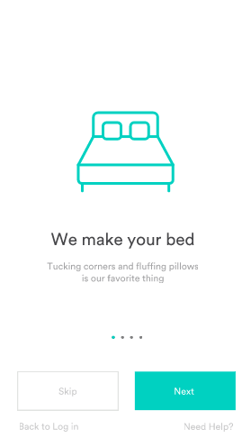

Acho que uma das coisas mais fascinantes (e trabalhosas) que existe é o trabalho de animador. Falo do cara do motion, do desenho animado. E falo isso com conhecimento de causa, na época que trabalhei com 3D essa era uma das coisas mais excitantes de se fazer, bem como uma das mais morosas, era difícil fazer parecer natural, bem como todo poder de processamento que isso ocupava.

As animações além de serem incríveis aos olhos, tem o poder de comunicar coisas de uma maneira mais direta e simples. E esse é talvez o maior desafio de quem cria UI/UX.

Quando se fala em UI, o desafio é igualmente grande quando falamos em animações. É complexo, é moroso. Até bem pouco tempo atrás, as saídas eram:

**1. Usar Gifs.**

**2. Fazer as animações de forma nativa, no braço.**

No primeiro caso as animações perdiam qualidade, não se podia controlar de forma eficiente os eventos para dispará-las, teríamos que criar um arquivo diferente para cada resolução. Na segunda opção, o trabalho seria de criar um código **_macarrônico_**, de difícil manutenção, que seria facilmente quebrado e quase sempre não-performático.

### O Lottie entra em campo para mudar o jogo

Se você não sabe, uma das empresas que hoje mais investe na parte de engenharia de UI é o (AirbnbEng)[https://medium.com/@airbnbeng]. É indiscutível o quanto eles tem investido em melhorar, automatizar e tornar processos de criação de interfaces algo mais aberto, democrático e por que não, Open - Source.

Com isso em mente eles criaram o **Lottie**. O Lottie é uma biblioteca universal que processa animações do After Effects em tempo real e permite que animações sejam tão facilmente usadas e manipuladas quanto arquivos estáticos.

O Lottie usa os dados de animação exportados como arquivos JSON de uma extensão After Effects aberta chamada Bodymovin.

> Ah, mas eu já usava o Bodymoving antes…

Sim, mas quando falamos em usar essas animações em JSON, era algo muito mais complexo e fora de controle, assim como citei anteriormente, gerando códigos macarrônicos e frágeis.

Além do mais, a biblioteca oferece a possibilidade de carregamento de arquivos JSON de animação via request, ou então você pode fazer cache para animações usadas frequentemente.

Outro recurso que achei muito interessante é o de você poder mesclar animações nativas (no caso de Android, iOs e React Native) com as animações do Lottie, criando assim animações muito mais complexas e legais.

Os próprios criadores declararam:

> _"Nosso objetivo é suportar tantos recursos de animação do After Effects quanto for possível, para permitir muito mais do que simplemente animar ícones. Nós criamos vários exemplos para mostrar a flexibilidade, a riqueza e o conjunto de recursos profundos da biblioteca."_

Ou seja, aquela animação maluca que o motion designer fez tem grandes chances de estar na aplicação sem que você tenha que invocar um demônio gargantual lovecraftiano.

### Mas e aí? E pra testar?

O melhor de tudo é que a ferramenta é open-source, ou seja você pode começar a brincar e usar ela em seus projetos assim que você terminar de ler e compartilhar esse texto.

No link abaixo está o repositório do github e algumas orientações pra você começar a mexer com ela.

[Acesse o Repositório do Lottie no Github](https://github.com/airbnb/lottie).

### Mas eu não tenho um motion designer e nem sei fazer animações para testar

Não é problema. Caso você não possua as ferramentas, não tenha um motion designer para te ajudar nessa jornada ou não sabe por onde começar para conseguir uma animação, saiba que a própria comunidade se organizou e criou um repositório de animações prontas para Lottie, então é só ir lá, escolher uma, baixar o JSON e dar seu hello world na ferramenta.

[Acesse o Lottie Files](https://www.lottiefiles.com/).

### Mas eu ainda não saquei direito como fazer isso

Não tem problema nobre padawan. Nos próximos textos pretendo te mostrar como usar o Lottie no Android e no Ionic 3+, aguarde uns dias caso queira esperar esses tutoriais. Mas já vou indicando, acesse o site, leia a documentação que a coisa fica bem mais clara com isso em mente.

[Página Oficial do Projeto](https://airbnb.design/lottie/).
