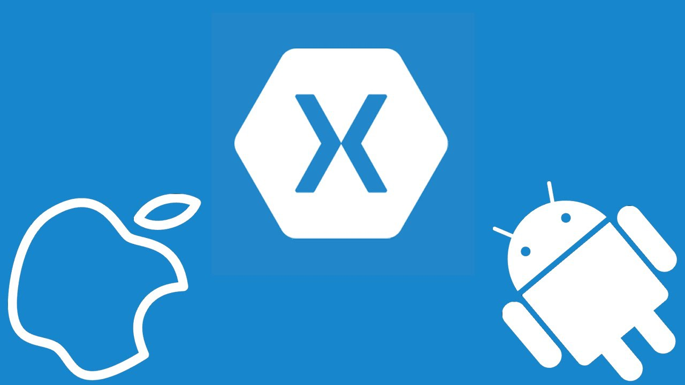
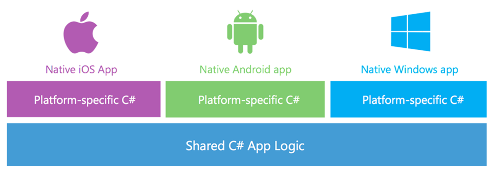
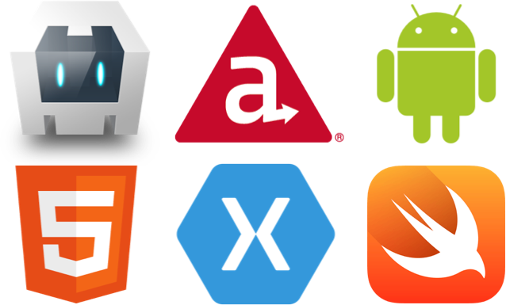

> Esse artigo é uma tradução livre e adaptada de “Xamarin Vs. Native”, publicada por Colby Williams. Eu ainda não sei mais que o básico e pesquisável em qualquer site de Xamarin na internet, por isso, sinta-se a vontade para sugerir correções e etc.

Eu passo muito do meu tempo falando com as pessoas sobre desenvolvimento móvel. Muitas dessas conversas são sobre Xamarin e como ele se compara ao “nativo”, então eu percebi que eu tirei um tempo para destrinchar o Xamarin.

Eu também vou gastar um pouco de tempo com abordagens alternativas para desenvolvimento móvel — apenas para adicionar algum contexto.

Aqui está a versão curta:

> As aplicações móveis escritos em C# usando Xamarin são nativas — tão nativas como iOS escrito em Swift ou Objective-C, e Android escrito em Java.

Se você está intrigado (ou discorda), continue a ler. Se você leu, e você ainda discordar, entre em contato. Nós vamos nos aprofundar nisto.)

### Abordagens sobre desenvolvimento de aplicativos móveis

Ok, vamos lá. Quando você, sua empresa, sua esposa, seu cachorro — seja lá quem for, decide construir um aplicativo móvel,existem algumas opções. E como a maioria das coisas na vida, cada escolha(é uma renúncia, isso é a vida), ou abordagem, vai ter seus prós e contras.

Já que nós estamos comparando Xamarin com “nativo”, vamos começar com uma abordagem que, sem dúvida, resulta em um aplicativo nativo de 100%.

Eu chamo esta abordagem de “indígena nativo”, ou simplesmente escrever o aplicativo nativo com o idioma “indígena” e seu respectivo conjunto de ferramentas (IDE, SDK, linguagens…).

Um exemplo desta abordagem seria escrever um aplicativo iOS em Swift usando o Xcode.

### Indígena Nativo.

Esta abordagem vai produzir um aplicativo totalmente nativo que executa e responde a maneira como o usuário espera que ele o faça. Perfeito não é?

No entanto, a abordagem também vai produzir uma base de código único para cada plataforma. Se o aplicativo é desenvolvido para iOS e Android, a versão iOS deve ser escrita em Swift ou Objective-C usando o Xcode, em seguida, a versão Android deve ser escrita a partir do zero em Java usando Android Studio, deixando-nos com duas bases de código separadas, e provavelmente duas equipes de desenvolvimento separadas para mantê-los.

Apesar de normal isso soa um tanto ruim. Porém um aplicativo verdadeiramente nativo é importante para o sucesso de uma aplicação móvel — tanto em aplicaçõs voltadas para o público como em aplicações do tipo business— os desenvolvedores normalmente escrevem e manter duas bases de código completamente distintas para o mesmo aplicativo no iOS e Android.

É por isso que lá atrás na “versão curta”, afirmei simplesmente que Xamarin é nativo. Essa é a parte mais importante.

### Xamarin

Xamarin(lê-se CSÁmarin)é até agora a única outra abordagem para a construção de aplicativos móveis que produz um aplicativos totalmente nativos e faz isso sem limitar o desenvolvedor para uma SDK nativa.

Para entender como isso é possível, vamos entender o que o Xamarin é e um pouco de como ele funciona.

Xamarin é essencialmente constituído por duas partes — a primeira é uma coleção de ligações individuais com o iOS, Mac e SDKs Android. O que isso significa?

### Ligações individuais

Bem, a Xamarin não fez engenharia reversa de todas as estruturas e bibliotecas que você usaria para escrever aplicações iOS e Android nativas logicamente.

Em vez disso, eles simplesmente expuseram essas APIs ao C #. Quando você usa uma API iOS ou Android em seu aplicativo Xamarin em C #, você está chamando a mesma API do mesmo frameworkou biblioteca que você chamaria usando as línguas “indígenas”.

Assim, com apenas esta “primeira parte” do Xamarin, você tem acesso a tudo o que você faria se estivesse escrevendo seu aplicativo em Objective-C, Swift, ou Java.

Qualquer coisa que pode ser feita em um aplicativo iOS usando Objective-C ou Swift, e qualquer coisa que pode ser feita em um aplicativo Android usando Java, pode ser feita em C # usando Xamarin. Não há exceção.

Essas ligações individuais cobrem 100% das APIs públicas da Apple e do Google para desenvolvedores desenvolverem para iOS e Android, respectivamente.

Para colocar isso em um contexto, você pode literalmente pegar um app iOS escrito em Swift, ou um aplicativo Android escrito em Java, e reescrevê-lo linha por linha — usando todos os mesmos objetos, métodos, propriedades, etc — em C # com Xamarin e acabar com o mesmo aplicativo com a mesma interface do usuário, o mesmo desempenho, o mesmo … bem, você entendeu.

Se você prestou atenção percebeu que o Xamarin não é tãããão multi-plataforma em tudo.

Ué mas, se você está apenas chamando as mesmas APIs em uma linguagem diferente, você não irá para compartilhar código?

Você está certo. A forma como eu vejo, Xamarin não é realmente uma “solução multi-plataforma”, mas há um “componente” que é multi-plataforma para Xamarin — e essa é a segunda parte — Mono.

### Mono

Mono é uma implementação das bibliotecas de base .NET que rodam nativamente dentro do seu aplicativo Xamarin.

Há uma abundância de informações lá fora, sobre Mono — se você quiser saber mais, eu encorajo-o a pesquisar no Google sobre — mas no contexto do Xamarin, Mono significa que você pode escrever código .NET portável em C # (ou F #) e compartilha-lo através de suas aplicações nativas iOS, Mac, Android, Windows.

Qualquer coisa que você pode fazer usando as bibliotecas .NET — ou com qualquer outra biblioteca portável .NET de terceiros — você escreve uma vez e compartilha esse código e funcionalidade pelas aplicações iOS, Mac, Android e Windows. Dois exêmplos comuns disso são a camada de serviço e de acesso a dados de sua aplicação.

O título deste post é Xamarin vs. nativo, então eu não vou gastar tanto tempo sobre as abordagens restantes.

Vou agrupar tudo em dois grupos restantes: Híbrido e Web. Existem várias soluções lá fora, que criam um grande espectro de opções, mas eu vou falar sobre estas duas categorias de uma maneira tão superficial que na verdade não irá ter muita importância.

### Híbrido

Primeiro vamos falar sobre aplicativos hibridos. Normalmente, estas soluções são verdadeiramente “ write-once-run-everywhere” — Escreva uma vez, rode em qualquer lugar — e muitas vezes escrito em uma linguagem familiar às plataformas como JavaScript.

As duas maiores vantagens de se utilizar uma solução híbrida são:

1 - O tempo que leva para produzir uma aplicação funcional e

2 - A capacidade de usar as competências existentes (JavaScript).

Além disso, algumas soluções híbridas podem compilar para um aplicativo nativo ou quase nativo (Vide o <a href="https://facebook.github.io/react-native/" target="_blank">React Native</a> do Facebook). E dependendo de como é feita, é um boa abordagem, isso vai significar uma performance muito melhor do que uma página Web disfarçada como um aplicativo (veja abaixo).

Mas quero deixar claro que eu disse que elas _“compilam para um aplicativo nativo ou quase nativo”_, porque a palavra _“nativo”_ é o que importa por aqui.

“Binário nativo” não significa necessariamente um “app nativo” no mesmo sentido que as duas abordagens anteriores. Se uma ferramenta híbrida compila seus códigos para 60% nativo do iOS e Android SDK através de suas próprias APIs “write-once-run-everywhere”, pode compilar o aplicativo resultante para um binário nativo, mas o app ainda vai parecer e passar aquele sentimento de desenvolvido utilizando 60% do SDK.

Para colocar isso em contexto, vamos olhar para um exemplo muito específico: a melhor maneira de fazer animações dentro de um aplicativo iOS é usar o framework de animação que a Apple criou e distribuiu para os desenvolvedores fazerem animações.

Usando qualquer outra técnica os resultados serão animações medíocres, que rodam mal, ou simplesmente uma abstração que na verdade está usando o mesmo framework de animação nos bastidores.

Sem acesso a 100% das APIs em 100% dos frameworks do iOS SDK, você estará limitado. O exemplo é específico para iOS, mas o conceito é igualmente verdade para Android.

Toda solução híbrida vai ter algum nível de “inferioridade”, algum tipo de limitação. As duas únicas abordagens que dispões de 100% dos SDKs são as nativas ‘indígenas’ e Xamarin.

### Web

Web refere-se a tudo, desde sites responsívos ou aplicações que empacotem estas páginas e as rodem em uma web-view.

E sobre esta abordagem, eu serei muito breve. Há sim lugar para aplicações web responsivas ou sites mobile,mas não vamos chamá-los de um aplicativo móvel.

Por quê? Bem, vamos ser honestos, só porque o aplicativo pode abrir a câmera, ainda é apenas uma página web.

### O fim

Esperemos que este pequeno resumo coloque oXamarin em perspectiva para os interessados.

Sou obviamente um fã da Xamarin, e isso porque eu realmente amo iOS nativo e desenvolvimento para Android, e também por que eu realmente gosto de C#.

> DISCLAIMER IMPORTANTE: Eu não concordo com todas as visões do autor do texto, minhas visões sobre a evolução de aplicativos web, hibridos e em especial PWAs divergem em alguns pontos da dele. Embora sim, o que ele diz tem extrema validade quanto ao compartilhamento de API’s e o sentimento nativo que um app Xamarin traz. Vide o app do Pinterest para iOs e Android.
